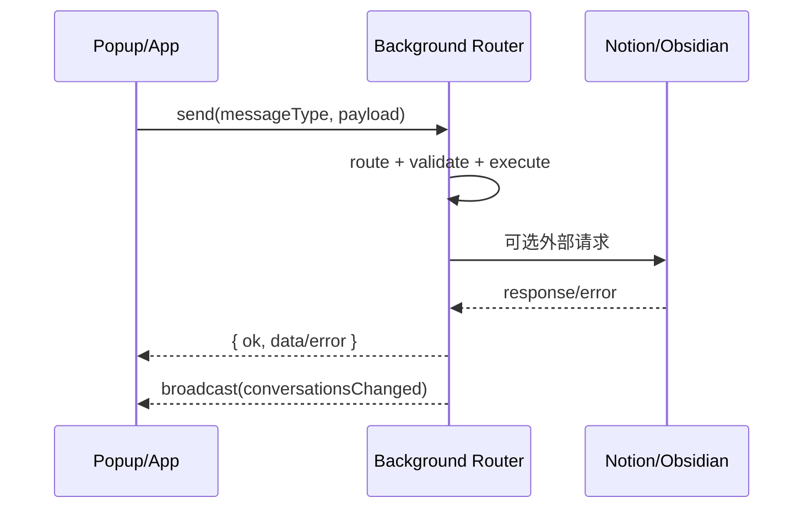

# API 与消息契约

## 页面目标
本页覆盖两类 API：
1. **扩展内部消息 API**（content/popup/app 与 background 间的协议）
2. **外部集成 API**（Notion、Obsidian Local REST、Cloudflare OAuth Worker）

## 内部消息契约总览

| 契约组 | 常量定义 | 典型用途 | 调用方 |
| --- | --- | --- | --- |
| CORE | `CORE_MESSAGE_TYPES` | conversation CRUD、列表分页、消息同步、图片回填 | popup/app/content -> background |
| NOTION | `NOTION_MESSAGE_TYPES` | 授权状态、手动同步、job 状态 | settings/conversations -> background |
| OBSIDIAN | `OBSIDIAN_MESSAGE_TYPES` | 设置保存、连接测试、同步 | settings/conversations -> background |
| ARTICLE | `ARTICLE_MESSAGE_TYPES` | 当前标签页正文抓取 | popup -> background |
| CHATGPT | `CHATGPT_MESSAGE_TYPES` | 提取 deep research / 结构化内容 | content -> background |
| CURRENT_PAGE | `CURRENT_PAGE_MESSAGE_TYPES` | 当前页捕获状态与触发 | popup/content |
| ITEM_MENTION | `ITEM_MENTION_MESSAGE_TYPES` | `$ mention` 候选搜索、插入文本构建 | content -> background |
| COMMENTS | `COMMENTS_MESSAGE_TYPES` | article comments 线程的 list/add/delete/migrate | detail/inpage panel -> background |
| UI | `UI_MESSAGE_TYPES` + `UI_EVENT_TYPES` | 打开 popup、打开 inpage comments panel、状态广播 | background <-> UI |
| CONTENT（非 router） | `CONTENT_MESSAGE_TYPES` | background -> content script 指令（例如打开 inpage comments panel） | background -> content |

## CORE 关键消息

| 消息类型 | 入参关键字段 | 返回 | 说明 |
| --- | --- | --- | --- |
| `upsertConversation` | `payload.source`, `payload.conversationKey` | `conversation + __isNew` | 会话主记录 upsert |
| `mergeConversations` | `keepConversationId`, `removeConversationId` | merge result | 合并两条会话（消息与缓存随之迁移） |
| `syncConversationMessages` | `conversationId`, `messages`, `mode`, `diff` | 写入结果 | 可触发图片内联与增量写入 |
| `backfillConversationImages` | `conversationId`, `conversationUrl` | `updatedMessages`, `downloadedCount` 等 | 历史消息图片回填 |
| `getConversationListBootstrap` | `query{sourceKey,siteKey,limit?}` | 列表第一页 + cursor | 会话列表入口（bootstrap） |
| `getConversationListPage` | `query`, `cursor{lastCapturedAt,id}`, `limit?` | 列表分页 + cursor | 会话列表分页 |
| `findConversationBySourceAndKey` | `source`, `conversationKey` | conversation 或 `null` | 以“来源 + 会话 key”定位会话 |
| `findConversationById` | `conversationId` | conversation 或 `null` | 以 id 定位会话 |
| `getConversationDetail` | `conversationId` | 详情 + messages | 详情页入口 |
| `deleteConversations` | `conversationIds[]` | 删除结果 | 同步删除会话、消息与 mapping |

## ITEM_MENTION（$ mention）关键消息

| 消息类型 | 入参关键字段 | 返回 | 说明 |
| --- | --- | --- | --- |
| `searchMentionCandidates` | `query`/`text`, `limit?` | `{query,candidates,scannedCount,truncatedByScanLimit}` | 从本地会话库检索候选并排序；为避免大库阻塞，background 侧会对扫描量与时间做上限 |
| `buildMentionInsertText` | `conversationId` | `{conversationId,markdown}` | 从本地 conversation detail 构建可插入的 Markdown；常见错误码：`INVALID_ARGUMENT` / `NOT_FOUND` / `EMPTY_DETAIL` |

## UI / CONTENT：打开页面内评论侧边栏（inpage comments panel）

这个入口用于把 **content 侧的“用户交互”** 变成 **content script 中的 UI 指令**：

1. content controller 监听 inpage 按钮的双击，在需要打开评论时发送 `UI_MESSAGE_TYPES.OPEN_CURRENT_TAB_INPAGE_COMMENTS_PANEL`（通常携带 `selectionText` 作为初始化引用内容）。
2. background 的 `ui-background-handlers.ts` 校验 sender tab，并用 `tabsSendMessage()` 向该 tab 发送 `CONTENT_MESSAGE_TYPES.OPEN_INPAGE_COMMENTS_PANEL`。
3. content script 收到 content message 后挂载/打开 inpage comments panel。

> `UI_MESSAGE_TYPES.OPEN_EXTENSION_POPUP` 仍存在，但不再是 inpage 双击的默认入口；它用于显式请求打开扩展 popup（依赖浏览器是否支持 `action.openPopup()`）。

## 外部 API 矩阵

| API | 入口 | 方法 | 关键参数 | 关键响应 |
| --- | --- | --- | --- | --- |
| Notion OAuth authorize | `https://api.notion.com/v1/oauth/authorize` | GET | `client_id`, `redirect_uri`, `state` | 授权码回调 |
| OAuth code exchange（worker） | `/notion/oauth/exchange` | POST JSON | `code`, `redirectUri` | `access_token` JSON |
| Notion API | `https://api.notion.com/*` | HTTPS | token + Parent Page + DB/page payload | 数据库/页面/block 读写 |
| Obsidian Local REST API | `http://127.0.0.1:27123/*`（可配置） | HTTP | API Key + path/body | 文件写入、patch、open |

## Notion OAuth Worker 交换流程

| 阶段 | 入口 / 文件 | 关键点 |
| --- | --- | --- |
| 用户发起授权 | `src/services/sync/notion/auth/oauth.ts` + Notion authorize URL | 使用 `authorizationUrl=https://api.notion.com/v1/oauth/authorize`，并生成 `state` 写入本地 pending key |
| 回调拦截 | `handleNotionOAuthCallbackNavigation()` | 只处理 `redirectUri=https://chiimagnus.github.io/syncnos-oauth/callback`，并校验 `state` 一致 |
| code 交换 | Worker `index.ts` | 扩展向 `/notion/oauth/exchange` 发送 `{ code, redirectUri }`；Worker 在服务端用 `NOTION_CLIENT_ID/SECRET` 调 Notion token endpoint |
| token 入库 | `setNotionOAuthToken()` | 扩展仅持久化 `access_token` 与 workspace 信息，不落地 `client_secret` |

| 关键参数 | 位置 | 说明 |
| --- | --- | --- |
| `tokenExchangeProxyUrl` | `src/services/sync/notion/auth/oauth.ts` | `https://syncnos-notion-oauth.chiimagnus.workers.dev/notion/oauth/exchange` |
| Worker `NOTION_CLIENT_ID` | Cloudflare Worker env | OAuth client id，仅 Worker 可见 |
| Worker `NOTION_CLIENT_SECRET` | Cloudflare Worker env | OAuth client secret，仅 Worker 可见 |
| `redirectUri` | `src/services/sync/notion/auth/oauth.ts` + Worker | 固定为 `https://chiimagnus.github.io/syncnos-oauth/callback`，用于 code exchange 对齐 |

## 典型调用时序

## 契约稳定性规则

| 规则 | 原因 | 实践建议 |
| --- | --- | --- |
| 消息 type 必须来自 `message-contracts.ts` | 避免字符串漂移 | 禁止在组件内硬编码 type 字符串 |
| 返回结构统一 `{ok,data,error}` | 便于 UI 一致处理 | 扩展 handler 时保持 router 输出结构 |
| 新增消息先补测试再接 UI | 降低协议回归 | 补 smoke/unit 覆盖 message path |
| UI 只消费必要字段 | 减少耦合 | 不直接依赖 background 内部实现细节 |

## 常见 API 失败模式

| 失败场景 | 触发位置 | 处理策略 |
| --- | --- | --- |
| OAuth state 不匹配 | `handleNotionOAuthCallbackNavigation` | 拒绝写 token，保留错误信息 |
| worker 限流 429 | Cloudflare worker | 返回 `Retry-After`，前端重试或提示稍后 |
| Obsidian PATCH 失败 | `obsidian-sync-orchestrator.ts` | 自动回退 full rebuild |
| 消息 type 未注册 | background router fallback | 返回 `unknown message type` |
| `$ mention` 插入失败（detail 为空） | `buildMentionInsertText` | 返回 `EMPTY_DETAIL`；通常需要重新采集该会话或先确认详情能正常打开 |
| 无法打开 popup | `OPEN_EXTENSION_POPUP` | 返回 `OPEN_POPUP_UNSUPPORTED` / `OPEN_POPUP_FAILED`；提示用户通过工具栏图标或检查浏览器能力 |
| 无法打开 inpage comments panel | `OPEN_CURRENT_TAB_INPAGE_COMMENTS_PANEL` | 返回 `OPEN_INPAGE_COMMENTS_PANEL_UNAVAILABLE/FAILED`；优先检查 sender tab、content script 是否仍在运行 |

## 来源引用（Source References）
- `webclipper/src/platform/messaging/message-contracts.ts`
- `webclipper/src/platform/messaging/background-router.ts`
- `webclipper/src/services/conversations/background/handlers.ts`
- `webclipper/src/services/bootstrap/content-controller.ts`
- `webclipper/src/services/sync/background-handlers.ts`
- `webclipper/src/services/integrations/item-mention/background-handlers.ts`
- `webclipper/src/services/integrations/item-mention/mention-contract.ts`
- `webclipper/src/services/integrations/item-mention/mention-search.ts`
- `webclipper/src/services/sync/notion/auth/oauth.ts`
- `webclipper/src/services/sync/notion/notion-sync-orchestrator.ts`
- `webclipper/src/services/sync/obsidian/obsidian-sync-orchestrator.ts`
- `webclipper/cloudflare-workers/syncnos-notion-oauth/index.ts`
- `webclipper/src/services/bootstrap/current-page-capture.ts`
- `webclipper/src/platform/messaging/ui-background-handlers.ts`

## 更新记录（Update Notes）
- 2026-03-29：同步内部消息契约组（补齐 `CHATGPT_MESSAGE_TYPES` / `ITEM_MENTION_MESSAGE_TYPES` / `COMMENTS_MESSAGE_TYPES` / `CONTENT_MESSAGE_TYPES`），并补充 `$ mention` 与“打开 inpage comments panel”的消息链路与失败模式。
- 2026-03-19：新增 Notion OAuth Worker 的 code exchange 分阶段说明与关键参数矩阵，明确密钥仅在 Worker 侧持有。
