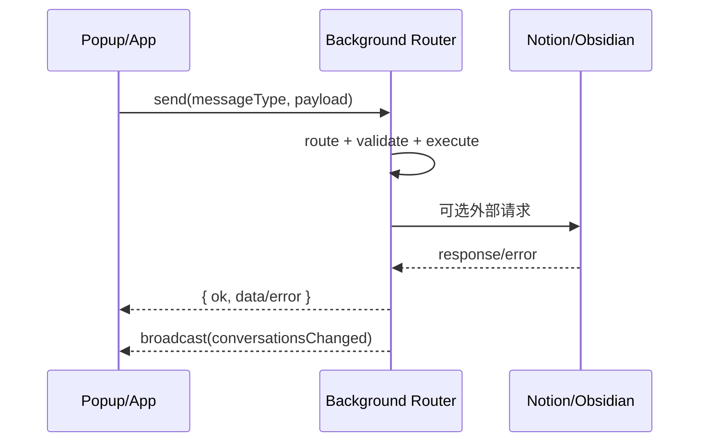

# API 与消息契约

## 页面目标
本页覆盖两类 API：
1. **扩展内部消息 API**（content/popup/app 与 background 间的协议）
2. **外部集成 API**（Notion、Obsidian Local REST、Cloudflare OAuth Worker）

## 内部消息契约总览

| 契约组 | 常量定义 | 典型用途 | 调用方 |
| --- | --- | --- | --- |
| CORE | `CORE_MESSAGE_TYPES` | conversation CRUD、消息同步、图片回填 | popup/app/content -> background |
| NOTION | `NOTION_MESSAGE_TYPES` | 授权状态、手动同步、job 状态 | settings/conversations -> background |
| OBSIDIAN | `OBSIDIAN_MESSAGE_TYPES` | 设置保存、连接测试、同步 | settings/conversations -> background |
| ARTICLE | `ARTICLE_MESSAGE_TYPES` | 当前标签页正文抓取 | popup -> background |
| CURRENT_PAGE | `CURRENT_PAGE_MESSAGE_TYPES` | 当前页捕获状态与触发 | popup/content |
| UI | `UI_MESSAGE_TYPES` + `UI_EVENT_TYPES` | 打开 popup、状态广播 | background <-> UI |

## CORE 关键消息

| 消息类型 | 入参关键字段 | 返回 | 说明 |
| --- | --- | --- | --- |
| `upsertConversation` | `payload.source`, `payload.conversationKey` | `conversation + __isNew` | 会话主记录 upsert |
| `syncConversationMessages` | `conversationId`, `messages`, `mode`, `diff` | 写入结果 | 可触发图片内联与增量写入 |
| `backfillConversationImages` | `conversationId`, `conversationUrl` | `updatedMessages`, `downloadedCount` 等 | 历史消息图片回填 |
| `getConversations` | - | 列表数据 | 会话列表入口 |
| `getConversationDetail` | `conversationId` | 详情 + messages | 详情页入口 |
| `deleteConversations` | `conversationIds[]` | 删除结果 | 同步删除会话、消息与 mapping |

## 外部 API 矩阵

| API | 入口 | 方法 | 关键参数 | 关键响应 |
| --- | --- | --- | --- | --- |
| Notion OAuth authorize | `https://api.notion.com/v1/oauth/authorize` | GET | `client_id`, `redirect_uri`, `state` | 授权码回调 |
| OAuth code exchange（worker） | `/notion/oauth/exchange` | POST JSON | `code`, `redirectUri` | `access_token` JSON |
| Notion API | `https://api.notion.com/*` | HTTPS | token + Parent Page + DB/page payload | 数据库/页面/block 读写 |
| Obsidian Local REST API | `http://127.0.0.1:27123/*`（可配置） | HTTP | API Key + path/body | 文件写入、patch、open |

## 典型调用时序

## 契约稳定性规则

| 规则 | 原因 | 实践建议 |
| --- | --- | --- |
| 消息 type 必须来自 `message-contracts.ts` | 避免字符串漂移 | 禁止在组件内硬编码 type 字符串 |
| 返回结构统一 `{ok,data,error}` | 便于 UI 一致处理 | 扩展 handler 时保持 router 输出结构 |
| 新增消息先补测试再接 UI | 降低协议回归 | 补 smoke/unit 覆盖 message path |
| UI 只消费必要字段 | 减少耦合 | 不直接依赖 background 内部实现细节 |

## 常见 API 失败模式

| 失败场景 | 触发位置 | 处理策略 |
| --- | --- | --- |
| OAuth state 不匹配 | `handleNotionOAuthCallbackNavigation` | 拒绝写 token，保留错误信息 |
| worker 限流 429 | Cloudflare worker | 返回 `Retry-After`，前端重试或提示稍后 |
| Obsidian PATCH 失败 | `obsidian-sync-orchestrator.ts` | 自动回退 full rebuild |
| 消息 type 未注册 | background router fallback | 返回 `unknown message type` |

## 来源引用（Source References）
- `webclipper/src/platform/messaging/message-contracts.ts`
- `webclipper/src/platform/messaging/background-router.ts`
- `webclipper/src/conversations/background/handlers.ts`
- `webclipper/src/sync/background-handlers.ts`
- `webclipper/src/sync/notion/auth/oauth.ts`
- `webclipper/src/sync/notion/notion-sync-orchestrator.ts`
- `webclipper/src/sync/obsidian/obsidian-sync-orchestrator.ts`
- `webclipper/cloudflare-workers/syncnos-notion-oauth/index.ts`
- `webclipper/src/bootstrap/current-page-capture.ts`
- `webclipper/src/platform/messaging/ui-background-handlers.ts`
