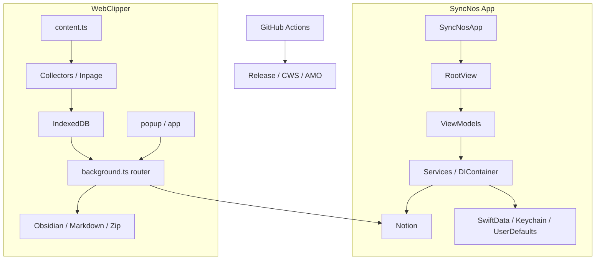

# 架构

## 系统上下文
SyncNos 仓库由三层共同构成：**双产品线运行时**（App 与 WebClipper）、**本地事实与同步层**（SwiftData / Keychain / IndexedDB / Notion / Obsidian）、以及 **交付层**（GitHub Release / CWS / AMO）。理解架构时最重要的不是“有哪些目录”，而是“哪个运行时拥有哪类状态，以及哪些契约负责在运行时之间传递数据”。

| 外部边界 | 主要交互方 | 真实职责 | 关键文件 |
| --- | --- | --- | --- |
| 用户 | App、popup、扩展内部 app、网页内 inpage UI | 选择来源、保存会话、选择 Parent Page、触发同步或导出 | `macOS/SyncNos/Views/`, `webclipper/src/ui/` |
| Notion | App + WebClipper | 作为统一云端知识落点 | `NotionSyncEngine.swift`, `notion-sync-orchestrator.ts` |
| 浏览器页面 | WebClipper content script | 提供 AI 对话 DOM 与网页正文 | `content.ts`, `collectors/`, `article-fetch.ts` |
| 本地来源 / 本地状态 | App Services、WebClipper storage | 承担来源读取、会话缓存、登录态、游标、映射 | `Services/`, `storage-idb.ts`, `schema.ts` |
| GitHub Actions / 商店 API | 发布脚本、workflow | 生成 release assets 并发布商店版本 | `.github/workflows/`, `.github/scripts/webclipper/` |

## 运行时单元

| 运行时单元 | 主要路径 | 核心职责 | 修改时最容易影响谁 |
| --- | --- | --- | --- |
| `SyncNosApp` | `macOS/SyncNos/SyncNosApp.swift` | 启动时预热 IAP、自动同步、缓存服务，定义窗口 | 所有 App 启动行为和 Scene 布局 |
| `AppDelegate` | `macOS/SyncNos/AppDelegate.swift` | 菜单栏 / Dock 模式、退出保护、Dock reopen、URL scheme 兜底 | AppKit 生命周期、退出行为、菜单栏 UX |
| `RootView` | `macOS/SyncNos/Views/RootView.swift` | 严格控制 Onboarding → PayWall → MainListView 顺序 | 引导、付费墙、主界面副作用 |
| `DIContainer` | `macOS/SyncNos/Services/Core/DIContainer.swift` | App 组合根，延迟装配服务与协议实现 | 几乎所有 App Service / ViewModel 注入关系 |
| App Service 层 | `macOS/SyncNos/Services/` | 数据源读取、缓存、搜索、鉴权、Notion 同步、自动调度 | 来源适配、同步策略、缓存结构 |
| background | `webclipper/src/entrypoints/background.ts` | 注册 handlers / router / sync orchestrators，清理孤儿 sync job | 所有扩展后台能力 |
| content | `webclipper/src/entrypoints/content.ts` | 注册 collectors、inpage UI、增量观察器、手动保存逻辑 | 采集稳定性、页面按钮体验 |
| popup / app | `webclipper/src/entrypoints/popup/`, `src/entrypoints/app/` | 呈现会话列表、设置页、同步 / 导出入口 | 用户操作流、设置写入和状态展示 |
| 发布层 | `.github/workflows/`, `.github/scripts/webclipper/` | release page、渠道构建、AMO/CWS 发布 | 版本一致性与最终产物 |

## App 内部边界

| 层 | 主目录 | 主要规则 | 代表实现 |
| --- | --- | --- | --- |
| Views | `macOS/SyncNos/Views/` | 以 SwiftUI 呈现状态，不直接访问底层存储 | `RootView.swift`, `MainListView` |
| ViewModels | `macOS/SyncNos/ViewModels/` | 编排状态、依赖注入、面向 UI 暴露操作 | `OnboardingViewModel.swift`, `GlobalSearchViewModel.swift` |
| Services | `macOS/SyncNos/Services/` | 协议优先、`@ModelActor`、业务逻辑与同步 | `AutoSyncService.swift`, `IAPService.swift`, cache services |
| Models | `macOS/SyncNos/Models/` | DTO、缓存模型、通知名 | `NotificationNames.swift` |
| Packages | `macOS/Packages/` | 可复用 macOS 能力，不反向依赖业务 UI | `MenuBarDockKit` |

- `RootView` 的门控顺序是 App 架构里非常关键的一层：它确保主列表视图只有在 onboarding 和 paywall 都通过后才初始化。
- `GlobalSearchViewModel` 与 `Notification.Name` 集中定义，让 App 既能做全局搜索，也能在窗口 / 焦点 / 同步状态之间保持统一事件语义。

## WebClipper 内部边界

| 子系统 | 主目录 | 核心职责 | 代表实现 |
| --- | --- | --- | --- |
| collectors | `src/collectors/` | 站点识别、DOM 抽取、消息标准化 | `register-all.ts`, 各站点 collector |
| conversations | `src/services/conversations/` | IndexedDB CRUD、本地事实源、UI 读取面 | `data/storage-idb.ts`, background handlers |
| comments | `src/services/comments/` | article 详情评论线程、回复 / 删除、shared session 与 inpage 面板 | `background/handlers.ts`, `data/storage-idb.ts`, `ArticleCommentsSection.tsx` |
| sync | `src/services/sync/` | Notion / Obsidian / 备份的编排层 | `notion-sync-orchestrator.ts`, `obsidian-sync-orchestrator.ts`, `backup/*` |
| ui | `src/ui/` | ConversationsScene、SettingsScene、popup/app 壳层，以及主题 token（`prefers-color-scheme`）、窄屏 list/detail 路由和会话级动作解析 | `ConversationsScene.tsx`, `SettingsScene.tsx`, `styles/tokens.css`, `pending-open.ts` |
| messaging | `src/platform/messaging/` | 消息 type、router、UI 事件与 tab relay | `message-contracts.ts`, `background-router.ts`, `ui-background-handlers.ts` |

- `content.ts` 把 content runtime 组装成“collectors registry + controller + inpage button/tip + runtime observer + incremental updater + notionAiModelPicker”的组合体。
- `background.ts` 则把 conversation handlers、article fetch、Notion / Obsidian settings handlers、sync handlers、UI handlers 一次性挂到 router 上，并在实例切换时终止其他 background 实例遗留的 sync job；`onInstalled` 只在首次安装时打开 About，更新不自动弹设置。
- `SettingsScene.tsx + src/viewmodels/settings/useSettingsSceneController.ts` 共同承担 WebClipper 的“设置组合根”职责：一方面把 `chrome.storage.local` 里的 theme / inpage / chat-with / Notion / Obsidian 设置喂给 UI，另一方面只在进入 `aboutyou` 分区时懒加载本地统计（旧 `insight` key 会被兼容映射到 `aboutyou`）。
- `ConversationsScene.tsx + pending-open.ts` 共同承担窄屏下的 list/detail bridge：当用户从 Insight 排行或其他路由跳到对话详情时，会先把目标 `conversationId` 写入 `sessionStorage`，再由 scene 消费并切进 detail。
- `conversations-context.tsx + DetailHeaderActionBar.tsx + DetailNavigationHeader.tsx` 共同承担会话详情动作分发：`open / chat-with / tools` 三类槽位在主详情页和窄屏 header 使用同一规则，避免两套动作系统分叉。
- `src/services/conversations/background/handlers.ts + image-backfill-job.ts` 把“图片缓存”拆成两条链：实时采集时按 `ai_chat_cache_images_enabled` 做内联；历史会话通过 `BACKFILL_CONVERSATION_IMAGES` 手动回填并广播刷新事件。
- `src/services/comments/background/handlers.ts + ArticleCommentsSection.tsx + src/services/comments/threaded-comments-panel.ts + inpage-comments-panel-shadow.ts` 负责 article 本地评论线程：它依赖 `article_comments` store 和 canonical URL 归一，但不进入 Notion / Obsidian 同步链。
- `ConversationListPane.tsx` 通过 `onOpenInsightsSection` 把列表底部统计组件连接到 popup/app 路由壳层：popup 打开 `'/settings?section=aboutyou'`，app 在 HashRouter 内导航同一参数。
- `SelectMenu.tsx + MenuPopover.tsx` 共同定义 WebClipper 下拉面板的高度边界：当 `adaptiveMaxHeight` 启用时，会通过 `findNearestClippingRect()` 查找最近 overflow 裁剪容器并动态计算 `panelMaxHeight`，从而让底部 `source/site` 筛选菜单在受限容器里减少无谓滚动条与裁切。

## 关键契约

| 契约 | 位置 | 谁依赖它 | 含义 |
| --- | --- | --- | --- |
| `NotionSyncSourceProtocol` | `macOS/SyncNos/Services/DataSources-To/Notion/Sync/NotionSyncSourceProtocol.swift` | App 各来源适配器、`NotionSyncEngine` | 把不同来源统一成可同步的条目 / 内容结构 |
| `NotionSyncConfig` | `macOS/SyncNos/Services/DataSources-To/Notion/Config/NotionSyncConfig.swift` | App 同步引擎 | 定义并发、RPS、批量大小、超时与重试策略 |
| `Notification.Name` 常量 | `macOS/SyncNos/Models/Core/NotificationNames.swift` | App 视图、ViewModel、Service | 统一同步、搜索、窗口、IAP、登录等事件 |
| `message-contracts.ts` | `webclipper/src/platform/messaging/message-contracts.ts` | content / background / popup / app | 把扩展功能拆成 CORE / NOTION / OBSIDIAN / ARTICLE / CHATGPT / CURRENT_PAGE / ITEM_MENTION / COMMENTS / UI 等消息组（另有 `CONTENT_MESSAGE_TYPES` 用于 background -> content script 指令，不经 router） |
| `COMMENTS_MESSAGE_TYPES` | `webclipper/src/platform/messaging/message-contracts.ts` | comments UI / background / content | 定义 article 评论线程的 add / list / delete / attach-orphan 消息 |
| `ITEM_MENTION_MESSAGE_TYPES` | `webclipper/src/platform/messaging/message-contracts.ts` | `$ mention` content controller、background handlers | 定义 `$ mention` 候选搜索与插入文本构建的消息契约 |
| `CONTENT_MESSAGE_TYPES.OPEN_INPAGE_COMMENTS_PANEL` | `webclipper/src/platform/messaging/message-contracts.ts` | UI background handlers、content handlers | background 发送到 content script 的“打开 inpage comments panel”指令（不经过 background router） |
| `CORE_MESSAGE_TYPES.BACKFILL_CONVERSATION_IMAGES` | `webclipper/src/platform/messaging/message-contracts.ts` | `conversations-context.tsx`, background handlers | 提供会话详情“缓存图片”工具动作的前后端消息契约 |
| `conversation-kinds.ts` | `webclipper/src/services/protocols/conversation-kinds.ts` | Notion / Obsidian orchestrator | 决定 chat/article 的 DB、folder 与重建规则 |
| `chatwith-settings.ts` | `webclipper/src/services/integrations/chatwith/chatwith-settings.ts` | detail header、SettingsScene controller、backup tests | 统一 `Chat with AI` 的模板、平台列表、字符截断与存储键 |
| `detail-header-action-types.ts` | `webclipper/src/services/integrations/detail-header-action-types.ts` | `ConversationDetailPane`, `DetailNavigationHeader`, `DetailHeaderActionBar` | 统一定义详情动作槽位（`open / chat-with / tools`）与触发接口 |
| `tokens.css` | `webclipper/src/ui/styles/tokens.css` | popup/app/inpage UI | 统一设计 token，并用 `prefers-color-scheme` 做亮暗切换 |
| `SelectMenu` 自适应高度约束 | `webclipper/src/ui/shared/SelectMenu.tsx` | `ConversationListPane` 等下拉触发点 | `adaptiveMaxHeight` 会结合 `side` 与最近可裁剪容器动态计算 `panelMaxHeight` |
| Zip v2 备份契约 | `src/services/sync/backup/export.ts`, `src/services/sync/backup/import.ts`, `src/services/sync/backup/backup-utils.ts` | 备份与恢复流程 | 约束 manifest、CSV、分源 JSON、storage-local.json 的结构 |

## 图表

## 可靠性与恢复路径

| 场景 | 当前机制 | 架构意义 |
| --- | --- | --- |
| App 高并发 ensure Database / Properties | `NotionSyncEngine.EnsureCache` | 避免同一数据库在批量同步里重复 ensure，降低 409 / 429 风险 |
| App 同步进行中退出 | `AppDelegate.applicationShouldTerminate` 弹确认框 | 防止用户在批量同步中途静默退出 |
| 扩展 background 实例切换 | `abortRunningJobIfFromOtherInstance()` | 防止旧实例残留 job 误导 UI 状态 |
| 聊天图片内联失败 | `src/services/conversations/background/handlers.ts` 中捕获并继续 | 避免图片下载失败阻塞主采集链路，保证“先落本地会话” |
| Obsidian PATCH 失败 | orchestrator 回退到 full rebuild | 确保“能修复目标文件”优先于“必须增量追加” |
| Notion 数据库被删 | Notion orchestrator 可清空缓存的 DB id 后重建一次 | 降低“缓存指向已删除数据库”造成的永久失败 |
| Keychain / 登录态读取副作用 | `SiteLoginsStore` 延迟加载 | 避免 App 一启动就触发不必要的读取与权限行为 |

## 修改热点
- **App 同步热点**：`DIContainer.swift`、`NotionSyncEngine.swift`、`NotionSyncSourceProtocol.swift`、各 `DataSources-From` / `DataSources-To` 适配器。
- **App 门控热点**：`RootView.swift`、`OnboardingViewModel.swift`、`IAPService.swift`、`PayWallViewModel.swift`。
- **扩展采集热点**：`content.ts`、`src/services/bootstrap/content-controller.ts`、`collectors/`、`article-fetch.ts`。
- **扩展同步热点**：`storage-idb.ts`、`schema.ts`、`notion-sync-orchestrator.ts`、`obsidian-sync-orchestrator.ts`、`conversation-kinds.ts`。
- **扩展设置 / 会话 UI 热点**：`SettingsScene.tsx`、`src/viewmodels/settings/useSettingsSceneController.ts`、`tokens.css`、`ConversationListPane.tsx`、`ConversationsScene.tsx`、`pending-open.ts`、`conversations-context.tsx`、`DetailHeaderActionBar.tsx`、`DetailNavigationHeader.tsx`、`src/services/integrations/detail-header-actions.ts`、`src/services/integrations/detail-header-action-types.ts`。
- **发布热点**：`wxt.config.ts`、`package.json`、`.github/workflows/webclipper-*.yml`、`.github/scripts/webclipper/*.mjs`。

## 来源引用（Source References）
- `macOS/SyncNos/SyncNosApp.swift`
- `macOS/SyncNos/AppDelegate.swift`
- `macOS/SyncNos/Views/RootView.swift`
- `macOS/SyncNos/Services/Core/DIContainer.swift`
- `macOS/SyncNos/Services/SyncScheduling/AutoSyncService.swift`
- `macOS/SyncNos/Services/DataSources-To/Notion/Sync/NotionSyncEngine.swift`
- `macOS/SyncNos/Services/DataSources-To/Notion/Sync/NotionSyncSourceProtocol.swift`
- `macOS/SyncNos/Services/DataSources-To/Notion/Config/NotionSyncConfig.swift`
- `macOS/SyncNos/Models/Core/NotificationNames.swift`
- `webclipper/src/entrypoints/background.ts`
- `webclipper/src/entrypoints/content.ts`
- `webclipper/src/services/bootstrap/content.ts`
- `webclipper/src/platform/messaging/message-contracts.ts`
- `webclipper/src/platform/messaging/background-router.ts`
- `webclipper/src/platform/messaging/ui-background-handlers.ts`
- `webclipper/src/services/conversations/background/handlers.ts`
- `webclipper/src/services/conversations/background/image-backfill-job.ts`
- `webclipper/src/services/conversations/client/repo.ts`
- `webclipper/src/services/comments/background/handlers.ts`
- `webclipper/src/services/comments/client/repo.ts`
- `webclipper/src/services/comments/data/storage-idb.ts`
- `webclipper/src/ui/conversations/conversations-context.tsx`
- `webclipper/src/ui/conversations/ArticleCommentsSection.tsx`
- `webclipper/src/services/comments/threaded-comments-panel.ts`
- `webclipper/src/ui/inpage/inpage-comments-panel-shadow.ts`
- `webclipper/src/services/bootstrap/inpage-comments-panel-content-handlers.ts`
- `webclipper/src/services/comments/sidebar/comment-sidebar-session.ts`
- `webclipper/src/ui/conversations/DetailHeaderActionBar.tsx`
- `webclipper/src/ui/conversations/DetailNavigationHeader.tsx`
- `webclipper/src/services/integrations/detail-header-actions.ts`
- `webclipper/src/services/integrations/detail-header-action-types.ts`
- `webclipper/src/ui/shared/MenuPopover.tsx`
- `webclipper/src/ui/shared/SelectMenu.tsx`
- `webclipper/src/ui/conversations/ConversationListPane.tsx`
- `webclipper/src/ui/popup/PopupShell.tsx`
- `webclipper/src/ui/app/AppShell.tsx`
- `webclipper/src/services/protocols/conversation-kinds.ts`
- `.github/workflows/release.yml`
- `.github/workflows/webclipper-release.yml`

## 更新记录（Update Notes）
- 2026-03-29：同步 WebClipper messaging 子系统与 `message-contracts.ts` 的真实分组（补齐 `CHATGPT` / `CURRENT_PAGE` / `ITEM_MENTION` / `CONTENT_MESSAGE_TYPES`），并更正 `ui-background-handlers.ts` 与图片回填消息的归属说明。
