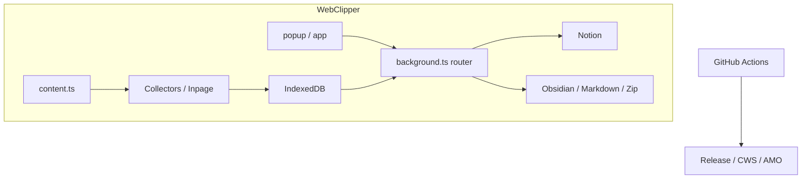

# 架构

macOS/ 历史资料已归档；本页仅保留 WebClipper 的运行时、契约和恢复路径。

## 系统上下文
SyncNos 仓库由三层共同构成：**WebClipper 运行时**、**本地事实与同步层**（IndexedDB / `chrome.storage.local` / Notion / Obsidian）、以及 **交付层**（GitHub Release / CWS / AMO）。理解架构时最重要的不是“有哪些目录”，而是“哪个运行时拥有哪类状态，以及哪些契约负责在运行时之间传递数据”。

| 外部边界 | 主要交互方 | 真实职责 | 关键文件 |
| --- | --- | --- | --- |
| 用户 | popup、扩展内部 app、网页内 inpage UI | 选择来源、保存会话、选择 Parent Page、触发同步或导出 | `webclipper/src/ui/` |
| Notion | WebClipper | 作为统一云端知识落点 | `notion-sync-orchestrator.ts` |
| 浏览器页面 | WebClipper content script | 提供 AI 对话 DOM 与网页正文 | `content.ts`, `collectors/`, `article-fetch.ts` |
| 本地来源 / 本地状态 | WebClipper storage | 承担来源读取、会话缓存、游标、映射 | `storage-idb.ts`, `schema.ts` |
| GitHub Actions / 商店 API | 发布脚本、workflow | 生成 release assets 并发布商店版本 | `.github/workflows/`, `.github/scripts/webclipper/` |

## 运行时单元

| 运行时单元 | 主要路径 | 核心职责 | 修改时最容易影响谁 |
| --- | --- | --- | --- |
| background | `webclipper/src/entrypoints/background.ts` | 注册 handlers / router / sync orchestrators，清理孤儿 sync job | 所有扩展后台能力 |
| content | `webclipper/src/entrypoints/content.ts` | 注册 collectors、inpage UI、增量观察器、手动保存逻辑 | 采集稳定性、页面按钮体验 |
| popup / app | `webclipper/src/entrypoints/popup/`, `src/entrypoints/app/` | 呈现会话列表、设置页、同步 / 导出入口 | 用户操作流、设置写入和状态展示 |
| 发布层 | `.github/workflows/`, `.github/scripts/webclipper/` | release page、渠道构建、AMO/CWS 发布 | 版本一致性与最终产物 |

## WebClipper 内部边界

| 子系统 | 主目录 | 核心职责 | 代表实现 |
| --- | --- | --- | --- |
| collectors | `src/collectors/` | 站点识别、DOM 抽取、消息标准化 | `register-all.ts`, 各站点 collector |
| conversations | `src/services/conversations/` | IndexedDB CRUD、本地事实源、UI 读取面 | `data/storage-idb.ts`, background handlers |
| comments | `src/services/comments/` + `src/ui/comments/react/` | article 详情评论线程（React 实现）、回复 / 删除 / 防重入 / 聚焦 / Chat with AI、shared session 与 inpage 面板 | `background/handlers.ts`, `data/storage-idb.ts`, `ThreadedCommentsPanel.tsx`, `panel-store.ts` |
| sync | `src/services/sync/` | Notion / Obsidian / 备份的编排层（含评论数同步） | `notion-sync-orchestrator.ts`, `obsidian-sync-orchestrator.ts`, `backup/*`, `comment-metrics.ts` |
| ui | `src/ui/` | ConversationsScene（listShell 注入）、SettingsScene（顶部标签/侧边栏导航）、popup/app 壳层，以及主题 token（`prefers-color-scheme`）、窄屏 list/detail/comments 路由和会话级动作解析 | `ConversationsScene.tsx`, `SettingsScene.tsx`, `SettingsTopTabsNav.tsx`, `CapturedListPaneShell.tsx`, `styles/tokens.css`, `pending-open.ts` |
| messaging | `src/platform/messaging/` | 消息 type、router、UI 事件与 tab relay | `message-contracts.ts`, `background-router.ts`, `ui-background-handlers.ts` |

- `content.ts` 把 content runtime 组装成"collectors registry + controller + inpage button/tip + runtime observer + incremental updater + notionAiModelPicker"的组合体。
- `background.ts` 则把 conversation handlers、article fetch、Notion / Obsidian settings handlers、sync handlers、UI handlers 一次性挂到 router 上，并在实例切换时终止其他 background 实例遗留的 sync job；`onInstalled` 只在首次安装时打开 About，更新不自动弹设置。
- `SettingsScene.tsx + SettingsTopTabsNav.tsx + src/viewmodels/settings/useSettingsSceneController.ts` 共同承担 WebClipper 的"设置组合根"职责：窄屏使用顶部标签导航，宽屏使用侧边栏导航；支持关闭按钮返回；blur 自动保存部分设置项（如 Inpage Display Mode、Chat with AI 平台/模板/maxChars）；仅在进入 `aboutyou` 分区时懒加载本地统计。
- `ConversationsScene.tsx + pending-open.ts` 共同承担窄屏下的 list/detail/comments 三路由：通过 `listShell` 属性接收来自 PopupShell/AppShell 的自定义列表头部（`CapturedListPaneShell`），实现 popup/app 共享列表架构。
- `conversations-context.tsx + DetailHeaderActionBar.tsx + DetailNavigationHeader.tsx` 共同承担会话详情动作分发：统一使用 `open / tools` 两类槽位，主详情页与窄屏 header 规则一致。
- `src/services/conversations/background/handlers.ts + image-backfill-job.ts` 把"图片缓存"拆成两条链：实时采集时按 `ai_chat_cache_images_enabled` / `web_article_cache_images_enabled` 做内联；历史会话通过 `BACKFILL_CONVERSATION_IMAGES` 手动回填并广播刷新事件。
- `src/ui/comments/react/ThreadedCommentsPanel.tsx + panel-store.ts + focus-rules.ts` 承担评论模块的 React 渲染职责：使用 `useSyncExternalStore` 桥接 background handlers，实现防重入保护（`runBusyTask`）、删除二次确认（`armedDeleteId`）、发送后自动聚焦、评论级 Chat with AI 菜单。
- `src/services/comments/domain/comment-metrics.ts` 提供评论数计算（`computeArticleCommentThreadCount`），用于 Notion "Comment Threads" 属性和 Obsidian `comments_root_count` frontmatter。
- `ConversationListPane.tsx` 通过 `onOpenInsightsSection` 把列表底部统计组件连接到 popup/app 路由壳层：popup 打开 `'/settings?section=aboutyou'`，app 在 HashRouter 内导航同一参数。
- `SelectMenu.tsx + MenuPopover.tsx` 共同定义 WebClipper 下拉面板的高度边界：当 `adaptiveMaxHeight` 启用时，会通过 `findNearestClippingRect()` 查找最近 overflow 裁剪容器并动态计算 `panelMaxHeight`，从而让底部 `source/site` 筛选菜单在受限容器里减少无谓滚动条与裁切。

## 关键契约

| 契约 | 位置 | 谁依赖它 | 含义 |
| --- | --- | --- | --- |
| `message-contracts.ts` | `webclipper/src/platform/messaging/message-contracts.ts` | content / background / popup / app | 把扩展功能拆成 CORE / NOTION / OBSIDIAN / ARTICLE / CHATGPT / CURRENT_PAGE / ITEM_MENTION / COMMENTS / UI 等消息组（另有 `CONTENT_MESSAGE_TYPES` 用于 background -> content script 指令，不经 router） |
| `COMMENTS_MESSAGE_TYPES` | `webclipper/src/platform/messaging/message-contracts.ts` | comments UI / background / content | 定义 article 评论线程的 add / list / delete / attach-orphan 消息 |
| `ITEM_MENTION_MESSAGE_TYPES` | `webclipper/src/platform/messaging/message-contracts.ts` | `$ mention` content controller、background handlers | 定义 `$ mention` 候选搜索与插入文本构建的消息契约 |
| `CONTENT_MESSAGE_TYPES.OPEN_INPAGE_COMMENTS_PANEL` | `webclipper/src/platform/messaging/message-contracts.ts` | UI background handlers、content handlers | background 发送到 content script 的“打开 inpage comments panel”指令（不经过 background router） |
| `CORE_MESSAGE_TYPES.BACKFILL_CONVERSATION_IMAGES` | `webclipper/src/platform/messaging/message-contracts.ts` | `src/viewmodels/conversations/conversations-context.tsx`, background handlers | 提供会话详情“缓存图片”工具动作的前后端消息契约 |
| `conversation-kinds.ts` | `webclipper/src/services/protocols/conversation-kinds.ts` | Notion / Obsidian orchestrator | 决定 chat/article 的 DB、folder 与重建规则 |
| `chatwith-settings.ts` | `webclipper/src/services/integrations/chatwith/chatwith-settings.ts` | detail header、SettingsScene controller、backup tests | 统一 `Chat with AI` 的模板、平台列表、字符截断与存储键 |
| `detail-header-action-types.ts` | `webclipper/src/services/integrations/detail-header-action-types.ts` | `ConversationDetailPane`, `DetailNavigationHeader`, `DetailHeaderActionBar` | 统一定义详情动作槽位（`open / tools`）与触发接口（Chat with AI 也复用 `tools`） |
| `tokens.css` | `webclipper/src/ui/styles/tokens.css` | popup/app/inpage UI | 统一设计 token，并用 `prefers-color-scheme` 做亮暗切换 |
| `SelectMenu` 自适应高度约束 | `webclipper/src/ui/shared/SelectMenu.tsx` | `ConversationListPane` 等下拉触发点 | `adaptiveMaxHeight` 会结合 `side` 与最近可裁剪容器动态计算 `panelMaxHeight` |
| Zip v2 备份契约 | `src/services/sync/backup/export.ts`, `src/services/sync/backup/import.ts`, `src/services/sync/backup/backup-utils.ts` | 备份与恢复流程 | 约束 manifest、CSV、分源 JSON、storage-local.json 的结构 |

## 图表

## 可靠性与恢复路径

| 场景 | 当前机制 | 架构意义 |
| --- | --- | --- |
| 扩展 background 实例切换 | `abortRunningJobIfFromOtherInstance()` | 防止旧实例残留 job 误导 UI 状态 |
| 聊天图片内联失败 | `src/services/conversations/background/handlers.ts` 中捕获并继续 | 避免图片下载失败阻塞主采集链路，保证“先落本地会话” |
| Obsidian PATCH 失败 | orchestrator 回退到 full rebuild | 确保“能修复目标文件”优先于“必须增量追加” |
| Notion 数据库被删 | Notion orchestrator 可清空缓存的 DB id 后重建一次 | 降低“缓存指向已删除数据库”造成的永久失败 |
| 登录态读取副作用 | `SiteLoginsStore` 延迟加载 | 避免启动时触发不必要的读取与权限行为 |

## 修改热点
- **扩展采集热点**：`content.ts`、`src/services/bootstrap/content-controller.ts`、`collectors/`、`article-fetch.ts`。
- **扩展同步热点**：`storage-idb.ts`、`schema.ts`、`notion-sync-orchestrator.ts`、`obsidian-sync-orchestrator.ts`、`conversation-kinds.ts`。
- **扩展设置 / 会话 UI 热点**：`SettingsScene.tsx`、`src/viewmodels/settings/useSettingsSceneController.ts`、`tokens.css`、`ConversationListPane.tsx`、`ConversationsScene.tsx`、`pending-open.ts`、`src/viewmodels/conversations/conversations-context.tsx`、`DetailHeaderActionBar.tsx`、`DetailNavigationHeader.tsx`、`src/services/integrations/detail-header-actions.ts`、`src/services/integrations/detail-header-action-types.ts`。
- **发布热点**：`wxt.config.ts`、`package.json`、`.github/workflows/webclipper-*.yml`、`.github/scripts/webclipper/*.mjs`。

## 来源引用（Source References）
- `webclipper/src/entrypoints/background.ts`
- `webclipper/src/entrypoints/content.ts`
- `webclipper/src/services/bootstrap/content.ts`
- `webclipper/src/platform/messaging/message-contracts.ts`
- `webclipper/src/platform/messaging/background-router.ts`
- `webclipper/src/platform/messaging/ui-background-handlers.ts`
- `webclipper/src/services/conversations/background/handlers.ts`
- `webclipper/src/services/conversations/background/image-backfill-job.ts`
- `webclipper/src/services/conversations/client/repo.ts`
- `webclipper/src/services/comments/background/handlers.ts`
- `webclipper/src/services/comments/client/repo.ts`
- `webclipper/src/services/comments/data/storage-idb.ts`
- `webclipper/src/services/comments/domain/comment-metrics.ts`
- `webclipper/src/ui/comments/react/ThreadedCommentsPanel.tsx`
- `webclipper/src/ui/comments/react/panel-store.ts`
- `webclipper/src/ui/comments/react/focus-rules.ts`
- `webclipper/src/viewmodels/conversations/conversations-context.tsx`
- `webclipper/src/ui/conversations/ArticleCommentsSection.tsx`
- `webclipper/src/ui/inpage/inpage-comments-panel-shadow.ts`
- `webclipper/src/services/bootstrap/inpage-comments-panel-content-handlers.ts`
- `webclipper/src/services/comments/sidebar/comment-sidebar-session.ts`
- `webclipper/src/ui/conversations/DetailHeaderActionBar.tsx`
- `webclipper/src/ui/conversations/DetailNavigationHeader.tsx`
- `webclipper/src/services/integrations/detail-header-actions.ts`
- `webclipper/src/services/integrations/detail-header-action-types.ts`
- `webclipper/src/ui/shared/MenuPopover.tsx`
- `webclipper/src/ui/shared/SelectMenu.tsx`
- `webclipper/src/ui/conversations/ConversationListPane.tsx`
- `webclipper/src/ui/conversations/ConversationsScene.tsx`
- `webclipper/src/ui/conversations/CapturedListPaneShell.tsx`
- `webclipper/src/ui/popup/PopupShell.tsx`
- `webclipper/src/ui/app/AppShell.tsx`
- `webclipper/src/ui/settings/SettingsScene.tsx`
- `webclipper/src/ui/settings/SettingsTopTabsNav.tsx`
- `webclipper/src/viewmodels/settings/useSettingsSceneController.ts`
- `webclipper/src/services/protocols/conversation-kinds.ts`
- `webclipper/src/services/sync/notion/notion-sync-orchestrator.ts`
- `webclipper/src/services/sync/obsidian/obsidian-markdown-writer.ts`
- `.github/workflows/release.yml`
- `.github/workflows/webclipper-release.yml`

## 更新记录（Update Notes）
- 2026-04-04：同步评论模块 React 迁移（`ThreadedCommentsPanel.tsx` + `panel-store.ts` + `focus-rules.ts`）、Settings 顶部标签导航（`SettingsTopTabsNav.tsx`）、ConversationsScene listShell 重构（`CapturedListPaneShell.tsx`）、Notion/Obsidian 评论数同步（`comment-metrics.ts`）；更新内部边界表和依赖说明。
- 2026-03-29：同步 WebClipper messaging 子系统与 `message-contracts.ts` 的真实分组（补齐 `CHATGPT` / `CURRENT_PAGE` / `ITEM_MENTION` / `CONTENT_MESSAGE_TYPES`），并更正 `ui-background-handlers.ts` 与图片回填消息的归属说明。
