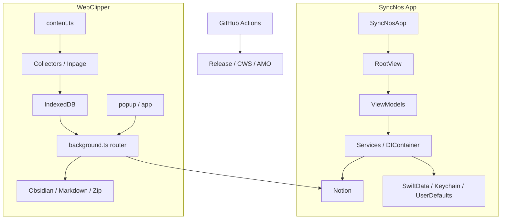

# 架构

## 系统上下文
SyncNos 仓库由三层共同构成：**双产品线运行时**（App 与 WebClipper）、**本地事实与同步层**（SwiftData / Keychain / IndexedDB / Notion / Obsidian）、以及 **交付层**（GitHub Release / CWS / AMO）。理解架构时最重要的不是“有哪些目录”，而是“哪个运行时拥有哪类状态，以及哪些契约负责在运行时之间传递数据”。

| 外部边界 | 主要交互方 | 真实职责 | 关键文件 |
| --- | --- | --- | --- |
| 用户 | App、popup、扩展内部 app、网页内 inpage UI | 选择来源、保存会话、选择 Parent Page、触发同步或导出 | `macOS/SyncNos/Views/`, `webclipper/src/ui/` |
| Notion | App + WebClipper | 作为统一云端知识落点 | `NotionSyncEngine.swift`, `notion-sync-orchestrator.ts` |
| 浏览器页面 | WebClipper content script | 提供 AI 对话 DOM 与网页正文 | `content.ts`, `collectors/`, `article-fetch.ts` |
| 本地来源 / 本地状态 | App Services、WebClipper storage | 承担来源读取、会话缓存、登录态、游标、映射 | `Services/`, `storage-idb.ts`, `schema.ts` |
| GitHub Actions / 商店 API | 发布脚本、workflow | 生成 release assets 并发布商店版本 | `.github/workflows/`, `.github/scripts/webclipper/` |

## 运行时单元

| 运行时单元 | 主要路径 | 核心职责 | 修改时最容易影响谁 |
| --- | --- | --- | --- |
| `SyncNosApp` | `macOS/SyncNos/SyncNosApp.swift` | 启动时预热 IAP、自动同步、缓存服务，定义窗口 | 所有 App 启动行为和 Scene 布局 |
| `AppDelegate` | `macOS/SyncNos/AppDelegate.swift` | 菜单栏 / Dock 模式、退出保护、Dock reopen、URL scheme 兜底 | AppKit 生命周期、退出行为、菜单栏 UX |
| `RootView` | `macOS/SyncNos/Views/RootView.swift` | 严格控制 Onboarding → PayWall → MainListView 顺序 | 引导、付费墙、主界面副作用 |
| `DIContainer` | `macOS/SyncNos/Services/Core/DIContainer.swift` | App 组合根，延迟装配服务与协议实现 | 几乎所有 App Service / ViewModel 注入关系 |
| App Service 层 | `macOS/SyncNos/Services/` | 数据源读取、缓存、搜索、鉴权、Notion 同步、自动调度 | 来源适配、同步策略、缓存结构 |
| background | `webclipper/src/entrypoints/background.ts` | 注册 handlers / router / sync orchestrators，清理孤儿 sync job | 所有扩展后台能力 |
| content | `webclipper/src/entrypoints/content.ts` | 注册 collectors、inpage UI、增量观察器、手动保存逻辑 | 采集稳定性、页面按钮体验 |
| popup / app | `webclipper/src/entrypoints/popup/`, `src/entrypoints/app/` | 呈现会话列表、设置页、同步 / 导出入口 | 用户操作流、设置写入和状态展示 |
| 发布层 | `.github/workflows/`, `.github/scripts/webclipper/` | release page、渠道构建、AMO/CWS 发布 | 版本一致性与最终产物 |

## App 内部边界

| 层 | 主目录 | 主要规则 | 代表实现 |
| --- | --- | --- | --- |
| Views | `macOS/SyncNos/Views/` | 以 SwiftUI 呈现状态，不直接访问底层存储 | `RootView.swift`, `MainListView` |
| ViewModels | `macOS/SyncNos/ViewModels/` | 编排状态、依赖注入、面向 UI 暴露操作 | `OnboardingViewModel.swift`, `GlobalSearchViewModel.swift` |
| Services | `macOS/SyncNos/Services/` | 协议优先、`@ModelActor`、业务逻辑与同步 | `AutoSyncService.swift`, `IAPService.swift`, cache services |
| Models | `macOS/SyncNos/Models/` | DTO、缓存模型、通知名 | `NotificationNames.swift` |
| Packages | `macOS/Packages/` | 可复用 macOS 能力，不反向依赖业务 UI | `MenuBarDockKit` |

- `RootView` 的门控顺序是 App 架构里非常关键的一层：它确保主列表视图只有在 onboarding 和 paywall 都通过后才初始化。
- `GlobalSearchViewModel` 与 `Notification.Name` 集中定义，让 App 既能做全局搜索，也能在窗口 / 焦点 / 同步状态之间保持统一事件语义。

## WebClipper 内部边界

| 子系统 | 主目录 | 核心职责 | 代表实现 |
| --- | --- | --- | --- |
| collectors | `src/collectors/` | 站点识别、DOM 抽取、消息标准化 | `register-all.ts`, 各站点 collector |
| conversations | `src/conversations/` | IndexedDB CRUD、本地事实源、UI 读取面 | `storage-idb.ts`, background handlers |
| sync | `src/sync/` | Notion / Obsidian / 备份的编排层 | `notion-sync-orchestrator.ts`, `obsidian-sync-orchestrator.ts`, `backup/*` |
| ui | `src/ui/` | ConversationsScene、SettingsScene、popup/app 壳层 | `ConversationsScene.tsx`, `SettingsScene.tsx` |
| messaging | `src/platform/messaging/` | 消息 type、router、UI 事件 | `message-contracts.ts`, `ui-background-handlers.ts` |

- `content.ts` 把 content runtime 组装成“collectors registry + controller + inpage button/tip + runtime observer + incremental updater + notionAiModelPicker”的组合体。
- `background.ts` 则把 conversation handlers、article fetch、Notion / Obsidian settings handlers、sync handlers、UI handlers 一次性挂到 router 上，并在实例切换时终止其他 background 实例遗留的 sync job。

## 关键契约

| 契约 | 位置 | 谁依赖它 | 含义 |
| --- | --- | --- | --- |
| `NotionSyncSourceProtocol` | `macOS/SyncNos/Services/DataSources-To/Notion/Sync/NotionSyncSourceProtocol.swift` | App 各来源适配器、`NotionSyncEngine` | 把不同来源统一成可同步的条目 / 内容结构 |
| `NotionSyncConfig` | `macOS/SyncNos/Services/DataSources-To/Notion/Config/NotionSyncConfig.swift` | App 同步引擎 | 定义并发、RPS、批量大小、超时与重试策略 |
| `Notification.Name` 常量 | `macOS/SyncNos/Models/Core/NotificationNames.swift` | App 视图、ViewModel、Service | 统一同步、搜索、窗口、IAP、登录等事件 |
| `message-contracts.ts` | `webclipper/src/platform/messaging/message-contracts.ts` | content / background / popup / app | 把扩展功能拆成 CORE / NOTION / OBSIDIAN / ARTICLE / UI 五类消息 |
| `conversation-kinds.ts` | `webclipper/src/protocols/conversation-kinds.ts` | Notion / Obsidian orchestrator | 决定 chat/article 的 DB、folder 与重建规则 |
| Zip v2 备份契约 | `backup/export.ts`, `backup/import.ts`, `backup-utils.ts` | 备份与恢复流程 | 约束 manifest、CSV、分源 JSON、storage-local.json 的结构 |

## 图表

## 可靠性与恢复路径

| 场景 | 当前机制 | 架构意义 |
| --- | --- | --- |
| App 高并发 ensure Database / Properties | `NotionSyncEngine.EnsureCache` | 避免同一数据库在批量同步里重复 ensure，降低 409 / 429 风险 |
| App 同步进行中退出 | `AppDelegate.applicationShouldTerminate` 弹确认框 | 防止用户在批量同步中途静默退出 |
| 扩展 background 实例切换 | `abortRunningJobIfFromOtherInstance()` | 防止旧实例残留 job 误导 UI 状态 |
| Obsidian PATCH 失败 | orchestrator 回退到 full rebuild | 确保“能修复目标文件”优先于“必须增量追加” |
| Notion 数据库被删 | Notion orchestrator 可清空缓存的 DB id 后重建一次 | 降低“缓存指向已删除数据库”造成的永久失败 |
| Keychain / 登录态读取副作用 | `SiteLoginsStore` 延迟加载 | 避免 App 一启动就触发不必要的读取与权限行为 |

## 修改热点
- **App 同步热点**：`DIContainer.swift`、`NotionSyncEngine.swift`、`NotionSyncSourceProtocol.swift`、各 `DataSources-From` / `DataSources-To` 适配器。
- **App 门控热点**：`RootView.swift`、`OnboardingViewModel.swift`、`IAPService.swift`、`PayWallViewModel.swift`。
- **扩展采集热点**：`content.ts`、`bootstrap/content-controller.ts`、`collectors/`、`article-fetch.ts`。
- **扩展同步热点**：`storage-idb.ts`、`schema.ts`、`notion-sync-orchestrator.ts`、`obsidian-sync-orchestrator.ts`、`conversation-kinds.ts`。
- **发布热点**：`wxt.config.ts`、`package.json`、`.github/workflows/webclipper-*.yml`、`.github/scripts/webclipper/*.mjs`。

## 来源引用（Source References）
- `macOS/SyncNos/SyncNosApp.swift`
- `macOS/SyncNos/AppDelegate.swift`
- `macOS/SyncNos/Views/RootView.swift`
- `macOS/SyncNos/Services/Core/DIContainer.swift`
- `macOS/SyncNos/Services/SyncScheduling/AutoSyncService.swift`
- `macOS/SyncNos/Services/DataSources-To/Notion/Sync/NotionSyncEngine.swift`
- `macOS/SyncNos/Services/DataSources-To/Notion/Sync/NotionSyncSourceProtocol.swift`
- `macOS/SyncNos/Services/DataSources-To/Notion/Config/NotionSyncConfig.swift`
- `macOS/SyncNos/Models/Core/NotificationNames.swift`
- `webclipper/src/entrypoints/background.ts`
- `webclipper/src/entrypoints/content.ts`
- `webclipper/src/bootstrap/content.ts`
- `webclipper/src/platform/messaging/message-contracts.ts`
- `webclipper/src/protocols/conversation-kinds.ts`
- `.github/workflows/release.yml`
- `.github/workflows/webclipper-release.yml`
