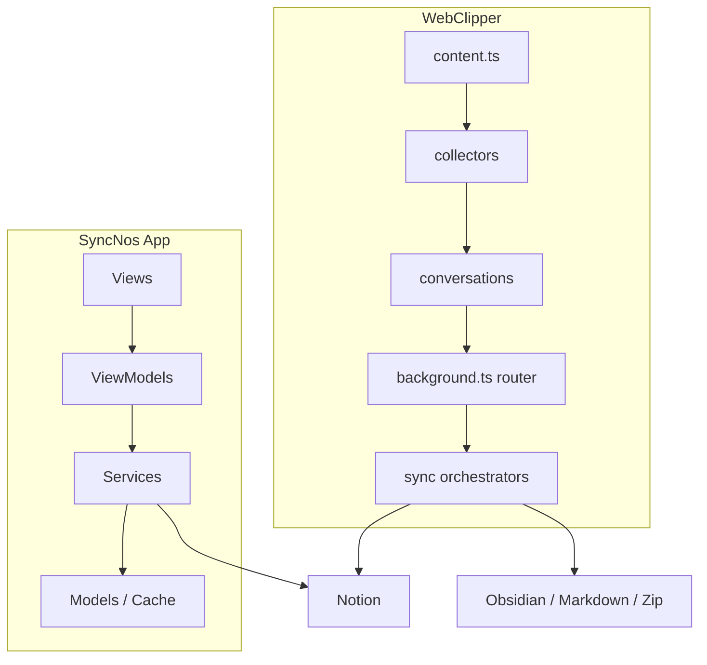

# 架构

## 系统上下文
- SyncNos 不是“一个 UI + 一个后端”的单体仓库，而是“macOS App + MV3 浏览器扩展 + 发布流水线 + 业务说明文档”的组合。
- 两条产品线共享的核心目标是把异构内容整理为稳定的 Notion 写入结果，但采集入口、运行时边界和本地存储模型完全不同。
- 仓库级文档的价值在于把业务约束写清楚：什么时候必须先授权、哪些敏感信息只能保存在本地、哪些发布动作只能由 CI 执行。

| 外部参与者 / 边界 | 交互方 | 主要关系 | 关键路径 |
| --- | --- | --- | --- |
| 用户 | App、WebClipper | 选择 Parent Page、触发同步、管理本地内容 | `README.md`, `.github/docs/business-logic.md` |
| Notion | App、WebClipper | 接收数据库、页面属性与 block 写入 | `SyncNos/AGENTS.md`, `Extensions/WebClipper/AGENTS.md` |
| 浏览器页面 | WebClipper | 提供 AI 对话 DOM 与网页正文 | `Extensions/WebClipper/src/entrypoints/content.ts` |
| 本地数据源 | App | 提供 Apple Books / GoodLinks 数据库、站点 Cookie、OCR 输入 | `SyncNos/AGENTS.md` |
| Obsidian Local REST API | WebClipper | 作为可选同步目标写入 vault 文件 | `.github/guide/obsidian/LocalRestAPI.zh.md` |
| GitHub Actions | Release / WebClipper 发布 | 负责生成 Release、zip、xpi 和商店发布 | `.github/workflows/*.yml` |

## 组件
| 组件 | 主要路径 | 职责 | 关键依赖 |
| --- | --- | --- | --- |
| App 视图层 | `SyncNos/Views/` | 负责 SwiftUI 呈现、焦点与窗口交互 | ViewModel、`MenuBarDockKit` |
| App 状态编排层 | `SyncNos/ViewModels/` | 负责状态管理、业务编排与 UI 绑定 | Services、Observation |
| App 服务层 | `SyncNos/Services/` | 负责读取来源、缓存、鉴权、同步与搜索 | SwiftData、Notion、站点会话 |
| App 组合根 | `SyncNos/Services/Core/DIContainer.swift` | 延迟组装服务并维持协议注入边界 | 各服务协议与实现 |
| WebClipper 入口层 | `Extensions/WebClipper/src/entrypoints/` | 注册 background / content / popup / app 运行时 | WXT、消息路由 |
| WebClipper 采集层 | `Extensions/WebClipper/src/collectors/` | 把站点 DOM 结构转为统一会话数据 | collectors registry、runtime observer |
| WebClipper 数据层 | `Extensions/WebClipper/src/conversations/` | 管理会话、消息、IndexedDB 与增量更新 | background handlers、tests |
| WebClipper 同步层 | `Extensions/WebClipper/src/sync/` | 编排 Notion / Obsidian 同步与设置管理 | message contracts、orchestrator |
| 发布与打包层 | `.github/workflows/`, `.github/scripts/webclipper/` | 根据 tag 或手动输入生成商店产物 | Node 20、GitHub Release |

## 关键流程
- **App 同步流程**：在 `SyncNosApp` 初始化期装配依赖和自动同步，再由 ViewModel 调用 `NotionSyncEngine + Adapter` 统一写入 Notion。
- **扩展采集流程**：content script 在页面加载后构建 collectors registry，background 通过 router 调用会话持久化、文章抓取和同步编排。
- **扩展发布流程**：tag 触发 workflow 后，先校验 `wxt.config.ts` 的 manifest 版本，再生成 Chrome / Edge / Firefox 产物并上传或发布。

| 流程 | 触发点 | 编排入口 | 产物 |
| --- | --- | --- | --- |
| App 启动与预热 | 启动 App | `SyncNos/SyncNosApp.swift` | 主窗口、自动同步状态、预热缓存服务 |
| App 内容同步 | 用户手动或自动同步 | ViewModel → `NotionSyncEngine` | Notion 数据库 / 页面、同步状态 |
| WebClipper 自动采集 | 进入支持站点或页面 | `src/entrypoints/content.ts` | 本地会话、消息、inpage 提示 |
| WebClipper 手动同步 | Popup / App 触发 | `src/entrypoints/background.ts` | Notion 页面、Obsidian 文件、导出文件 |
| WebClipper 发布 | `v*` tag / workflow_dispatch | `.github/workflows/webclipper-*.yml` | zip、xpi、AMO / CWS 发布动作 |

## 图表


## 接口与契约
| 契约 | 位置 | 主要调用方 | 含义 |
| --- | --- | --- | --- |
| `NotionSyncSourceProtocol` | `SyncNos/AGENTS.md` 中的同步架构说明 | 各阅读来源适配器 | 把不同来源转换为统一同步输入，避免修改 `NotionSyncEngine`。 |
| `DIContainer` 延迟装配 | `SyncNos/Services/Core/DIContainer.swift` | App 各 ViewModel / Service | 保持协议优先和可替换实现。 |
| `messageContracts` | `Extensions/WebClipper/src/platform/messaging/message-contracts.ts` | popup / app / background / content | 统一消息 type，避免硬编码字符串散落。 |
| Zip v2 备份结构 | `Extensions/WebClipper/AGENTS.md` | 备份导入导出 | 固定为 `manifest.json + sources/conversations.csv + sources/... + config/storage-local.json`。 |
| Obsidian Local REST API 配置 | `.github/guide/obsidian/LocalRestAPI.zh.md` | Popup 设置页与 orchestrator | 约束为 `http://127.0.0.1:27123` 与 `Authorization` 头。 |
| URL Scheme 回调 | `SyncNos/Info.plist`, `SyncNos/AppDelegate.swift` | App OAuth 流程 | 通过 `syncnos://oauth/callback` 兜底接收回调。 |

## 关键参数
| 参数 | 位置 | 默认 / 约束 | 影响 |
| --- | --- | --- | --- |
| `autoSync.appleBooks` / `goodLinks` / `weRead` | `SyncNos/SyncNosApp.swift` | UserDefaults 布尔值 | 决定启动后是否自动开启增量同步。 |
| `SyncNos.FontScaleLevel` | `SyncNos/Services/Core/AGENTS.md` | 本地保存的离散等级 | 影响所有 `.scaledFont()` 组件与键盘滚动步长。 |
| `manifestVersion` | `Extensions/WebClipper/wxt.config.ts` | `3` | 确定扩展运行在 MV3。 |
| `inpage_supported_only` | `Extensions/WebClipper/AGENTS.md` | 默认 `false` | 决定 inpage 按钮是全站显示还是仅支持站点显示。 |
| Obsidian Base URL | `.github/guide/obsidian/LocalRestAPI.zh.md` | `http://127.0.0.1:27123` | 决定扩展是否能写入本地 vault。 |
| Node 版本 | `.github/workflows/webclipper-release.yml` | `20` | 发布 workflow 的固定执行环境。 |

| 平台 / 运行时 | 约束 | 说明 |
| --- | --- | --- |
| macOS App | `macOS 14.0+`, Swift 6.0+ | 依赖 SwiftUI、SwiftData 与 MenuBarDockKit。 |
| WebClipper | Chrome / Edge / Firefox, MV3 | `entrypointsDir` 固定为 `src/entrypoints`。 |
| 发布流水线 | GitHub Actions | WebClipper 正式产物不在本地手工维护。 |

## 错误处理与可靠性
- App 侧强调“未授权或未选择 Parent Page 时阻止写入”，避免出现成功外观但无目标落点的同步。
- App 在退出时会检查 `syncActivityMonitor.isSyncing`，必要时弹出确认，避免中途终止批量同步。
- WebClipper 要求关键路径返回结构化错误，尤其是 OAuth、数据库创建/复用、Notion blocks 写入和 Obsidian 连接。
- WebClipper 备份会显式排除 `notion_oauth_token*` 与 `notion_oauth_client_secret`，降低敏感信息泄露风险。

| 场景 | 当前策略 | 说明 |
| --- | --- | --- |
| 同步进行中退出 App | 弹窗确认后决定是否终止 | `AppDelegate.applicationShouldTerminate` |
| 页面结构变化导致 collector 识别失败 | 尽量保留可识别内容并给出提示 | `Extensions/WebClipper/AGENTS.md` 的 collector 约束 |
| Obsidian 不可达 | UI 显示失败，要求检查端口 / 插件 / API Key | `LocalRestAPI.zh.md` |
| 发布版本不匹配 | workflow 校验 manifest 版本与 tag | `webclipper-amo-publish.yml`, `webclipper-cws-publish.yml` |

## 示例片段
### 片段 1：WebClipper 后台把消息处理注册集中在一个 router
```ts
registerConversationHandlers(router);
registerWebArticleHandlers(router);
registerNotionSettingsHandlers(router, { ... });
registerObsidianSettingsHandlers(router, { ... });
registerSyncHandlers(router, { ... });
router.start();
```

### 片段 2：App 通过 DIContainer 做惰性依赖装配
```swift
var notionClient: NotionClientProtocol {
    if _notionClient == nil {
        _notionClient = NotionClient(configStore: notionConfigStore)
    }
    return _notionClient!
}
```

## 运行时与部署
| 运行单元 | 部署表面 | 说明 |
| --- | --- | --- |
| `SyncNosApp` 主窗口 | macOS 桌面应用 | 含主窗口、Settings、Logs 与菜单栏模式。 |
| `AppDelegate` | macOS 生命周期 | 负责菜单栏 Popover、URL scheme 与退出确认。 |
| background service worker | MV3 浏览器扩展 | 负责消息编排、同步 job 与设置 handlers。 |
| content script | 浏览器页面 | 负责 DOM 观察、inpage UI 和自动采集。 |
| popup / app | 扩展 React UI | 提供会话列表、设置、导出和手动同步入口。 |
| GitHub Actions | 云端 CI/CD | 负责 release 页面和商店交付。 |

## 扩展性说明
- App 新增阅读来源的推荐路径是：在 `DataSources-From/` 增加读取服务，在 `DataSources-To/Notion/Sync/Adapters/` 增加适配器，然后由 ViewModel 调用 `NotionSyncEngine.sync(source:)`。
- WebClipper 新增 AI 站点时，应优先扩展 collectors registry，而不是把站点判断散落到 popup 或 background。
- 可复用的 macOS 能力优先放进 `Packages/`，例如 `MenuBarDockKit` 已抽离出菜单栏 / Dock / `WindowReader` 等通用功能。

## 来源引用（Source References）
- `.github/docs/business-logic.md`
- `SyncNos/AGENTS.md`
- `SyncNos/Services/AGENTS.md`
- `SyncNos/Services/Core/AGENTS.md`
- `SyncNos/Services/Core/DIContainer.swift`
- `SyncNos/SyncNosApp.swift`
- `SyncNos/AppDelegate.swift`
- `SyncNos/Info.plist`
- `Extensions/WebClipper/AGENTS.md`
- `Extensions/WebClipper/src/entrypoints/background.ts`
- `Extensions/WebClipper/src/entrypoints/content.ts`
- `Extensions/WebClipper/src/platform/messaging/message-contracts.ts`
- `Extensions/WebClipper/wxt.config.ts`
- `Packages/MenuBarDockKit/README.md`
