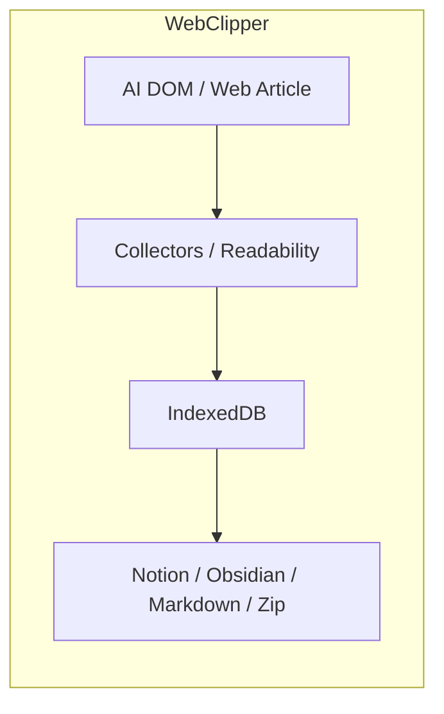

# 数据流

macOS/ 历史资料已归档；本页仅保留 WebClipper 的数据链路与外部同步说明。

## 主要流程总览

| 流程 | 起点 | 中间层 | 终点 | 增量 / 重建策略 |
| --- | --- | --- | --- | --- |
| WebClipper 自动采集 | 支持站点 DOM | content controller → collectors → background storage | IndexedDB conversations / messages | 基于 runtime observer 与增量快照 |
| WebClipper 手动保存网页 | 当前普通网页 | `Readability` 抽取 → article conversation | IndexedDB `article` 会话 | 重新抓取后按 `updatedAt` 决定下游是否重建 |
| WebClipper 文章评论 / 注释线程 | article detail / inpage comments panel | comments handlers → `article_comments` store → panel refresh | IndexedDB `article_comments` + shared session panel refresh | local-first / orphan attach |
| WebClipper 外部同步 | popup / app 中选中的会话 | Notion / Obsidian orchestrator | Notion 页面、Obsidian 文件、导出文件 | 基于 cursor、目标存在性和目标结构决定 append / rebuild |

## WebClipper：从页面到本地会话

### 1. 支持 AI 对话页面
1. `content.ts` 在所有 `http(s)` 页面注入内容脚本。
2. `src/services/bootstrap/content.ts` 先判断当前 host 是否属于支持站点；非支持站点是否显示 inpage UI 还取决于 `inpage_display_mode`（并兼容旧 `inpage_supported_only`）。
3. collectors registry 识别具体站点，把 DOM 统一为 `conversation + messages`。
4. background conversation handlers 处理 `SYNC_CONVERSATION_MESSAGES`，并把快照写入 IndexedDB；UI 通过相同存储读会话列表与详情。
5. 当 `ai_chat_cache_images_enabled = true` 且 `sourceType !== 'article'` 时，handler 会在写入前尝试把消息图片内联到 `contentMarkdown`（失败不阻塞主链路）。
- 若 `ai_chat_dollar_mention_enabled = true` 且当前站点在 `SUPPORTED_AI_CHAT_SITES` 中启用 `features.dollarMention`，content runtime 会启动 `$ mention` controller：输入框内 `$` 触发候选搜索（`ITEM_MENTION_MESSAGE_TYPES.SEARCH_MENTION_CANDIDATES`），选中后构建并插入 conversation markdown（`ITEM_MENTION_MESSAGE_TYPES.BUILD_MENTION_INSERT_TEXT`）。该链路只读取本地 IndexedDB，不涉及外部 API。
- Gemini 采集链会主动过滤 `.cdk-visually-hidden` 与 `[hidden]` 里的噪音文案，并把 blob 上传图内联为 `data:image/*`；Kimi 与 z.ai 则扩大附件卡片抓图范围，减少“消息有图但落库丢图”。
- 图片内联失败会被记录并继续写入消息：设计目标是“先保证会话可保存”，而不是因为图片链路失败导致整条采集失败。

### 2. 普通网页文章
1. 用户手动触发“保存当前页”或网页端保存按钮。
2. background 向当前 tab 注入 `readability.js`，尝试抽取标题、作者、发布时间、HTML、markdown 和纯文本。
3. 抓取结果会被写成 `source='web'`, `sourceType='article'` 的 conversation，并同步一条 `messageKey = 'article_body'` 的正文消息。
4. background 再广播 `conversationsChanged`，让 popup / app 刷新列表。

### 3. 为什么有些来源不自动增量保存
- Google AI Studio 使用虚拟化渲染；自动 observer 常常只能看到当前可见 turns，容易覆盖历史，因此该来源保留“手动保存优先”的策略。
- inpage 单击触发保存，双击打开页面内评论侧边栏（inpage comments panel），多击只触发彩蛋提示，不直接改变数据链路。

### 4. 会话详情里的手动图片补全（cache-images）
1. 用户在 chat detail header 触发 `cache-images` 工具动作（article 不显示该动作）。
2. 前端通过 `BACKFILL_CONVERSATION_IMAGES` 消息调用 background job，并附带 `conversationId` 与 `conversationUrl`。
3. `image-backfill-job.ts` 读取该会话全部消息，复用 `inlineChatImagesInMessages()` 重新内联图片，并用 incremental diff 回写仅变化的消息。
4. 完成后 background 广播 `conversationsChanged`，前端刷新 detail，并向用户反馈 `updatedMessages / downloadedCount / fromCacheCount`。

### 5. 文章评论 / 注释线程
1. 用户在 article detail 或 inpage comments panel 中打开评论区。
2. `ArticleCommentsSection.tsx` 先按 canonical URL 读取 `article_comments`，并把结果交给 threaded panel。
3. 新评论、回复、删除与 orphan attach 都通过 comments background handlers 统一落库；`conversationId` 解析出来后会刷新 detail。
4. 面板的 open / close / quote / focus / busy 由 shared session 统一调度；评论线程可选使用 `locator` 恢复 Range/上下文（TextQuote/TextPosition selectors），但不做“持久高亮回显”式的正文标注。
5. Zip v2 备份会把 `article_comments` 写入 `assets/article-comments/index.json`，导入时按 merge 规则把评论线程恢复回本地库。

## WebClipper：从本地会话到外部目标

| 目标 | 真实输入 | 判定逻辑 | 结果 |
| --- | --- | --- | --- |
| Notion | 本地 conversation + messages + mapping + kind 定义 | `conversation-kinds.ts` 决定 DB / page schema；cursor 匹配则 append，不匹配或目标要求重建则 full rebuild | `SyncNos-AI Chats` / `SyncNos-Web Articles` 等数据库与页面 |
| Obsidian | 本地 conversation + messages + settings | 先决定 `incremental_append` 还是 `full_rebuild`；PATCH 失败时回退 full rebuild | `SyncNos-AIChats` / `SyncNos-WebArticles` 目录下笔记 |
| Markdown / Zip 导出 | 本地 conversation + messages | 不依赖外部 API，直接按本地事实生成 | 用户本地文件系统 |
| 备份导入导出 | IndexedDB + `chrome.storage.local` | 以 Zip v2 为主，导入是 merge 而不是覆盖；会一并保留 `image_cache` 与 `article_comments` | 供迁移 / 恢复使用的本地备份 |

- 对 WebClipper 而言，外部目标都不是事实源；**事实源只有 IndexedDB 与非敏感 `chrome.storage.local`**。
- `conversationKinds` 当前定义了 `chat` 和 `article` 两种 kind：前者默认进入 `SyncNos-AI Chats` / `SyncNos-AIChats`，后者进入 `SyncNos-Web Articles` / `SyncNos-WebArticles`。

### Notion：OAuth 连接、Parent Page 刷新与手动同步

1. **连接（OAuth）**：Settings UI 生成随机 `state`，写入本地 pending key，并打开 Notion authorize URL；background 监听 OAuth 回调 URL，校验 `state` 后通过 Cloudflare Worker 交换 token，成功后写入 token store，并清理 pending/error 状态（UI 会通过 `GET_AUTH_STATUS` polling 刷新连接状态）。
2. **Parent Page 刷新**：Settings UI 通过 background router 调用 `LIST_PARENT_PAGES`；background 会读取已保存 page id 并调用 `listNotionParentPages()` 统一执行 `/v1/search` 分页、过滤不可用页面，并在必要时 resolve 已保存 page id，返回 `{ pages, resolvedSaved }` 供 UI 兜底展示。
3. **手动同步**：会话列表选择会话后触发 `notionSyncConversations(conversationIds[])`；background 会先做 sync provider gate、token/parentPageId 校验与“是否已有 running job”判断，再启动 orchestrator detached job，并在结束时广播 `conversationsChanged` 刷新 UI。

> 存储键与门控键的命名以 `configuration.md` 为准（避免多处重复维护同一份 key 列表）。

## 状态、游标与映射

| 状态对象 | 位置 | 关键字段 | 作用 |
| --- | --- | --- | --- |
| WebClipper `sync_mappings` | IndexedDB | `notionPageId`, `lastSyncedMessageKey`, `lastSyncedSequence`, `lastSyncedAt` | 决定 Notion / Obsidian 是否可增量追加 |
| WebClipper conversation | IndexedDB | `sourceType`, `source`, `conversationKey`, `lastCapturedAt` | UI 排序、导出、同步、备份的基础 |
| WebClipper message | IndexedDB | `messageKey`, `sequence`, `updatedAt`, `contentMarkdown` | 生成 Notion blocks / Markdown / Obsidian 内容；图片可在实时采集或 backfill 时内联更新 |
| WebClipper `article_comments` | IndexedDB | `canonicalUrl`, `conversationId`, `parentId`, `quoteText`, `commentText`, `locator?` | article 详情页的本地评论线程与回复 / 删除 |
| WebClipper 图片缓存开关 | `chrome.storage.local` | `ai_chat_cache_images_enabled` | 控制 chat 消息图片内联策略；历史消息需手动触发 backfill |

## 图表

## 常见失败模式与恢复

| 失败模式 | 发生位置 | 典型表现 | 恢复方向 |
| --- | --- | --- | --- |
| Parent Page / token 缺失 | WebClipper Notion 同步前 | 直接阻止写入或报错 | 回到配置页补齐授权与 Parent Page |
| Parent Page 列表加载失败 / 429 | WebClipper Notion 设置页 | 下拉为空、提示稍后重试或显示 retry seconds | 等待后重试；检查 Notion 连接状态与限流；必要时断开重连 |
| article 抽取失败 | WebClipper article fetch | `No article content detected` | 检查页面是否有足够正文或改用支持站点保存 |
| 缓存图片按钮不可见或“点了没变化” | WebClipper detail tools / backfill job | article 会话无按钮，或回填结果 `updatedMessages=0` | 先确认是 chat 会话，再检查消息里是否存在可下载图片链接 |
| 旧版或被裁剪的备份不含文章评论 | WebClipper comments / backup | 旧备份或缺失 `assets/article-comments/index.json` 时，恢复后看不到评论线程 | 当前版本的 Zip v2 已覆盖该链路；若遇到旧备份，先确认是否缺少该索引文件 |
| cursor 缺失或不匹配 | WebClipper Notion / Obsidian | 从 append 退回 rebuild | 检查本地 mapping 和目标文件 / 页面状态 |
| Obsidian PATCH 失败 | Obsidian orchestrator | 增量追加失败 | orchestrator 自动回退 full rebuild |
| 发布版本不一致 | workflow | `manifest version mismatch` | 检查 `wxt.config.ts` 与 tag |

## 来源引用（Source References）
- `webclipper/src/entrypoints/content.ts`
- `webclipper/src/services/bootstrap/content.ts`
- `webclipper/src/services/bootstrap/content-controller.ts`
- `webclipper/src/services/conversations/background/handlers.ts`
- `webclipper/src/services/conversations/background/image-backfill-job.ts`
- `webclipper/src/services/conversations/client/repo.ts`
- `webclipper/src/services/comments/background/handlers.ts`
- `webclipper/src/services/comments/client/repo.ts`
- `webclipper/src/services/comments/data/storage-idb.ts`
- `webclipper/src/ui/conversations/ArticleCommentsSection.tsx`
- `webclipper/src/services/comments/threaded-comments-panel.ts`
- `webclipper/src/ui/inpage/inpage-comments-panel-shadow.ts`
- `webclipper/src/services/bootstrap/inpage-comments-panel-content-handlers.ts`
- `webclipper/src/services/comments/sidebar/comment-sidebar-session.ts`
- `webclipper/src/ui/conversations/conversations-context.tsx`
- `webclipper/src/services/sync/backup/export.ts`
- `webclipper/src/services/sync/backup/import.ts`
- `webclipper/src/services/sync/backup/backup-utils.ts`
- `webclipper/src/collectors/gemini/gemini-collector.ts`
- `webclipper/src/collectors/kimi/kimi-collector.ts`
- `webclipper/src/collectors/zai/zai-collector.ts`
- `webclipper/src/collectors/web/article-fetch.ts`
- `webclipper/src/collectors/web/article-fetch-background-handlers.ts`
- `webclipper/src/services/conversations/data/storage-idb.ts`
- `webclipper/src/platform/messaging/message-contracts.ts`
- `webclipper/src/services/sync/background-handlers.ts`
- `webclipper/src/services/sync/sync-provider-gate.ts`
- `webclipper/src/services/sync/notion/auth/oauth.ts`
- `webclipper/src/services/sync/notion/auth/token-store.ts`
- `webclipper/src/services/sync/notion/settings-background-handlers.ts`
- `webclipper/src/services/sync/notion/notion-parent-pages.ts`
- `webclipper/src/services/integrations/item-mention/background-handlers.ts`
- `webclipper/src/services/integrations/item-mention/mention-search.ts`
- `webclipper/src/services/protocols/conversation-kinds.ts`
- `webclipper/src/services/sync/notion/notion-sync-orchestrator.ts`
- `webclipper/src/services/sync/obsidian/obsidian-sync-orchestrator.ts`

## 更新记录（Update Notes）
- 2026-03-30：补齐 WebClipper Notion 设置侧数据流（OAuth pending/error、Parent Page 列表刷新与 resolve 逻辑、sync provider gate 的前置校验）。
- 2026-03-29：同步 inpage 双击行为为“打开页面内评论侧边栏（inpage comments panel）”，并补充 `$ mention` 的本地候选搜索与插入链路说明。
