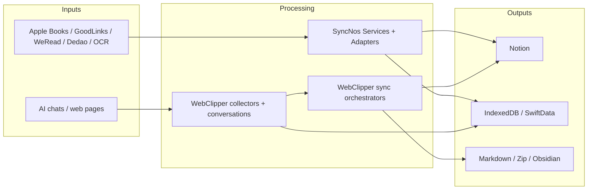

# 数据流

## 主要流程
| 流程 | 起点 | 中间层 | 终点 | 增量策略 |
| --- | --- | --- | --- | --- |
| App 阅读同步 | 本地数据库 / Cookie / OCR 输入 | Services → Adapter → `NotionSyncEngine` | Notion 页面与同步状态 | 优先依赖稳定标识，仅同步新增或变更内容。 |
| WebClipper 自动采集 | 支持站点 DOM | content script → collectors → conversations | IndexedDB / `chrome.storage.local` | 基于页面观察与增量更新持续写入本地。 |
| WebClipper 手动同步 | Popup / App 中选中的会话 | background router → sync orchestrator | Notion / Obsidian / 导出文件 | 根据 cursor、frontmatter 和目标存在性决定追加或重建。 |

## 分步说明
### 1. SyncNos App：阅读内容进入 Notion
1. 用户在 App 中授权目录、登录站点或导入 OCR 输入。
2. 对应 `Services/DataSources-From/*` 读取原始内容并转换为 DTO。
3. ViewModel 触发 `NotionSyncEngine + Adapter`，统一生成可写入 Notion 的结构。
4. App 更新本地缓存、同步时间戳与任务状态，供后续增量同步复用。

### 2. WebClipper：页面内容进入本地数据库
1. `content.ts` 为所有 `http(s)` 页面加载运行时环境。
2. collectors registry 识别当前站点，抽取对话消息或文章正文。
3. content script 通过消息协议把内容发送给 background。
4. background handlers 把会话与消息写入 conversations 数据层，并更新 UI 事件。

### 3. WebClipper：从本地会话进入外部目标
1. 用户在 popup / app 中选择导出、同步到 Obsidian、备份导入导出或同步到 Notion。
2. background 侧 orchestrator 读取本地会话与设置。
3. 同步层根据 target 选择 Markdown / Zip、Local REST API 或 Notion blocks 写入策略。
4. UI 再读取结果状态，决定是否提示、刷新列表或要求重试。

## 输入与输出（Inputs and Outputs）
输入/输出在下表中汇总。

| 类型 | 名称 | 位置 | 说明 |
| --- | --- | --- | --- |
| 输入 | Apple Books / GoodLinks 数据库 | `SyncNos/Services/DataSources-From/` | App 从本地数据库读取高亮、笔记和元数据。 |
| 输入 | WeRead / Dedao Cookie | `SyncNos/Services/SiteLogins/`, `DataSources-From/` | App 用站点会话抓取在线内容。 |
| 输入 | 聊天截图 / OCR 内容 | `SyncNos/Services/DataSources-From/OCR/` | App 解析聊天截图为可同步消息。 |
| 输入 | AI 对话 DOM / 文章正文 | `Extensions/WebClipper/src/collectors/` | 扩展采集页面中的消息和正文。 |
| 输入 | 用户设置 | UserDefaults / `chrome.storage.local` | 决定同步目标、按钮可见性和本地路径。 |
| 输出 | Notion 数据库与页面 | Notion Parent Page | 两条产品线都把最终内容整理成 Notion 结构。 |
| 输出 | IndexedDB / SwiftData 缓存 | 本地存储 | 用于增量同步、UI 列表和回显。 |
| 输出 | Markdown / Zip / Obsidian 文件 | 用户文件系统 / 本地 vault | 仅 WebClipper 负责导出和本地知识库同步。 |

## 数据结构
| 结构 | 位置 / 来源 | 关键字段 / 组成 | 用途 |
| --- | --- | --- | --- |
| 统一条目 + 内容片段 | `.github/docs/business-logic.md` | 条目元数据 + 高亮 / 笔记 / 消息 / 正文 | 作为“来源异构 → 同步统一”的中间抽象。 |
| 会话与消息 | `Extensions/WebClipper/src/conversations/` | `source`, `conversationKey`, messages | 作为扩展本地数据库的基本对象。 |
| Zip v2 备份 | `Extensions/WebClipper/AGENTS.md` | `manifest.json`, `sources/conversations.csv`, `config/storage-local.json` | 支撑合并导入和跨设备恢复。 |
| 同步状态 | `SyncNos/SyncNosApp.swift`, `SyncNos/Services/` | 最后同步时间、队列状态、运行任务 | 支撑增量同步和退出确认。 |

## 图表




## 状态与存储
| 存储层 | 主要写入方 | 内容 | 说明 |
| --- | --- | --- | --- |
| SwiftData / 本地 store | App Services | 书籍、文章、同步状态与缓存 DTO | `@ModelActor` 模式负责后台安全访问。 |
| UserDefaults | App | 自动同步开关、调试引导、字体缩放等级 | 启动阶段即会读取。 |
| Keychain / 受控存储 | App | 授权与加密相关敏感数据 | 业务文档强调敏感信息尽量只留在本地。 |
| IndexedDB | WebClipper | conversations / messages | 支撑会话列表、增量更新与导出。 |
| `chrome.storage.local` | WebClipper | 非敏感设置、按钮开关、同步配置 | 备份时会排除敏感键。 |
| Notion / Obsidian | 双产品线 / WebClipper | 外部最终产物 | 分别是云端知识库和本地 vault。 |

## 示例片段
### 片段 1：WebClipper 的消息协议直接体现数据流方向
```ts
export const CORE_MESSAGE_TYPES = {
  UPSERT_CONVERSATION: 'upsertConversation',
  SYNC_CONVERSATION_MESSAGES: 'syncConversationMessages',
  GET_CONVERSATIONS: 'getConversations'
} as const;
```

### 片段 2：App 在启动阶段就决定是否进入自动同步链路
```swift
let autoSyncEnabled = UserDefaults.standard.bool(forKey: "autoSync.appleBooks")
    || UserDefaults.standard.bool(forKey: "autoSync.goodLinks")
    || UserDefaults.standard.bool(forKey: "autoSync.weRead")
if autoSyncEnabled { DIContainer.shared.autoSyncService.start() }
```

## 失败模式
| 场景 | 失败点 | 当前处理 / 降级 |
| --- | --- | --- |
| App 未完成 Notion 授权 | 无法决定写入落点 | 阻止需要写入 Notion 的入口并给出提示。 |
| 站点 Cookie 失效 | WeRead / Dedao 抓取失败 | 提示用户重新登录。 |
| OCR 识别不足 | 无法形成可用消息 | 记录统计或失败信息，避免写入噪声内容。 |
| collector 适配失效 | 页面结构变化 | 尽量保留可识别内容并给出诊断。 |
| Obsidian 连接失败 | 端口、插件、API Key 不正确 | Settings 中测试连接并提示修复。 |
| 发布版本号不一致 | manifest 版本与 tag 不匹配 | workflow 直接失败，阻止错误产物发布。 |

## 来源引用（Source References）
- `README.md`
- `Resource/flows.svg`
- `.github/docs/business-logic.md`
- `SyncNos/SyncNosApp.swift`
- `SyncNos/AppDelegate.swift`
- `SyncNos/Services/Core/DIContainer.swift`
- `SyncNos/Services/AGENTS.md`
- `Extensions/WebClipper/AGENTS.md`
- `Extensions/WebClipper/src/entrypoints/content.ts`
- `Extensions/WebClipper/src/entrypoints/background.ts`
- `Extensions/WebClipper/src/platform/messaging/message-contracts.ts`
- `.github/guide/obsidian/LocalRestAPI.zh.md`
