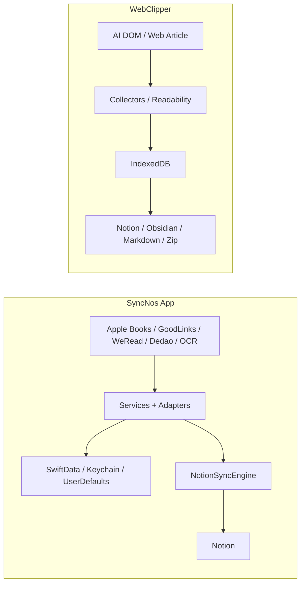

# 数据流

## 主要流程总览

| 流程 | 起点 | 中间层 | 终点 | 增量 / 重建策略 |
| --- | --- | --- | --- | --- |
| App 阅读同步 | 本地数据库、登录态、OCR 输入 | Services → Adapter → `NotionSyncEngine` | Notion 页面 / 数据库 | 基于条目时间戳、已同步映射与统一高亮结构 |
| WebClipper 自动采集 | 支持站点 DOM | content controller → collectors → background storage | IndexedDB conversations / messages | 基于 runtime observer 与增量快照 |
| WebClipper 手动保存网页 | 当前普通网页 | `Readability` 抽取 → article conversation | IndexedDB `article` 会话 | 重新抓取后按 `updatedAt` 决定下游是否重建 |
| WebClipper 外部同步 | popup / app 中选中的会话 | Notion / Obsidian orchestrator | Notion 页面、Obsidian 文件、导出文件 | 基于 cursor、目标存在性和目标结构决定 append / rebuild |

## SyncNos App：从来源到 Notion

| 阶段 | 入口 | 主要动作 | 结果 |
| --- | --- | --- | --- |
| 启动与门控 | `SyncNosApp.swift`, `RootView.swift` | 预热 IAP、自动同步、缓存服务；按需进入 onboarding / paywall | 用户看到正确的起始界面 |
| 读取来源 | `Services/DataSources-From/` | 读取 Apple Books / GoodLinks、本地登录态、OCR 结果 | 统一的条目与高亮输入 |
| 统一同步 | `NotionSyncSourceProtocol` + `NotionSyncEngine` | ensure DB / page / properties、取高亮、写 blocks / 属性、记录 pageId | 稳定的 Notion 结构 |
| 状态更新 | `SyncTimestampStore`, `SyncedHighlightStore`, 缓存服务 | 更新时间戳、已同步映射、本地缓存 | 为后续增量同步提供事实依据 |

- `NotionSyncEngine` 在 single-database 与 per-book-database 两种策略之间切换。
- `EnsureCache` 会去重同一数据库 / 属性的并发 ensure，降低批量同步里的冲突和长时间无进度。
- `NotionSyncConfig` 当前默认 `batchConcurrency = 3`、读取 `8 RPS`、写入 `3 RPS`、`append batch size = 50`、请求超时 `120s`。

## WebClipper：从页面到本地会话

### 1. 支持 AI 对话页面
1. `content.ts` 在所有 `http(s)` 页面注入内容脚本。
2. `bootstrap/content.ts` 先判断当前 host 是否属于支持站点；非支持站点是否显示 inpage UI 还取决于 `inpage_supported_only`。
3. collectors registry 识别具体站点，把 DOM 统一为 `conversation + messages`。
4. background conversation handlers 把快照写入 IndexedDB；UI 通过相同存储读会话列表与详情。

### 2. 普通网页文章
1. 用户手动触发“保存当前页”或网页端保存按钮。
2. background 向当前 tab 注入 `readability.js`，尝试抽取标题、作者、发布时间、HTML、markdown 和纯文本。
3. 抓取结果会被写成 `source='web'`, `sourceType='article'` 的 conversation，并同步一条 `messageKey = 'article_body'` 的正文消息。
4. background 再广播 `conversationsChanged`，让 popup / app 刷新列表。

### 3. 为什么有些来源不自动增量保存
- Google AI Studio 使用虚拟化渲染；自动 observer 常常只能看到当前可见 turns，容易覆盖历史，因此该来源保留“手动保存优先”的策略。
- inpage 单击触发保存，双击尝试打开 popup，多击只触发彩蛋提示，不直接改变数据链路。

## WebClipper：从本地会话到外部目标

| 目标 | 真实输入 | 判定逻辑 | 结果 |
| --- | --- | --- | --- |
| Notion | 本地 conversation + messages + mapping + kind 定义 | `conversation-kinds.ts` 决定 DB / page schema；cursor 匹配则 append，不匹配或目标要求重建则 full rebuild | `SyncNos-AI Chats` / `SyncNos-Web Articles` 等数据库与页面 |
| Obsidian | 本地 conversation + messages + settings | 先决定 `incremental_append` 还是 `full_rebuild`；PATCH 失败时回退 full rebuild | `SyncNos-AIChats` / `SyncNos-WebArticles` 目录下笔记 |
| Markdown / Zip 导出 | 本地 conversation + messages | 不依赖外部 API，直接按本地事实生成 | 用户本地文件系统 |
| 备份导入导出 | IndexedDB + `chrome.storage.local` | 以 Zip v2 为主，导入是 merge 而不是覆盖 | 供迁移 / 恢复使用的本地备份 |

- 对 WebClipper 而言，外部目标都不是事实源；**事实源只有 IndexedDB 与非敏感 `chrome.storage.local`**。
- `conversationKinds` 当前定义了 `chat` 和 `article` 两种 kind：前者默认进入 `SyncNos-AI Chats` / `SyncNos-AIChats`，后者进入 `SyncNos-Web Articles` / `SyncNos-WebArticles`。

## 状态、游标与映射

| 状态对象 | 位置 | 关键字段 | 作用 |
| --- | --- | --- | --- |
| App 同步时间戳 | App stores / services | `lastSyncTime` 等 | 决定下一次是全量还是增量 |
| App 已同步高亮映射 | `synced-highlights.store` | Notion 子项映射 | 避免重复遍历 Notion children |
| WebClipper `sync_mappings` | IndexedDB | `notionPageId`, `lastSyncedMessageKey`, `lastSyncedSequence`, `lastSyncedAt` | 决定 Notion / Obsidian 是否可增量追加 |
| WebClipper conversation | IndexedDB | `sourceType`, `source`, `conversationKey`, `lastCapturedAt` | UI 排序、导出、同步、备份的基础 |
| WebClipper message | IndexedDB | `messageKey`, `sequence`, `updatedAt`, `contentMarkdown` | 生成 Notion blocks / Markdown / Obsidian 内容 |

## 图表

## 常见失败模式与恢复

| 失败模式 | 发生位置 | 典型表现 | 恢复方向 |
| --- | --- | --- | --- |
| Parent Page / token 缺失 | App / WebClipper Notion 同步前 | 直接阻止写入或报错 | 回到配置页补齐授权与 Parent Page |
| 登录态过期 | App 在线来源 | WeRead / Dedao 无法抓取 | 重新登录并更新 `SiteLoginsStore` |
| article 抽取失败 | WebClipper article fetch | `No article content detected` | 检查页面是否有足够正文或改用支持站点保存 |
| cursor 缺失或不匹配 | WebClipper Notion / Obsidian | 从 append 退回 rebuild | 检查本地 mapping 和目标文件 / 页面状态 |
| Obsidian PATCH 失败 | Obsidian orchestrator | 增量追加失败 | orchestrator 自动回退 full rebuild |
| 发布版本不一致 | workflow | `manifest version mismatch` | 检查 `wxt.config.ts` 与 tag |

## 来源引用（Source References）
- `SyncNos/SyncNosApp.swift`
- `SyncNos/Views/RootView.swift`
- `SyncNos/Services/SyncScheduling/AutoSyncService.swift`
- `SyncNos/Services/DataSources-To/Notion/Sync/NotionSyncEngine.swift`
- `SyncNos/Services/DataSources-To/Notion/Config/NotionSyncConfig.swift`
- `Extensions/WebClipper/src/entrypoints/content.ts`
- `Extensions/WebClipper/src/bootstrap/content.ts`
- `Extensions/WebClipper/src/bootstrap/content-controller.ts`
- `Extensions/WebClipper/src/collectors/web/article-fetch.ts`
- `Extensions/WebClipper/src/collectors/web/article-fetch-background-handlers.ts`
- `Extensions/WebClipper/src/conversations/data/storage-idb.ts`
- `Extensions/WebClipper/src/protocols/conversation-kinds.ts`
- `Extensions/WebClipper/src/sync/notion/notion-sync-orchestrator.ts`
- `Extensions/WebClipper/src/sync/obsidian/obsidian-sync-orchestrator.ts`
