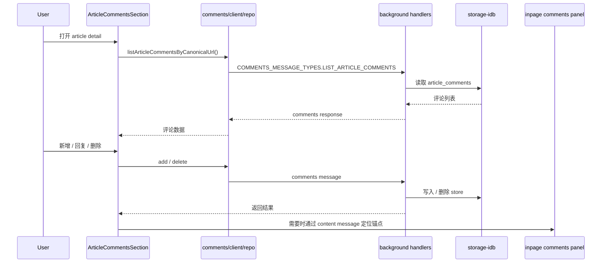

# 模块：文章评论 / 注释线程

## 职责
- 为 WebClipper 的 article 会话提供本地优先的 threaded comments。
- 允许用户在 article detail 或 inpage comments panel 中添加、回复、删除评论，并把评论锚定到正文文本。
- 当前定位是**本地注释层**：它是 article 会话的一部分，但不进入 Notion / Obsidian / Zip v2 导出。

## 关键文件

| 路径 | 作用 | 为什么重要 |
| --- | --- | --- |
| `src/comments/data/storage-idb.ts` | 评论存储层 | 负责 `article_comments` 的本地读写、查询、附着 orphan 评论 |
| `src/comments/background/handlers.ts` | 评论消息路由 | 把 add / list / delete / attach-orphan 等消息接到 IndexedDB |
| `src/comments/client/repo.ts` | UI 侧客户端仓库 | 给 React 组件提供 add / list / delete API |
| `src/ui/conversations/ArticleCommentsSection.tsx` | article 详情评论区 | 在 article detail 中展示和刷新本地评论线程 |
| `src/ui/comments/threaded-comments-panel.ts` | threaded comments 渲染器 | 负责评论树、编辑器、按钮状态与面板交互 |
| `src/ui/inpage/inpage-comments-panel-shadow.ts` | inpage comments 面板壳 | 让页面内评论面板运行在独立 shadow root 中 |
| `src/bootstrap/inpage-comments-panel-content-handlers.ts` | inpage comments content bridge | 负责打开 panel、解析选区、首次解析 article 后附着 orphan 评论 |
| `src/bootstrap/inpage-comments-locate-content-handlers.ts` | 评论锚点定位桥 | 把 quoteText + quoteContext 转成 DOM 高亮定位 |
| `src/platform/messaging/message-contracts.ts` | 消息契约 | 定义 `COMMENTS_MESSAGE_TYPES`、`CONTENT_MESSAGE_TYPES.OPEN_INPAGE_COMMENTS_PANEL`、`LOCATE_INPAGE_COMMENT_ANCHOR` |
| `src/platform/idb/schema.ts` | IndexedDB schema | 在 `DB_VERSION = 7` 时创建 `article_comments` store 和索引 |
| `tests/storage/article-comments-idb.test.ts` | 存储测试 | 覆盖 add / list / delete / replies / orphan attachment |

## 存储模型

| 项目 | 说明 | 备注 |
| --- | --- | --- |
| store 名称 | `article_comments` | WebClipper 的独立 object store |
| 主键 | `id` 自增 | 便于回复树与删除操作 |
| 主要字段 | `canonicalUrl`, `conversationId`, `parentId`, `quoteText`, `quoteContext`, `commentText`, `createdAt`, `updatedAt` | `canonicalUrl` 会去掉 hash 后再归一 |
| 索引 | `by_canonicalUrl_createdAt`, `by_conversationId_createdAt` | 支持按 article 和按会话两种读取路径 |
| 线程关系 | `parentId` | `null` 表示 root comment；非空表示 reply |
| orphan 处理 | `conversationId = null` | 页面未解析出会话时先落本地，随后 attach |

- `article_comments` 是 article 的本地注释层，不参与 Notion / Obsidian 的增量同步。
- 目前 Zip v2 备份不会带回 `article_comments`；如果用户依赖恢复，这一点要单独提醒。
- `quoteContext` 只保存少量前后文（`prefix` / `suffix`），用于锚点定位时提高命中率，但不是全文备份。

## 运行流程

### 文章详情页
1. `ArticleCommentsSection.tsx` 根据 `canonicalUrl` 读取评论列表，并把结果交给 `threaded-comments-panel`。
2. 组件会监听 `UI_EVENT_TYPES.CONVERSATIONS_CHANGED`；如果变化的 `conversationId` 与当前详情匹配，就刷新本地评论。
3. 新评论和回复都会先写入 IndexedDB，然后再刷新 UI。
4. 删除操作会直接走 background handler，再由组件刷新列表。

### Inpage comments panel
1. 用户从页面内入口打开评论面板。
2. `inpage-comments-panel-content-handlers.ts` 先解析选区 / quoteText，再尝试解析 article 对应的 `canonicalUrl` 和 `conversationId`。
3. 若 article 还没建立 conversation，系统会先捕获/解析 article，再把 orphan 评论附着到新的 conversation。
4. 面板内的“定位”动作会把 `quoteText + quoteContext` 交给内容脚本里的 text-quote 定位器，高亮正文锚点。

## 消息契约

| 契约 | 作用 | 依赖方 |
| --- | --- | --- |
| `COMMENTS_MESSAGE_TYPES.ADD_ARTICLE_COMMENT` | 新增评论 / 回复 | `ArticleCommentsSection`, inpage comments panel |
| `COMMENTS_MESSAGE_TYPES.LIST_ARTICLE_COMMENTS` | 读取评论列表 | article detail, inpage comments panel |
| `COMMENTS_MESSAGE_TYPES.DELETE_ARTICLE_COMMENT` | 删除评论 | article detail, inpage comments panel |
| `COMMENTS_MESSAGE_TYPES.ATTACH_ORPHAN_ARTICLE_COMMENTS` | 把先前无 conversation 的评论附着到 article | inpage comments panel |
| `CONTENT_MESSAGE_TYPES.OPEN_INPAGE_COMMENTS_PANEL` | 打开页面内评论面板 | context menu / content bridge |
| `CONTENT_MESSAGE_TYPES.LOCATE_INPAGE_COMMENT_ANCHOR` | 定位正文锚点 | `ArticleCommentsSection.tsx`, inpage comments panel |

- 评论相关消息会通过 background handlers 统一落库，而不是直接在 UI 中操作 IndexedDB。
- `COMMENTS_MESSAGE_TYPES.LIST_ARTICLE_COMMENTS` 支持按 `canonicalUrl` 或 `conversationId` 读取，方便 article detail 与 orphan attach 两条路径共用。
- `UI_EVENT_TYPES.CONVERSATIONS_CHANGED` 会在新增 / 附着评论后广播，用来刷新 article detail。

## 测试与回归

| 文件 | 覆盖点 | 说明 |
| --- | --- | --- |
| `tests/storage/article-comments-idb.test.ts` | add / list / delete / replies / orphan attachment | 当前最直接的存储回归入口 |

- 评论线程改动至少要跑 `tests/storage/article-comments-idb.test.ts`。
- 若涉及锚点定位或 inpage 面板，建议再做一次 article detail + 页面内面板的人工冒烟。
- 备份 / 导入未覆盖 `article_comments`，因此如果你在做恢复链路改动，要把这条缺口放进验证清单。

## 修改热点
- **改评论数据结构**：先看 `comments/data/storage-idb.ts`、`src/platform/idb/schema.ts`、`tests/storage/article-comments-idb.test.ts`。
- **改 article detail UI**：先看 `ArticleCommentsSection.tsx`、`threaded-comments-panel.ts`。
- **改页面内评论面板**：先看 `inpage-comments-panel-shadow.ts`、`inpage-comments-panel-content-handlers.ts`、`inpage-comments-locate-content-handlers.ts`。
- **改消息契约**：先看 `message-contracts.ts` 和 background handlers，确保 UI / background / content 三端契约一致。

## 来源引用（Source References）
- `webclipper/src/comments/background/handlers.ts`
- `webclipper/src/comments/client/repo.ts`
- `webclipper/src/comments/data/storage-idb.ts`
- `webclipper/src/comments/anchor/text-quote-dom.ts`
- `webclipper/src/bootstrap/inpage-comments-panel-content-handlers.ts`
- `webclipper/src/bootstrap/inpage-comments-locate-content-handlers.ts`
- `webclipper/src/platform/idb/schema.ts`
- `webclipper/src/platform/messaging/message-contracts.ts`
- `webclipper/src/ui/conversations/ArticleCommentsSection.tsx`
- `webclipper/src/ui/comments/threaded-comments-panel.ts`
- `webclipper/src/ui/inpage/inpage-comments-panel-shadow.ts`
- `webclipper/tests/storage/article-comments-idb.test.ts`
