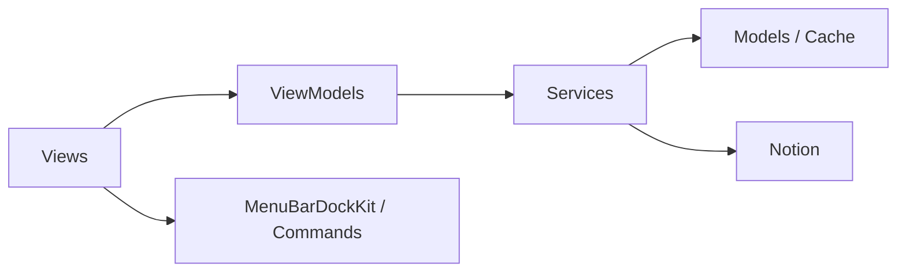

# 模块：SyncNos App

## 职责
- 负责把 Apple Books、GoodLinks、WeRead、Dedao 与聊天 OCR 的内容整理后同步到 Notion。
- 负责维护桌面端状态管理、窗口与菜单栏行为、同步队列、自动同步和本地安全存储。
- 通过 MVVM + Protocol-Oriented Programming 保持 UI、状态编排、数据访问与同步逻辑的边界清晰。

## 关键文件
| 路径 | 作用 | 为什么重要 |
| --- | --- | --- |
| `SyncNos/SyncNosApp.swift` | App 主入口与启动期预热 | 决定试用状态、自动同步、窗口结构。 |
| `SyncNos/AppDelegate.swift` | 生命周期与菜单栏 / Dock / 退出处理 | 管理 URL scheme、同步中退出确认。 |
| `SyncNos/Services/Core/DIContainer.swift` | 依赖装配根 | 体现“协议优先、惰性注入”的实现方式。 |
| `SyncNos/Services/` | 数据源、同步、搜索、调度 | App 的主要业务能力都在这里。 |
| `SyncNos/ViewModels/` | 视图状态与业务编排 | 保持 View 与 Service 解耦。 |
| `SyncNos/Views/` | SwiftUI UI 层 | 负责主界面、搜索面板、设置、日志等交互。 |
| `Packages/MenuBarDockKit/` | 菜单栏 / Dock 可复用能力 | 体现仓库对可复用 macOS 能力的抽离方式。 |

## 分层结构
| 层 | 主要目录 | 职责 | 典型关注点 |
| --- | --- | --- | --- |
| Models | `SyncNos/Models/` | DTO、缓存模型、通知名等纯数据结构 | 不应直接依赖 SwiftUI。 |
| Services | `SyncNos/Services/` | 数据访问、同步、鉴权、搜索、调度 | 协议注入、`@ModelActor`、错误处理。 |
| ViewModels | `SyncNos/ViewModels/` | 状态管理、业务编排、UI 绑定 | `@Observable`、依赖注入、避免单例。 |
| Views | `SyncNos/Views/` | SwiftUI 视图与交互 | 只触发 ViewModel，不直接碰数据库 / 网络。 |
| Packages | `Packages/` | 可复用非 UI 逻辑 / 桥接组件 | 保持依赖方向单向。 |

## 对外接口
| 接口 / 入口 | 位置 | 用途 | 备注 |
| --- | --- | --- | --- |
| `SyncNosApp` | `SyncNos/SyncNosApp.swift` | 组装 Scene、Commands 与启动行为 | App 的最外层入口。 |
| `AppDelegate` | `SyncNos/AppDelegate.swift` | 响应生命周期、回调和菜单栏模式 | 与 AppKit 交互的核心入口。 |
| `DIContainer.shared.*` | `SyncNos/Services/Core/DIContainer.swift` | 提供 service / store / engine 依赖 | 新服务应按统一方式注册。 |
| `NotionSyncEngine.sync(source:)` | `SyncNos/AGENTS.md` 描述的同步架构 | 统一处理数据库、页面与内容同步 | 通过 Adapter 接入新数据源。 |
| `syncnos://oauth/callback` | `SyncNos/Info.plist`, `AppDelegate.swift` | 接收 OAuth 回调 | 主要由认证流程使用。 |

## 输入与输出（Inputs and Outputs）
输入/输出在下表中汇总。

| 类型 | 名称 | 位置 | 说明 |
| --- | --- | --- | --- |
| 输入 | Apple Books / GoodLinks 本地数据库 | `Services/DataSources-From/` | 读取本地高亮、笔记与元数据。 |
| 输入 | WeRead / Dedao 登录态 | `Services/SiteLogins/`, `DataSources-From/` | 拉取在线阅读内容。 |
| 输入 | 聊天截图 / OCR 结果 | `Services/DataSources-From/OCR/` | 解析聊天内容并写入本地缓存。 |
| 输入 | 用户同步设置 | UserDefaults、Notion 配置 | 决定自动同步与写入目标。 |
| 输出 | Notion 数据库与页面 | Notion Parent Page | 最终知识库产物。 |
| 输出 | SwiftData / 本地缓存 | `Services/*Cache*` | 支撑列表、搜索、增量同步。 |
| 输出 | UI 状态与同步进度 | `ViewModels/`, `Views/` | 用户可见的排队、成功、失败信息。 |

## 配置
| 配置项 | 位置 | 默认 / 触发 | 作用 |
| --- | --- | --- | --- |
| `debug.forceOnboardingEveryLaunch` | `SyncNos/SyncNosApp.swift` | `false` | 调试时强制重复走引导流程。 |
| `autoSync.appleBooks` / `goodLinks` / `weRead` | `SyncNos/SyncNosApp.swift` | UserDefaults | 决定启动后是否自动开启增量同步。 |
| `SyncNos.FontScaleLevel` | `SyncNos/Services/Core/AGENTS.md` | 本地保存值 | 控制字体、布局和键盘滚动体验。 |
| `syncnos` URL scheme | `SyncNos/Info.plist` | 固定 | 处理 OAuth 回调兜底。 |
| 菜单栏 / Dock 显示模式 | `Packages/MenuBarDockKit`, `AppDelegate.swift` | 取决于当前模式 | 控制主窗口关闭后的展示行为。 |

## 图表


## 示例片段
### 片段 1：App 会在启动时预热同步与缓存相关服务
```swift
_ = DIContainer.shared.syncActivityMonitor
_ = DIContainer.shared.syncQueueStore
_ = DIContainer.shared.weReadCacheService
_ = DIContainer.shared.syncedHighlightStore
```

### 片段 2：`@ModelActor` 约束 App 的后台 SwiftData 访问模式
```swift
@ModelActor
actor CacheService {
    func getAllBooks() throws -> [BookDTO] {
        let books = try modelContext.fetch(FetchDescriptor<Book>())
        return books.map { BookDTO(from: $0) }
    }
}
```

## 边界情况
| 场景 | 影响 | 对应机制 |
| --- | --- | --- |
| 目录未授权或数据库不可读 | Apple Books / GoodLinks 无法读取 | 需要用户显式授权目录。 |
| WeRead / Dedao Cookie 失效 | 在线来源抓取失败 | 需要重新登录。 |
| OCR 识别失败 | 不能形成可同步聊天消息 | 应提示失败并保留诊断线索。 |
| 同步进行中退出 App | 可能打断批量同步 | `AppDelegate` 会弹出确认框。 |
| 动态字体未正确接入 | UI 尺寸和滚动体验不一致 | 新窗口和根视图要调用 `.applyFontScale()`。 |

## 测试
| 验证面 | 推荐方式 | 关注点 |
| --- | --- | --- |
| 构建 | `xcodebuild -scheme SyncNos -configuration Debug build` | 工程与依赖完整可构建。 |
| ViewModel / Service 逻辑 | 单元测试或 mock 验证 | 数据转换、状态变化、边界条件。 |
| UI | `SwiftUI #Preview` + 人工验证 | 加载态、错误态、空态和主流程态。 |
| 同步冒烟 | 连接至少一个来源并完成一次同步 | Notion 中应出现对应数据库 / 页面。 |
| 键盘与焦点 | 参考专项文档手工验证 | 主窗口、搜索面板、快捷键隔离。 |

## 来源引用（Source References）
- `SyncNos/AGENTS.md`
- `SyncNos/SyncNosApp.swift`
- `SyncNos/AppDelegate.swift`
- `SyncNos/Info.plist`
- `SyncNos/Services/AGENTS.md`
- `SyncNos/Services/Core/AGENTS.md`
- `SyncNos/Services/Core/DIContainer.swift`
- `SyncNos/Services/DataSources-From/添加新数据源完整指南.md`
- `SyncNos/Services/DataSources-From/OCR/AppleVisionOCR技术文档.md`
- `SyncNos/ViewModels/`
- `SyncNos/Views/`
- `.github/docs/键盘导航与焦点管理技术文档（全项目）.md`
- `Packages/MenuBarDockKit/README.md`
