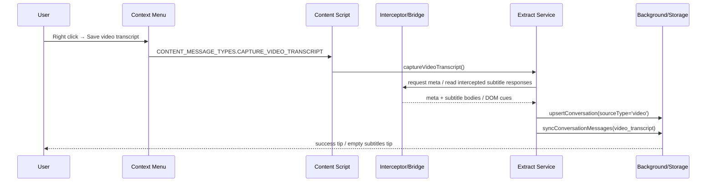

# 模块：视频字幕采集

## 职责
- 从 YouTube / Bilibili **已加载** 的字幕、转录或字幕面板中提取内容，保存为 `sourceType='video'` 的本地会话。
- 通过右键菜单 `Save video transcript` 与 Settings 里的 `Videos` 分区提供用户入口。
- 只做字幕/转录采集，不负责下载视频媒体；它仍然是 **local-first** 的本地事实源能力。
- 将采集结果写入与 chat/article 并列的 `conversations + messages` 结构，再由 Notion / Obsidian / Markdown / Zip 继承同一条下游链路。

| 业务概念 | 实际落点 | 约束 |
| --- | --- | --- |
| Video conversation | `sourceType='video'`, `conversationKey='video:${url}'` | 只面向支持的视频页 |
| Transcript message | `messageKey='video_transcript'` | 内容按时间戳格式化为 Markdown |
| 采集入口 | `VideosSection.tsx` + 右键菜单 | 仅采集已加载字幕 |
| 目标输出 | Notion / Obsidian / Markdown / Zip | 与其它会话类型共用同步/导出管线 |

## 关键文件

| 路径 | 作用 | 为什么重要 |
| --- | --- | --- |
| `src/ui/settings/sections/VideosSection.tsx` | Settings 页视频字幕分区 | 告诉用户支持范围、操作步骤与失败提示 |
| `src/platform/context-menus/clipper-context-menu.ts` | 右键菜单入口 | 注册 `Save video transcript`，把用户动作转成内容脚本消息 |
| `src/platform/messaging/message-contracts.ts` | 内容脚本消息契约 | 定义 `CONTENT_MESSAGE_TYPES.CAPTURE_VIDEO_TRANSCRIPT` |
| `src/entrypoints/content.ts` | content script 入口 | 注册 `video-transcript-capture-content-handlers` |
| `src/entrypoints/video-transcript-interceptor.content.ts` | 页面级拦截器 | 在 `document_start` 的 MAIN world 监听字幕请求与页面元信息 |
| `src/entrypoints/video-transcript-bridge.content.ts` | 页面内桥接存储 | 暂存字幕响应与 meta，供提取器读取 |
| `src/collectors/video/video-transcript-extract.ts` | 字幕提取主逻辑 | 负责 intercept -> DOM -> fallback 的提取顺序 |
| `src/collectors/video/video-transcript-parse.ts` | 字幕解析器 | 解析 WebVTT / YouTube JSON / Bilibili JSON |
| `src/services/bootstrap/video-transcript-capture.ts` | 视频采集服务 | 把 cues 转成会话 + transcript message |
| `src/services/bootstrap/video-transcript-capture-content-handlers.ts` | 内容脚本消息处理器 | 连接右键菜单与 capture service，并显示保存提示 |
| `src/services/url-cleaning/video-url.ts` | 视频 URL 规范化 | 统一 YouTube / Bilibili 的 canonical URL |
| `src/services/protocols/conversation-kinds.ts` | 会话类型定义 | 定义 `video` kind 及 Notion / Obsidian 目标 |
| `tests/smoke/video-kind.test.ts` | 会话 kind 冒烟测试 | 确认 `SyncNos-Videos` DB 规格没有回退 |

## 采集链路

### 1) 页面级拦截与元数据采集
- `video-transcript-interceptor.content.ts` 只匹配 `youtube.com/watch`, `youtu.be`, `bilibili.com/video` 等视频页。
- 该脚本以 `runAt: 'document_start'`、`world: 'MAIN'` 运行，能拦截页面内 `fetch` / `XMLHttpRequest` 对字幕资源的请求。
- 它还会通过 `window.postMessage` 向同页桥接请求页面元信息，例如标题、作者、时长、缩略图。
- `video-transcript-bridge.content.ts` 负责把这些响应暂存到 `__SYNCNOS_VIDEO_TRANSCRIPT_BRIDGE__`，供后续提取器读取。

### 2) 字幕提取与格式化
- `video-transcript-extract.ts` 的优先级固定为：**拦截响应 → DOM 字幕节点 → 空结果**。
- YouTube 优先读取 `youtube.com/api/timedtext`，支持 XML / JSON3 / WebVTT 等常见格式。
- Bilibili 优先读取 `/bfs/subtitle/` 与 `/bfs/ai_subtitle/`，DOM 回退则读取播放器字幕面板文本。
- `video-transcript-capture.ts` 会把 cue 列表格式化成 Markdown：
  - 有时间戳时使用 `mm:ss text` 或 `hh:mm:ss text`
  - 没有时间戳时仅保留文本行

### 3) 会话落库与下游派生
- 当字幕为空时，服务会直接返回 `subtitleStatus='empty'`，并不写入会话。
- 成功时会写入一个 `sourceType='video'` conversation，`conversationKey` 由 canonical URL 计算而来。
- 同时写入一条 `messageKey='video_transcript'` 的 transcript message，后续 Notion / Obsidian / Markdown / Zip 都读取同一份本地事实。
- Notion 侧映射为 `SyncNos-Videos` 数据库；Obsidian 侧映射为 `SyncNos-Videos` 文件夹。

## 数据模型与产物

| 字段 / 产物 | 说明 | 备注 |
| --- | --- | --- |
| `platform` | `youtube` / `bilibili` / `unknown` | 由 URL 和页面 meta 共同决定 |
| `title` | 视频标题 | 优先使用页面 meta，其次回退文档标题 |
| `author` | 作者 / UP 主 | 用于 Notion/Obsidian 属性 |
| `durationSeconds` | 视频时长（秒） | 非必填 |
| `thumbnailUrl` | 缩略图 | 用于 Notion 属性与列表展示 |
| `transcriptSource` | `A` / `B` / `C` | A=拦截响应，B=DOM，C=空/回退 |
| `hasTimestamps` | boolean | 是否保留时间戳 |
| `contentMarkdown` | 采集后的字幕正文 | 后续导出 / 同步统一消费 |
| `SyncNos-Videos` | Notion DB / Obsidian folder | 视频字幕的远端 / 本地落点 |

### Notion 属性映射

| Notion 字段 | 来源 |
| --- | --- |
| `Name` | `title` |
| `Date` | `lastCapturedAt` |
| `URL` | `url` |
| `Platform` | `platform` |
| `Author` | `author` |
| `Duration` | `durationSeconds` |
| `Thumbnail` | `thumbnailUrl` |
| `Transcript Source` | `transcriptSource` |
| `Has Timestamps` | `hasTimestamps` |

### Obsidian / Markdown 语义

| 输出面 | 行为 |
| --- | --- |
| Obsidian | 写入 `SyncNos-Videos` 文件夹，和 chat/article 一样走本地文件落盘 |
| Markdown | 直接输出 transcript 文本，保留 cue 顺序与时间戳 |
| Zip v2 | 走通用会话备份链路，不需要单独的特殊资产格式 |

## 支持范围与边界

| 场景 | 支持情况 | 说明 |
| --- | --- | --- |
| YouTube watch / youtu.be | 支持 | 支持官方字幕与自动生成字幕，只抓已加载内容 |
| Bilibili video | 支持 | 支持 UP 主字幕与 AI 字幕 |
| YouTube Shorts | 不支持 | 当前 URL 匹配与 UI 文案都未覆盖 |
| 未开启字幕 / 未加载字幕 | 可能为空 | 应显示“未检测到字幕，未保存”类提示 |
| 未匹配的视频页 | 不支持 | 不应显示成功提示或伪造保存结果 |
| 未加载完成就立即保存 | 可能为空 | 需要先让字幕真的出现在页面里 |

## 失败模式与排障

| 失败现象 | 可能原因 | 首查文件 | 处理策略 |
| --- | --- | --- | --- |
| 菜单点了没反应 | content script 未注入 / sender tab 不对 | `clipper-context-menu.ts`, `content.ts` | 确认页面是支持的视频页并刷新 |
| 保存后提示无字幕 | 字幕未加载或未开启 | `VideosSection.tsx`, `video-transcript-extract.ts` | 开启字幕/切换轨道，再重试 |
| 保存后只剩文本没时间戳 | DOM 回退分支命中 | `video-transcript-extract.ts` | 这是预期回退行为，不是失败 |
| 识别到页面但未写入会话 | `subtitleStatus='empty'` | `video-transcript-capture.ts` | 先让字幕加载完成再保存 |
| Notion/Obsidian 没看到视频目标 | kind 映射缺失 | `conversation-kinds.ts` | 检查 `video` kind 与目标 DB/folder 是否仍存在 |

## 测试与修改热点

| 要改什么 | 先看哪里 | 回归抓手 |
| --- | --- | --- |
| 右键菜单 / 入口文案 | `clipper-context-menu.ts`, `VideosSection.tsx` | 菜单项是否还叫 `Save video transcript` |
| 字幕解析 | `video-transcript-parse.ts` | 解析 WebVTT / JSON / XML 是否仍可用 |
| 页面拦截逻辑 | `video-transcript-interceptor.content.ts`, `video-transcript-bridge.content.ts` | intercept / meta 传递是否仍工作 |
| 会话落库字段 | `video-transcript-capture.ts`, `conversation-kinds.ts` | `sourceType='video'`、`SyncNos-Videos` 是否一致 |
| 回归测试 | `tests/smoke/video-kind.test.ts` | `SyncNos-Videos` DB 规格不回退 |

## 来源引用（Source References）
- `webclipper/src/ui/settings/sections/VideosSection.tsx`
- `webclipper/src/platform/context-menus/clipper-context-menu.ts`
- `webclipper/src/platform/messaging/message-contracts.ts`
- `webclipper/src/entrypoints/content.ts`
- `webclipper/src/entrypoints/video-transcript-interceptor.content.ts`
- `webclipper/src/entrypoints/video-transcript-bridge.content.ts`
- `webclipper/src/collectors/video/video-transcript-extract.ts`
- `webclipper/src/collectors/video/video-transcript-parse.ts`
- `webclipper/src/services/bootstrap/video-transcript-capture.ts`
- `webclipper/src/services/bootstrap/video-transcript-capture-content-handlers.ts`
- `webclipper/src/services/url-cleaning/video-url.ts`
- `webclipper/src/services/protocols/conversation-kinds.ts`
- `webclipper/tests/smoke/video-kind.test.ts`
