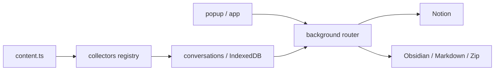

# 模块：WebClipper

## 职责
- 负责从支持站点采集 AI 对话、从普通网页抓取文章，并先写入本地浏览器数据库。
- 负责在 popup / app 中提供导出、备份、删除、Notion 同步与 Obsidian 同步等用户入口。
- 通过 MV3 的 background + content + popup + app 分层，把采集、存储、同步和渲染职责拆开。

## 关键文件
| 路径 | 作用 | 为什么重要 |
| --- | --- | --- |
| `Extensions/WebClipper/src/entrypoints/background.ts` | 后台 service worker 入口 | 负责注册 router 与所有后台 handlers。 |
| `Extensions/WebClipper/src/entrypoints/content.ts` | 内容脚本入口 | 负责 collectors、inpage 与运行时 gating。 |
| `Extensions/WebClipper/src/platform/messaging/message-contracts.ts` | 消息协议 | popup / app / background / content 的共享契约。 |
| `Extensions/WebClipper/src/collectors/` | 站点采集适配器 | 新 AI 站点通常从这里扩展。 |
| `Extensions/WebClipper/src/conversations/` | 会话与消息数据层 | 管理 IndexedDB、增量更新与背景 handlers。 |
| `Extensions/WebClipper/src/sync/` | Notion / Obsidian 同步编排 | 负责外部写入和状态返回。 |
| `Extensions/WebClipper/wxt.config.ts` | manifest 与权限配置 | 决定扩展能力边界。 |
| `Extensions/WebClipper/package.json` | 构建、测试和打包脚本 | 体现默认验证顺序。 |

## 运行时结构
| 运行时单元 | 主要路径 | 职责 | 关键依赖 |
| --- | --- | --- | --- |
| background | `src/entrypoints/background.ts` | 路由消息、编排同步、管理后台状态 | background router、handlers |
| content | `src/entrypoints/content.ts` | 观察页面、注册 collectors、显示 inpage UI | runtime client、registry |
| popup | `src/entrypoints/popup/` | 轻量入口 UI | React、消息协议 |
| app | `src/entrypoints/app/` | 更完整的扩展页面 UI | React Router、共享 UI 组件 |
| collectors | `src/collectors/` | 把站点 DOM 转成统一会话结构 | collector env、registry |
| conversations | `src/conversations/` | IndexedDB 数据访问和会话操作 | storage tests、background handlers |
| sync | `src/sync/` | Notion / Obsidian / 设置编排 | orchestrators、settings handlers |

## 对外接口
| 接口 / 入口 | 位置 | 用途 | 备注 |
| --- | --- | --- | --- |
| `CORE_MESSAGE_TYPES` | `message-contracts.ts` | conversations 相关 CRUD 和同步消息 | popup / app / background 共享。 |
| `NOTION_MESSAGE_TYPES` | `message-contracts.ts` | Notion 授权与同步消息 | 用于手动 Notion 同步。 |
| `OBSIDIAN_MESSAGE_TYPES` | `message-contracts.ts` | Obsidian 设置与同步消息 | 用于 Local REST API 连接。 |
| `ARTICLE_MESSAGE_TYPES.FETCH_ACTIVE_TAB` | `message-contracts.ts` | 手动抓取当前网页文章 | 生成 `article` 会话。 |
| popup / Settings | `src/ui/popup/tabs/SettingsTab.tsx`（由 AGENTS 指向） | 修改 Obsidian / inpage / 备份配置 | 是用户主要设置入口。 |

## 输入与输出（Inputs and Outputs）
输入/输出在下表中汇总。

| 类型 | 名称 | 位置 | 说明 |
| --- | --- | --- | --- |
| 输入 | 支持站点 DOM | `src/collectors/` | 采集 AI 对话消息。 |
| 输入 | 当前网页正文 | `FETCH_ACTIVE_TAB` + article fetch handlers | 把普通网页抓取为 article 会话。 |
| 输入 | 用户设置 | popup / `chrome.storage.local` | 控制 inpage、Obsidian、Notion 等行为。 |
| 输入 | 备份 zip / legacy JSON | 备份导入流程 | 恢复 conversations 与非敏感设置。 |
| 输出 | IndexedDB conversations / messages | `src/conversations/` | 作为本地事实源供 UI 和同步使用。 |
| 输出 | Markdown / Zip 文件 | 导出流程 | 让用户离线保存内容。 |
| 输出 | Obsidian 文件 | Local REST API | 写入或重命名 vault 中的笔记。 |
| 输出 | Notion 页面 | Notion 同步 orchestrator | 写入 `SyncNos-AI Chats` 或 `SyncNos-Web Articles`。 |

## 配置
| 配置项 | 位置 | 默认 / 约束 | 作用 |
| --- | --- | --- | --- |
| `manifestVersion` | `wxt.config.ts` | `3` | 固定为 MV3。 |
| `entrypointsDir` | `wxt.config.ts` | `src/entrypoints` | 统一入口目录。 |
| `inpage_supported_only` | `Extensions/WebClipper/AGENTS.md` | `false` | 决定 inpage 是否全站显示。 |
| Obsidian `Base URL` | `LocalRestAPI.zh.md` | `http://127.0.0.1:27123` | 控制本地插件连接。 |
| Obsidian `Auth Header` | `LocalRestAPI.zh.md` | `Authorization` | 控制 API Key 发送方式。 |
| 备份敏感键排除 | `Extensions/WebClipper/AGENTS.md` | 固定排除列表 | 防止敏感信息导出到备份。 |

## 图表


## 示例片段
### 片段 1：content script 会先搭建采集环境，再启动 inpage 控制器
```ts
const env = createCollectorEnv({ window, document, location, normalize: normalizeApi });
const collectorsRegistry = createCollectorsRegistry();
registerAllCollectors(collectorsRegistry, env);
const controller = createContentController({ runtime, collectorsRegistry, ... });
startContentBootstrap({ runtime, inpageButton: inpageButtonApi, createController: () => controller });
```

### 片段 2：消息协议把扩展功能拆分为若干明确的消息族
```ts
export const OBSIDIAN_MESSAGE_TYPES = {
  GET_SETTINGS: 'obsidianGetSettings',
  SAVE_SETTINGS: 'obsidianSaveSettings',
  TEST_CONNECTION: 'obsidianTestConnection',
  SYNC_CONVERSATIONS: 'obsidianSyncConversations'
} as const;
```

## 边界情况
| 场景 | 影响 | 对应机制 |
| --- | --- | --- |
| `inpage_supported_only` 切换后当前页不生效 | 用户误以为开关失效 | 需要刷新或新开页面。 |
| collector 无法适配站点改版 | 会话采集不完整 | 应优先在 collector 层补齐 DOM 兼容。 |
| 备份包含敏感键 | 有泄露风险 | 当前策略显式排除 `notion_oauth_token*` 和 client secret。 |
| 双击 / 多击 inpage 按钮行为复杂 | 容易误判 | 仓库已定义 `400ms` 结算窗口和多击彩蛋规则。 |
| Obsidian PATCH 冲突 | 无法增量写入 | orchestrator 会回退全量重建。 |

## 测试
| 验证面 | 推荐方式 | 关注点 |
| --- | --- | --- |
| 类型检查 | `npm --prefix Extensions/WebClipper run compile` | 消息协议、collector 类型和 UI 调用面。 |
| 单元测试 | `npm --prefix Extensions/WebClipper run test` | Markdown 渲染、游标、IndexedDB 迁移。 |
| 构建 | `npm --prefix Extensions/WebClipper run build` | 产物与 manifest 正确生成。 |
| Firefox 兼容 | `run build:firefox` + `run check`（必要时） | 涉及发布打包和 manifest 细节时必须补。 |
| 人工验证 | 支持站点 + 普通网页 + popup 设置流 | 验证自动采集、文章抓取、导出与同步按钮。 |

## 来源引用（Source References）
- `Extensions/WebClipper/AGENTS.md`
- `Extensions/WebClipper/package.json`
- `Extensions/WebClipper/wxt.config.ts`
- `Extensions/WebClipper/src/entrypoints/background.ts`
- `Extensions/WebClipper/src/entrypoints/content.ts`
- `Extensions/WebClipper/src/platform/messaging/message-contracts.ts`
- `Extensions/WebClipper/src/collectors/`
- `Extensions/WebClipper/src/conversations/`
- `Extensions/WebClipper/src/sync/`
- `Extensions/WebClipper/tests/`
- `.github/guide/obsidian/LocalRestAPI.zh.md`
- `.github/workflows/webclipper-release.yml`
