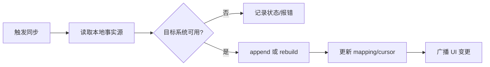

# 运维与运行操作（Operations）

macOS/ 历史资料已归档；本页仅保留 WebClipper 的运维与交付操作。

## 页面目标
本页聚焦“如何稳定运行与交付 WebClipper”，覆盖：日常运行检查、故障处置路径、发布前后操作、备份与恢复。

- 产品语义入口先读：[business-context.md](business-context.md)
- 架构与数据边界参考：[architecture.md](architecture.md)、[storage.md](storage.md)、[api.md](api.md)
- 商店发布细节参考：[release.md](release.md)

## 运行面矩阵

| 运行面 | 主体 | 关键进程/入口 | 关键状态 | 主要风险 |
| --- | --- | --- | --- | --- |
| WebClipper 内容侧 | content script | `src/entrypoints/content.ts` | inpage 显示模式、自动保存开关 | 页面未刷新导致开关未生效、采集不完整 |
| WebClipper 视频字幕侧 | `video-transcript-*.content.ts` + `VideosSection.tsx` | `src/entrypoints/video-transcript-interceptor.content.ts`, `src/services/bootstrap/video-transcript-capture.ts` | 字幕轨道、`video` kind、`SyncNos-Videos` | 字幕未加载、误以为是下载失败 |
| WebClipper 后台侧 | MV3 service worker | `src/entrypoints/background.ts` | 消息路由、sync job 状态、OAuth 回调监听 | 多实例残留 job、消息类型漂移 |
| WebClipper 设置侧 | popup/app UI | `SettingsScene.tsx`, `src/viewmodels/settings/useSettingsSceneController.ts` | Notion/Obsidian 设置、Inpage 阅读风格 / anti-hotlink、备份导入导出、Insight 只读统计 | 设置与真实存储不一致 |
| CI/CD 发布侧 | GitHub Actions | `.github/workflows/webclipper-*.yml` | tag、manifest.version、渠道凭据 | 版本不一致、商店凭据缺失 |

## 日常运行检查清单

| 检查项 | WebClipper | 频率 |
| --- | --- | --- |
| 构建可用性 | `npm run compile && npm run build` 成功 | 每次改动 |
| 核心链路可用性 | 至少一个 chat/article 可落本地并可手动同步 | 每次改动 |
| 配置写入有效性 | `inpage_display_mode`、`ai_chat_auto_save_enabled`、`ai_chat_cache_images_enabled`、`web_article_cache_images_enabled`、`markdown_reading_profile_v1`、`anti_hotlink_rules_v1`、`chat_with_*` 写入可回读 | 每次改动 |
| 备份恢复可用性 | Zip v2 导出与导入（merge）正常，且 `article_comments` 能往返 | 每个里程碑 |
| 发布一致性 | `manifest.version == tag 去掉 v` | 每次发版 |

## 同步作业生命周期

| 作业类型 | 触发入口 | 状态锚点 | 失败后策略 |
| --- | --- | --- | --- |
| Notion 手动同步（扩展） | `NOTION_MESSAGE_TYPES.SYNC_CONVERSATIONS` | `sync_mappings` + job store | cursor 不匹配时转 rebuild |
| Obsidian 同步（扩展） | `OBSIDIAN_MESSAGE_TYPES.SYNC_CONVERSATIONS` | Obsidian sync status + 本地 messages | PATCH 失败自动回退 full rebuild |
| 图片回填（扩展） | `BACKFILL_CONVERSATION_IMAGES` | `updatedMessages/downloadedCount` | 回填失败不阻塞主会话保存 |

## 备份与恢复操作

| 场景 | 操作入口 | 预期结果 | 备注 |
| --- | --- | --- | --- |
| 导出备份 | `exportBackupZipV2()` | 生成 `SyncNos-Backup-*.zip` | 含 manifest、sources、config、image-cache、`article-comments/index.json` |
| 导入 Zip v2 | `importBackupZipV2Merge()` | merge 到本地库，不强制覆盖 | 丢失 bundle 时会 fallback 扫描 `sources/**/*.json`，并恢复 `article_comments` |
| 导入 legacy JSON | `importBackupLegacyJsonMerge()` | 与现有数据合并 | 保留本地非空字段优先 |
| 恢复后核验 | Settings + 列表 + Insight | 会话/消息/评论数量与 UI 可见结果一致 | Insight 只读，不回写新状态 |

## 事件与故障处置 Runbook

| 现象 | 首查文件 | 快速动作 |
| --- | --- | --- |
| 扩展升级后无弹窗引导 | `background.ts` | 确认 `onInstalled` 仅 `install` 打开 About（预期行为） |
| 切换 inpage 开关无变化 | `src/services/bootstrap/content.ts` | 刷新页面或新开页面后再验证；若改的是 Inpage 阅读风格或 anti-hotlink 规则，先确认当前页是否已经启动 content controller |
| `cache-images` 提示更新 0 条 | `src/services/conversations/background/image-backfill-job.ts` | 检查对应来源开关是否开启、且消息内存在可下载图片链接 |
| 视频字幕采集结果为空 | `src/entrypoints/video-transcript-interceptor.content.ts`, `src/services/bootstrap/video-transcript-capture.ts` | 先确认视频页字幕轨道已加载，再通过 `VideosSection` 或右键菜单重试；若仍为空，检查是否仅支持 YouTube / Bilibili |
| Notion OAuth 回调失败 | `src/services/sync/notion/auth/oauth.ts`, worker `index.ts` | 核对 pending state、worker secret、429/超时情况 |
| 发布 workflow 报版本不匹配 | `wxt.config.ts`, `webclipper-*.yml` | 对齐 `manifest.version` 与 tag |

## 运维边界与 Coverage Gaps

- 仓库内已覆盖 WebClipper 的自动化发布与扩展运行面。

## 来源引用（Source References）
- `webclipper/src/entrypoints/background.ts`
- `webclipper/src/entrypoints/content.ts`
- `webclipper/src/entrypoints/video-transcript-interceptor.content.ts`
- `webclipper/src/entrypoints/video-transcript-bridge.content.ts`
- `webclipper/src/services/bootstrap/content.ts`
- `webclipper/src/services/bootstrap/video-transcript-capture.ts`
- `webclipper/src/services/bootstrap/video-transcript-capture-content-handlers.ts`
- `webclipper/src/viewmodels/settings/useSettingsSceneController.ts`
- `webclipper/src/ui/settings/sections/VideosSection.tsx`
- `webclipper/src/services/conversations/background/handlers.ts`
- `webclipper/src/services/conversations/background/image-backfill-job.ts`
- `webclipper/src/services/sync/backup/export.ts`
- `webclipper/src/services/sync/backup/import.ts`
- `webclipper/src/services/sync/backup/backup-utils.ts`
- `webclipper/src/services/sync/notion/auth/oauth.ts`
- `webclipper/cloudflare-workers/syncnos-notion-oauth/index.ts`
- `.github/workflows/webclipper-release.yml`
- `.github/workflows/webclipper-amo-publish.yml`
- `.github/workflows/webclipper-cws-publish.yml`
- `.github/workflows/webclipper-edge-publish.yml`

## 更新记录（Update Notes）
- 2026-04-18：补充视频字幕采集的运行面与排查动作，明确字幕轨道未加载时应先重试而不是当作同步故障。
