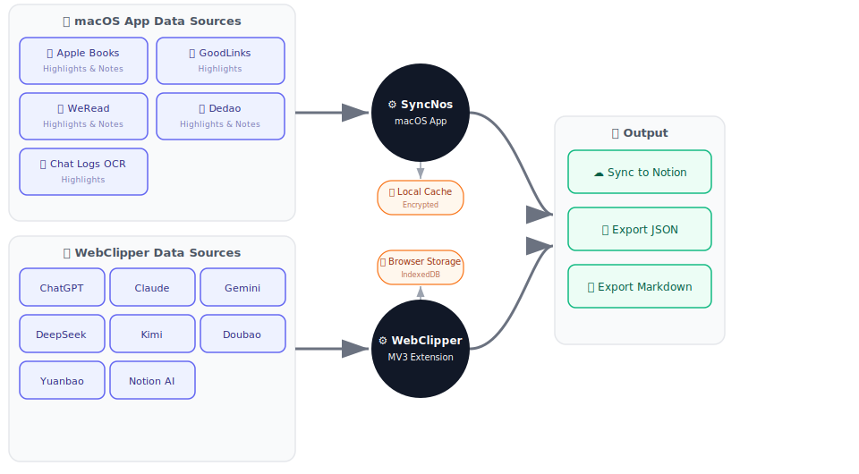
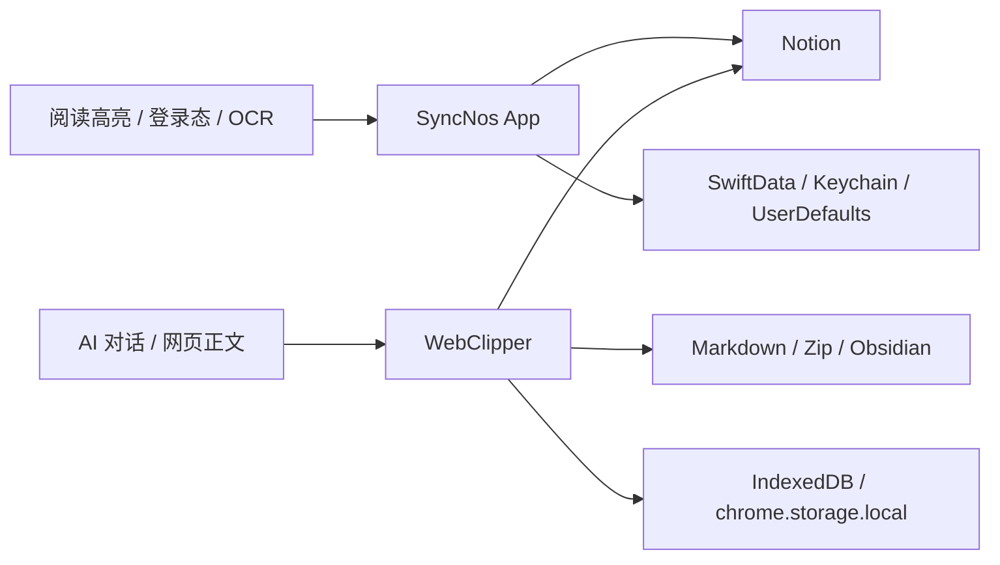

# 概览

## 仓库是什么
- SyncNos 是一个围绕“异构内容 → 稳定知识资产”展开的双产品线仓库，而不是单一 app 或单一脚本集合。
- 正式的业务入口页是 [business-context.md](business-context.md)；本页负责在业务语义之上，再给出目录、入口、运行时和产物层面的整体地图。
- 两条产品线共享“最终可沉淀到 Notion”的目标，但一个是 macOS App、一个是 MV3 扩展，本地状态、鉴权、同步节奏和测试方式都不同。

| 产品线 | 主目录 | 运行时 | 主要输入 | 主要输出 |
| --- | --- | --- | --- | --- |
| SyncNos App | `macOS/` | macOS 14+ / SwiftUI / SwiftData / AppKit | Apple Books / GoodLinks 本地库、WeRead / Dedao 登录态、聊天 OCR | Notion 数据库 / 页面、桌面缓存、搜索结果 |
| WebClipper | `webclipper/` | MV3 service worker + content script + popup/app React UI | AI 站点 DOM、网页正文、浏览器本地设置、备份包 | IndexedDB、Settings Insight、主题/行为偏好、本地导出、Notion 页面、Obsidian 文件 |

## 顶层目录地图

| 路径 | 角色 | 典型内容 | 阅读建议 |
| --- | --- | --- | --- |
| `macOS/` | macOS App 容器 | `SyncNos/`, `SyncNos.xcodeproj/`, `Packages/`, `Resource/` | 先读 `macOS/SyncNos/AGENTS.md`，再按 MVVM + 协议注入边界进入。 |
| `webclipper/` | 浏览器扩展 | `src/entrypoints/`, `src/collectors/`, `src/conversations/`, `src/sync/`, `src/ui/` | 先判断改动属于 background / content / popup / app 哪一层。 |
| `.github/docs/` | 仓库级专项文档 | 键盘焦点文档等 | 用来理解跨产品线的专项约束。 |
| `.github/workflows/` | CI / Release / 商店发布入口 | `release.yml`, `webclipper-release.yml`, `webclipper-amo-publish.yml`, `webclipper-cws-publish.yml` | 看真实交付链路而不是猜测。 |
| `.github/scripts/webclipper/` | WebClipper 打包 / 发布脚本 | 打包 release assets、AMO source、AMO 发布 | 与 workflow 配套理解渠道差异。 |
| `macOS/Packages/` | 本地 SwiftPM 包 | `MenuBarDockKit` | 放可复用的 macOS 能力，而不是业务 UI。 |
| `macOS/Resource/` | 共享资源与图示 | `flows.svg` | 适合配合理解双产品线的最终输出面。 |

## 关键入口文件

| 入口 | 路径 | 作用 | 为什么先看这里 |
| --- | --- | --- | --- |
| App 启动入口 | `macOS/SyncNos/SyncNosApp.swift` | 启动 IAP、预热缓存、决定是否启动自动同步、定义主窗口 / 设置 / 日志窗口 | 它决定用户一启动 App 会发生什么 |
| App 生命周期入口 | `macOS/SyncNos/AppDelegate.swift` | 菜单栏 / Dock 模式、同步中退出保护、Dock reopen、OAuth URL scheme 兜底 | 它决定 AppKit 层的行为边界 |
| App 根门控 | `macOS/SyncNos/Views/RootView.swift` | 按顺序切换 Onboarding → PayWall → MainListView | 它解释为什么主界面不是总能直接出现 |
| 扩展后台入口 | `webclipper/src/entrypoints/background.ts` | 注册消息处理、sync orchestrator、Notion OAuth 监听、清理孤儿 job | 它决定所有后台能力如何挂接 |
| 扩展内容入口 | `webclipper/src/entrypoints/content.ts` | 注册 collectors、inpage UI、runtime observer、增量更新 | 它决定页面采集是如何启动的 |
| 扩展设置入口 | `webclipper/src/ui/settings/SettingsScene.tsx` | 组织 `General / Chat with AI / Backup / Notion / Obsidian / Insight / About` 分区，并在窄屏下切换 list/detail 路由 | 它决定设置项如何被真正看见和进入 |
| 扩展主题入口 | `webclipper/src/ui/shared/hooks/useThemeMode.ts` | 监听 `ui_theme_mode` 并把 light/dark/system 应用到根节点 `data-theme` | 它解释“为什么 popup 与 app 会同步切主题” |
| WXT / manifest 入口 | `webclipper/wxt.config.ts` | 版本号、权限、host permissions、entrypointsDir | 它是发布版本和能力边界的代码事实源 |
| 脚本入口 | `webclipper/package.json` | `dev`, `compile`, `test`, `build`, `check` | 它定义扩展侧默认验证顺序 |

## 主要来源与主要产物

| 类型 | 来源 / 产物 | 生产或消费方 | 说明 |
| --- | --- | --- | --- |
| 阅读来源 | Apple Books、GoodLinks、WeRead、Dedao、聊天 OCR | SyncNos App | App 先做来源适配，再统一走 Notion 同步引擎 |
| 页面来源 | ChatGPT、Claude、Gemini、Google AI Studio、DeepSeek、Kimi、豆包、元宝、Poe、Notion AI、z.ai、普通网页 | WebClipper | 扩展先采集为本地会话，再派生到任意目标 |
| 本地事实源 | SwiftData / UserDefaults / Keychain；IndexedDB / `chrome.storage.local` / `localStorage` / `sessionStorage` | 两条产品线各自维护 | 这是 debug、迁移、恢复、回归时最先要看的地方 |
| 外部结果 | Notion 数据库 / 页面、Obsidian 文件、Markdown / Zip 导出、Release 附件 | App + WebClipper + GitHub Actions | 对用户可见，但不是所有情况下都等于事实源 |

- WebClipper 的 Insight 统计面板是**本地会话库的只读视图**：它不生成新的导出产物，也不改变同步链路，而是把 `conversations + messages` 的累计结果变成可见的仪表盘。
- WebClipper 的 `Chat with AI` 是**本地会话库派生出的 UI 动作**：它复用 detail 数据生成 payload，并把结果复制到剪贴板后跳转外部站点。

## 常用命令与工程入口

| 场景 | 命令 / 入口 | 结果 |
| --- | --- | --- |
| 打开 App 工程 | `open macOS/SyncNos.xcodeproj` | 在 Xcode 中进入 macOS 工程 |
| App 构建 | `xcodebuild -project macOS/SyncNos.xcodeproj -scheme SyncNos -configuration Debug build` | 验证桌面端可构建 |
| 扩展安装依赖 | `npm --prefix webclipper install` | 安装 WebClipper 依赖 |
| 扩展类型检查 | `npm --prefix webclipper run compile` | 先发现 TS 类型 / 契约问题 |
| 扩展单测 | `npm --prefix webclipper run test` | 覆盖游标、IndexedDB 迁移、Markdown 等关键逻辑 |
| 扩展构建 | `npm --prefix webclipper run build` | 生成 Chrome / Edge 产物 |
| 扩展 Firefox 构建 | `npm --prefix webclipper run build:firefox` | 生成 Firefox 产物 |
| 扩展产物校验 | `npm --prefix webclipper run check` | build 后再跑 `check-dist.mjs` 做完整性检查 |

## 图表

## 推荐导航
- 如果你还没建立产品语义，先回到 [business-context.md](business-context.md)。
- 如果你需要判断“代码应该改哪里”，先看 [architecture.md](architecture.md) 和对应 `modules/` 页面。
- 如果你想理解“为什么本地有这些缓存 / mapping / backup 文件”，优先看 [storage.md](storage.md)。
- 如果你要发布 WebClipper，优先看 [release.md](release.md)、[configuration.md](configuration.md) 和 [testing.md](testing.md)。
- 如果你正在排查“配置没生效 / 按钮不显示 / workflow 失败 / 同步重建”，优先看 [troubleshooting.md](troubleshooting.md)。

## 常见误区
- **误区 1：把仓库当成一个统一 UI。** 实际上 App 和 WebClipper 在运行时、权限、存储、同步触发方式上完全不同。
- **误区 2：把 Notion 当成唯一事实源。** 对扩展来说，Notion 只是本地会话库的一个输出面；对 App 来说，也仍然有本地缓存和登录态作为运行前提。
- **误区 3：只看 README 就开始改代码。** 这个仓库大量关键约束在 `AGENTS.md`、产品线 `AGENTS.md` 和专项文档里。

## 来源引用（Source References）
- `README.md`
- `AGENTS.md`
- `macOS/SyncNos/SyncNosApp.swift`
- `macOS/SyncNos/AppDelegate.swift`
- `macOS/SyncNos/Views/RootView.swift`
- `webclipper/package.json`
- `webclipper/wxt.config.ts`
- `webclipper/src/entrypoints/background.ts`
- `webclipper/src/entrypoints/content.ts`
- `webclipper/src/ui/settings/SettingsScene.tsx`
- `webclipper/src/ui/settings/sections/insight-stats.ts`
- `.github/workflows/release.yml`
- `.github/workflows/webclipper-release.yml`
- `macOS/Resource/flows.svg`
