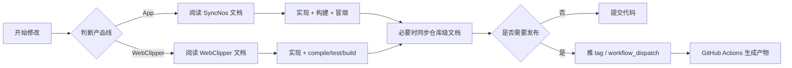

# 工作流

## 协作入口
| 变更类型 | 先看哪里 | 为什么 |
| --- | --- | --- |
| 仓库级行为或共享业务 | `AGENTS.md`, `.github/docs/business-logic.md` | 先确认是不是同时影响两条产品线。 |
| App 改动 | `SyncNos/AGENTS.md`, `SyncNos/Services/AGENTS.md` | 需要遵守 MVVM、协议注入和 SwiftData 约束。 |
| WebClipper 改动 | `Extensions/WebClipper/AGENTS.md` | 需要先判断属于 background / content / popup / app。 |
| 发布 / 打包改动 | `.github/workflows/*.yml`, `.github/scripts/webclipper/*.mjs` | 防止本地流程与 CI 产物脱节。 |

## 仓库级文档工作流
| 步骤 | 动作 | 输出 |
| --- | --- | --- |
| 1 | 先从代码、脚本和配置确认实际行为 | 避免文档互相抄写。 |
| 2 | 确认是否影响仓库级入口文档 | 必要时更新 `AGENTS.md`、产品线 `AGENTS.md`、`business-logic.md`。 |
| 3 | 保持产品线边界清晰 | App 约束和扩展约束分开描述。 |
| 4 | 非明确要求下不碰国际化字段 | 降低与本次任务无关的多语言改动风险。 |

## SyncNos App 开发工作流
| 步骤 | 动作 | 关键约束 |
| --- | --- | --- |
| 1 | 判断改动属于 `Models`、`Services`、`ViewModels` 还是 `Views` | 不要跨层混杂职责。 |
| 2 | 涉及 OCR、字体、键盘、数据源或同步目标时先看专项文档 | 避免绕过现有约定。 |
| 3 | 通过协议和 DIContainer 注入改动 Service / ViewModel | 避免引入新的全局状态。 |
| 4 | 至少执行一次构建与最小人工冒烟 | 文档中明确要求构建和同步验证。 |

## WebClipper 开发工作流
| 步骤 | 动作 | 关键约束 |
| --- | --- | --- |
| 1 | 先确认职责边界 | 采集进 `collectors/content`，持久化进 `background`，UI 进 `popup` / `app`。 |
| 2 | 如果涉及权限、content scripts、消息协议或构建产物 | 同时检查 WXT 入口、manifest 和 CI 脚本是否一致。 |
| 3 | 默认按 `compile` → `test` → `build` 验证 | 先查类型，再查逻辑，再查产物。 |
| 4 | 影响 Firefox / 发布打包 / manifest 重写时追加 `build:firefox` 和 `check` | 防止只在特定渠道暴露问题。 |

## 发布与打包工作流
| 工作流 | 触发 | 主要动作 | 产物 |
| --- | --- | --- | --- |
| `release.yml` | `v*` tag / 手动触发 | 创建 GitHub Release | Release 页面与自动备注 |
| `webclipper-release.yml` | `v*` tag / 手动触发 | 构建 Chrome / Edge / Firefox 资产并上传 | zip / xpi |
| `webclipper-amo-publish.yml` | `v*` tag / 手动触发 | 校验 manifest 版本、构建 XPI、生成 AMO source、提交 AMO | Firefox 商店版本 |
| `webclipper-cws-publish.yml` | `v*` tag / 手动触发 | 校验 manifest 版本、构建 Chrome zip、上传 Chrome Web Store | Chrome 商店版本 |

## 图表


## 示例片段
### 片段 1：GitHub Release 由单独 workflow 负责
```yaml
on:
  push:
    tags:
      - 'v*'
  workflow_dispatch:
```

### 片段 2：WebClipper 产物打包命令由 CI 直接复用
```bash
node .github/scripts/webclipper/package-release-assets.mjs --target=chrome --zip
node .github/scripts/webclipper/package-release-assets.mjs --target=edge --zip
node .github/scripts/webclipper/package-release-assets.mjs --target=firefox --zip
```

## 常见决策点
- 是否需要更新仓库级文档：只要共享行为变了，就不仅仅更新某个产品线目录下的说明。
- 是否需要改动 CI：如果改动 manifest、产物命名或发布路径，通常需要同步 workflow 与 `.github/scripts/webclipper/*.mjs`。
- 是否需要增加权限：WebClipper 默认强调最小权限；新增权限之前要先能解释“为什么原有方案不够”。
- 是否需要调整模块边界：App 优先维持 `Views → ViewModels → Services → Models` 单向依赖，扩展优先维持 collectors / conversations / sync / UI 分层。

## 来源引用（Source References）
- `AGENTS.md`
- `.github/docs/business-logic.md`
- `SyncNos/AGENTS.md`
- `Extensions/WebClipper/AGENTS.md`
- `.github/workflows/release.yml`
- `.github/workflows/webclipper-release.yml`
- `.github/workflows/webclipper-amo-publish.yml`
- `.github/workflows/webclipper-cws-publish.yml`
- `.github/scripts/webclipper/package-release-assets.mjs`
- `.github/scripts/webclipper/package-amo-source.mjs`
- `.github/scripts/webclipper/publish-amo.mjs`
