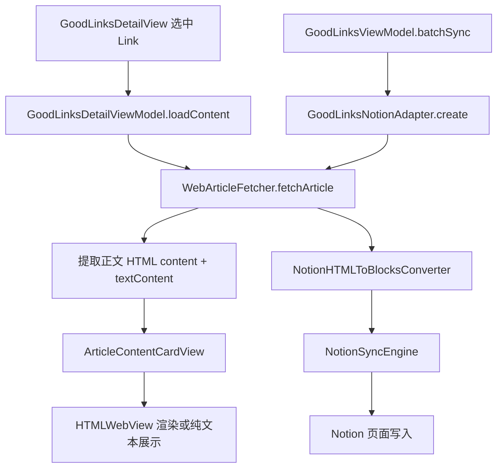

# GoodLinks 文章展示与 Notion 同步业务逻辑技术报告

> 目的：归档 SyncNos 中 GoodLinks 文章正文的获取、展示与 Notion 同步流程，并明确“提取正文”与“原始 HTML”的关系。

## 1. 范围与结论摘要

- **正文抓取与提取**统一由 `WebArticleFetcher.fetchArticle()` 完成。
- **详情页展示**与**同步到 Notion**是**两次独立的抓取调用**，但**走同一套提取逻辑**。
- `NotionHTMLToBlocksConverter` 使用的是**提取后的正文 HTML 片段**（`ArticleFetchResult.content`），**不是整页原始 HTML**。
- 详情页显示的是**提取后的 HTML（优先）**，若无 HTML 则显示纯文本（`textContent`）。

## 2. 关键数据结构

### 2.1 `ArticleFetchResult`
用于承载网页抓取和正文提取后的结果：

- `content`: 提取后的正文 **HTML 片段**
- `textContent`: HTML 转换后的纯文本（用于搜索/降级显示/Notion 降级写入）
- `title` / `author` / `wordCount` / `fetchedAt` 等元信息

来源：
- SyncNos/Models/WebArticle/WebArticleModels.swift

## 3. 详情页正文展示流程（GoodLinks DetailView）

### 3.1 触发与加载
当用户在 GoodLinks 详情页选中某条 link：

1. `GoodLinksDetailView` 的 `.task(id: linkId)` 触发加载
2. 调用 `GoodLinksDetailViewModel.loadContent(for:)`
3. 内部调用 `WebArticleFetcher.fetchArticle(url:)`

相关文件：
- SyncNos/Views/GoodLinks/GoodLinksDetailView.swift
- SyncNos/ViewModels/GoodLinks/GoodLinksDetailViewModel.swift
- SyncNos/Services/WebArticle/WebArticleFetcher.swift

### 3.2 渲染逻辑
`ArticleContentCardView` 的渲染顺序为：

1. 若 `article.content`（HTML）不为空 → 使用 `HTMLWebView` 渲染
2. 否则显示 `article.textContent`（纯文本）

`HTMLWebView` 仅用于展示 **提取后的 HTML 片段**，并做以下增强：
- 统一 CSS 样式
- 清除隐藏样式（避免正文不可见）
- 修复懒加载图片
- 动态测量高度

相关文件：
- SyncNos/Views/Components/Cards/ArticleContentCardView.swift
- SyncNos/Views/Components/Web/HTMLWebView.swift

## 4. 正文提取逻辑（WebArticleFetcher）

### 4.1 抓取与缓存
`WebArticleFetcher.fetchArticle(url:)` 的流程：

1. **缓存命中**：若缓存存在且未过期，直接返回缓存结果
2. **带 cookie 抓取**：若站点需要登录，尝试带 cookie 的请求
3. **普通抓取**：否则使用普通 HTTP 请求

缓存逻辑：
- `WebArticleCacheService`（7 天有效期）

相关文件：
- SyncNos/Services/WebArticle/WebArticleFetcher.swift
- SyncNos/Services/WebArticle/WebArticleCacheService.swift

### 4.2 正文提取策略
提取逻辑由 `parseArticleFromHTMLData()` 实现：

1. 清理脚本与样式（`sanitizeHTML`）
2. **优先提取正文容器**：`<article>` → `<main>` → `<body>`
3. 若都不存在，退化为清理后的整页 HTML

最终得到：
- `content` = 提取后的 HTML 片段
- `textContent` = HTML 转纯文本

相关文件：
- SyncNos/Services/WebArticle/WebArticleFetcher.swift

> 结论：`content` 不是原始 HTML，而是经过“轻量正文提取”的 HTML 片段。

## 5. Notion 同步流程（GoodLinks）

### 5.1 同步触发
- 入口来自 `GoodLinksViewModel.batchSync()`
- 每个 link 创建 `GoodLinksNotionAdapter`

相关文件：
- SyncNos/ViewModels/GoodLinks/GoodLinksViewModel.swift

### 5.2 适配器预加载正文
`GoodLinksNotionAdapter.create()` 在创建适配器时：

1. 再次调用 `WebArticleFetcher.fetchArticle(url:)`
2. 使用 `result.content` 进行 HTML → Notion Blocks 转换
3. 若转换失败或为空，则使用 `result.textContent` 降级为纯文本段落

相关文件：
- SyncNos/Services/DataSources-To/Notion/Sync/Adapters/GoodLinksNotionAdapter.swift

### 5.3 HTML → Notion Blocks
`NotionHTMLToBlocksConverter` 使用 WebKit DOM 抽取：

- 将提取后的 HTML 解析为 DOM Items
- 映射为 Notion blocks（段落、标题、列表、图片、引用等）

相关文件：
- SyncNos/Services/DataSources-To/Notion/Utils/NotionHTMLToBlocksConverter.swift

### 5.4 同步引擎落库
`NotionSyncEngine` 在创建新页面时：

1. 先写入 **Article 标题**
2. 再写入正文 blocks
3. 随后追加高亮内容

相关文件：
- SyncNos/Services/DataSources-To/Notion/Sync/NotionSyncEngine.swift

## 6. “提取正文”与“原始 HTML”的关系

| 场景 | 使用的 HTML | 是否原始 HTML | 说明 |
|------|------------|---------------|------|
| DetailView 正文展示 | `ArticleFetchResult.content` | 否 | 提取后的正文 HTML 片段 |
| Notion 同步正文 | `ArticleFetchResult.content` | 否 | 提取后再转 Notion blocks |
| 纯文本降级 | `ArticleFetchResult.textContent` | 否 | 由提取后的 HTML 转文本 |

> 当前实现 **未保留整页原始 HTML**；仅保留提取后的正文 HTML 片段。

## 7. 两次抓取的独立性说明

- **DetailView 展示**与 **Notion 同步**调用是两次独立的 `fetchArticle()`。
- 逻辑一致，但**结果可能因缓存/网络/登录态变化而略有差异**。
- 若缓存命中，两次结果通常一致。

## 8. 关键链路简图

---

如需新增“显示原始 HTML 模式”，需要在抓取阶段额外保留整页原始 HTML 并在 UI/同步链路中区分使用。