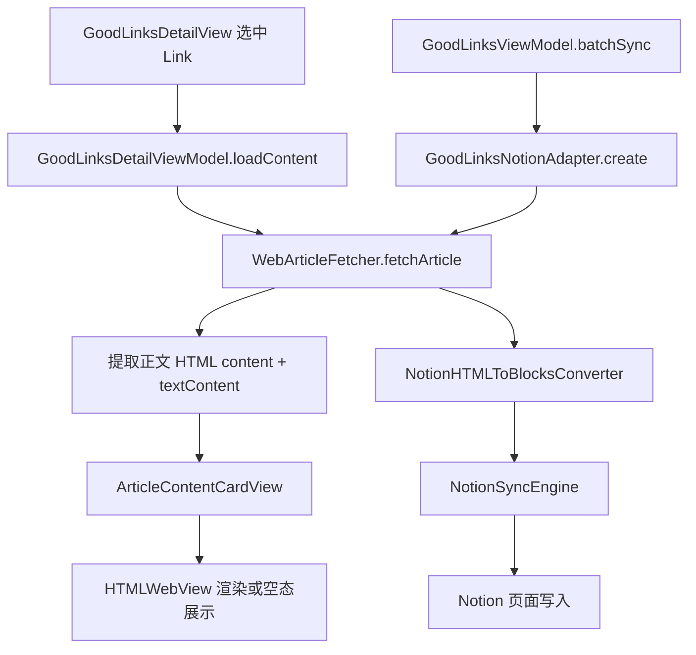

# GoodLinks 文章展示与 Notion 同步业务逻辑技术报告

> 目的：归档 SyncNos 中 GoodLinks 文章正文的获取、展示与 Notion 同步流程，并明确“提取正文”与“原始 HTML”的关系。

## 1. 范围与结论摘要

- **正文抓取与提取**统一由 `WebArticleFetcher.fetchArticle()` 完成。
- **详情页展示**会触发抓取调用；**同步到 Notion**优先使用**本地持久化缓存（SwiftData）**，缓存缺失时才抓取并写回缓存。
- `NotionHTMLToBlocksConverter` 使用的是**提取后的正文 HTML 片段**（`ArticleFetchResult.content`），**不是整页原始 HTML**。
- 详情页仅展示**提取后的 HTML**；无 HTML 时显示空态/错误，不再降级为纯文本（`textContent`）。

## 2. 关键数据结构

### 2.1 `ArticleFetchResult`
用于承载网页抓取和正文提取后的结果：

- `content`: 提取后的正文 **HTML 片段**
- `textContent`: HTML 转换后的纯文本（用于搜索/词数统计等内部用途）
- `title` / `author` / `wordCount` / `fetchedAt` 等元信息

来源：
- SyncNos/Models/WebArticle/WebArticleModels.swift

## 3. 详情页正文展示流程（GoodLinks DetailView）

### 3.1 触发与加载
当用户在 GoodLinks 详情页选中某条 link：

1. `GoodLinksDetailView` 的 `.task(id: linkId)` 触发加载
2. 调用 `GoodLinksDetailViewModel.loadContent(for:)`
3. 内部调用 `WebArticleFetcher.fetchArticle(url:)`

相关文件：
- SyncNos/Views/GoodLinks/GoodLinksDetailView.swift
- SyncNos/ViewModels/GoodLinks/GoodLinksDetailViewModel.swift
- SyncNos/Services/WebArticle/WebArticleFetcher.swift

### 3.2 渲染逻辑
`ArticleContentCardView` 的渲染顺序为：

1. 若 `article.content`（HTML）不为空 → 使用 `HTMLWebView` 渲染
2. 否则显示空态（无正文）

`HTMLWebView` 仅用于展示 **提取后的 HTML 片段**，并做以下增强：
- 统一 CSS 样式
- 清除隐藏样式（避免正文不可见）
- 修复懒加载图片
- 动态测量高度

相关文件：
- SyncNos/Views/Components/Cards/ArticleContentCardView.swift
- SyncNos/Views/Components/Web/HTMLWebView.swift

## 4. 正文提取逻辑（WebArticleFetcher）

### 4.1 抓取与缓存
`WebArticleFetcher.fetchArticle(url:)` 的流程：

1. **缓存命中**：若缓存存在，直接返回缓存结果
2. **离屏 WebKit 渲染**：使用离屏 `WKWebView` 加载目标 URL（支持 SPA / 动态注入）
3. **DOM 稳定性等待**：`didFinish` 后继续采样文本长度/节点数，尽量等到正文稳定再抽取
4. **DOM 抽取**：优先 `#js_content`（公众号）→ `<article>` → `<main>` → `<body>`，克隆并导出最小 HTML

缓存逻辑：
- `WebArticleCacheService`（持久化存储，不做过期淘汰）

相关文件：
- SyncNos/Services/WebArticle/WebArticleFetcher.swift
- SyncNos/Services/WebArticle/WebArticleCacheService.swift
- SyncNos/Services/WebArticle/WebArticleWebKitExtractor.swift

### 4.2 正文提取策略
提取逻辑由 `WebArticleWebKitExtractor` 实现：

1. 页面渲染后，从 DOM 中选择“最可能是正文”的根节点（公众号优先 `#js_content`）
2. 克隆正文子树并移除脚本/样式等噪声节点
3. 同时导出 `content`（HTML）与 `textContent`（纯文本）

最终得到：
- `content` = 提取后的 HTML 片段
- `textContent` = HTML 转纯文本

相关文件：
- SyncNos/Services/WebArticle/WebArticleFetcher.swift

> 结论：`content` 不是原始 HTML，而是从“渲染后的 DOM”抽取的正文 HTML 片段。

## 5. Notion 同步流程（GoodLinks）

### 5.1 同步触发
- 入口来自 `GoodLinksViewModel.batchSync()`
- 每个 link 创建 `GoodLinksNotionAdapter`

相关文件：
- SyncNos/ViewModels/GoodLinks/GoodLinksViewModel.swift

### 5.2 适配器预加载正文
`GoodLinksNotionAdapter.create()` 在创建适配器时：

1. 优先读取本地持久化缓存：`WebArticleCacheService.getArticle(url:)`
2. 缓存缺失时，调用 `WebArticleFetcher.fetchArticle(url:)` 抓取正文，并写回缓存
3. 使用 `result.content` 进行 HTML → Notion Blocks 转换；转换失败则跳过正文写入（不再降级为纯文本段落）

相关文件：
- SyncNos/Services/DataSources-To/Notion/Sync/Adapters/GoodLinksNotionAdapter.swift

### 5.3 HTML → Notion Blocks
`NotionHTMLToBlocksConverter` 使用 WebKit DOM 抽取：

- 将提取后的 HTML 解析为 DOM Items
- 映射为 Notion blocks（段落、标题、列表、图片、引用等）

相关文件：
- SyncNos/Services/DataSources-To/Notion/Utils/NotionHTMLToBlocksConverter.swift

### 5.4 同步引擎落库
`NotionSyncEngine` 在创建新页面时：

1. 先写入正文 blocks
3. 随后追加高亮内容

相关文件：
- SyncNos/Services/DataSources-To/Notion/Sync/NotionSyncEngine.swift

## 6. “提取正文”与“原始 HTML”的关系

| 场景 | 使用的 HTML | 是否原始 HTML | 说明 |
|------|------------|---------------|------|
| DetailView 正文展示 | `ArticleFetchResult.content` | 否 | 提取后的正文 HTML 片段 |
| Notion 同步正文 | `ArticleFetchResult.content` | 否 | 提取后再转 Notion blocks |

> 当前实现 **未保留整页原始 HTML**；仅保留提取后的正文 HTML 片段。

## 7. 抓取调用与缓存策略

- **DetailView 展示**：调用 `WebArticleFetcher.fetchArticle(url:)` 获取正文。
- **Notion 同步**：优先读取 `WebArticleCacheService` 的持久化缓存；若缓存缺失/过期，则调用 `fetchArticle()` 抓取并写回缓存。
- 因缓存过期/清空或未曾抓取过，Notion 同步在少数情况下仍可能触发一次抓取；但不再“必然二次抓取”。

## 8. 关键链路简图



## 9. 关键代码片段（节选）

### 9.1 详情页触发加载（DetailView）

参考：
- [SyncNos/Views/GoodLinks/GoodLinksDetailView.swift](../../SyncNos/Views/GoodLinks/GoodLinksDetailView.swift)

```swift
// 全文内容卡片入口
articleContentSection(linkId: linkId)

// linkId 变化时加载高亮与全文
.task(id: linkId) {
    detailViewModel.clear()
    await detailViewModel.loadHighlights(for: linkId)
    if let link = viewModel.links.first(where: { $0.id == linkId }) {
        await detailViewModel.loadContent(for: link)
    }
    externalIsSyncing = viewModel.syncingLinkIds.contains(linkId)
    if !externalIsSyncing { externalSyncProgress = nil }
}
```

### 9.2 详情页正文抓取（DetailViewModel）

参考：
- [SyncNos/ViewModels/GoodLinks/GoodLinksDetailViewModel.swift](../../SyncNos/ViewModels/GoodLinks/GoodLinksDetailViewModel.swift)

```swift
func loadContent(for link: GoodLinksLinkRow) async {
    let linkId = link.id
    currentLinkId = linkId

    contentFetchTask?.cancel()
    contentFetchTask = nil
    article = nil
    contentLoadState = .loadingFull

    do {
        let task = Task { [urlFetcher, logger] () async throws -> ArticleFetchResult? in
            logger.info("[GoodLinksDetail] 开始从 URL 加载全文内容，linkId=\(linkId), url=\(link.url)")
            do {
                return try await urlFetcher.fetchArticle(url: link.url)
            } catch URLFetchError.contentNotFound {
                return nil
            }
        }
        contentFetchTask = task

        let result = try await withTaskCancellationHandler {
            try await task.value
        } onCancel: {
            task.cancel()
        }

        guard !Task.isCancelled, currentLinkId == linkId else { return }

        article = result
        contentLoadState = .loaded
        contentFetchTask = nil
    } catch {
        let desc = error.localizedDescription
        logger.error("[GoodLinksDetail] loadContent error: \(desc)")
        guard !Task.isCancelled, currentLinkId == linkId else { return }
        contentLoadState = .error(desc)
        contentFetchTask = nil
    }
}
```

### 9.3 HTML 优先渲染（ArticleContentCardView）

参考：
- [SyncNos/Views/Components/Cards/ArticleContentCardView.swift](../../SyncNos/Views/Components/Cards/ArticleContentCardView.swift)

```swift
private func loadedContent() -> some View {
    Group {
        if let htmlContent,
           !htmlContent.trimmingCharacters(in: .whitespacesAndNewlines).isEmpty {
            HTMLWebView(
                html: htmlContent,
                baseURL: htmlBaseURL,
                openLinksInExternalBrowser: true,
                contentHeight: $htmlContentHeight
            )
            .frame(height: max(320, htmlContentHeight))
        } else {
            emptyContent
        }
    }
}
```

### 9.4 正文提取策略（WebArticleFetcher）

参考：
- [SyncNos/Services/WebArticle/WebArticleFetcher.swift](../../SyncNos/Services/WebArticle/WebArticleFetcher.swift)

```swift
// 统一使用离屏 WKWebView 渲染后抽取正文（支持 SPA）
let extracted = try await extractor.extractArticle(url: targetURL, cookieHeader: headerFromStore)
let result = ArticleFetchResult(
    title: extracted.title,
    content: extracted.contentHTML,
    textContent: extracted.textContent,
    author: extracted.author,
    publishedDate: nil,
    wordCount: countWords(in: extracted.textContent),
    fetchedAt: Date(),
    source: source
)
```

### 9.5 Notion 预加载与 HTML → Blocks（GoodLinksNotionAdapter）

参考：
- [SyncNos/Services/DataSources-To/Notion/Sync/Adapters/GoodLinksNotionAdapter.swift](../../SyncNos/Services/DataSources-To/Notion/Sync/Adapters/GoodLinksNotionAdapter.swift)

```swift
static func create(
    link: GoodLinksLinkRow,
    dbPath: String,
    databaseService: GoodLinksDatabaseServiceExposed = DIContainer.shared.goodLinksService,
    cacheService: WebArticleCacheServiceProtocol = DIContainer.shared.webArticleCacheService,
    urlFetcher: WebArticleFetcherProtocol = DIContainer.shared.webArticleFetcher,
    htmlToBlocksConverter: NotionHTMLToBlocksConverterProtocol = DIContainer.shared.notionHTMLToBlocksConverter
) async throws -> GoodLinksNotionAdapter {
    let logger = DIContainer.shared.loggerService

    let cached = try? await cacheService.getArticle(url: link.url)
    var result = cached
    if result == nil {
        do {
            let fetched = try await urlFetcher.fetchArticle(url: link.url)
            result = fetched
            try? await cacheService.upsertArticle(url: link.url, result: fetched)
        } catch URLFetchError.contentNotFound {
            result = nil
        }
    }

    var blocks: [[String: Any]]?
    if let result, let baseURL = URL(string: link.url) {
        do {
            let converted = try await htmlToBlocksConverter.convertArticleHTMLToBlocks(
                html: result.content,
                baseURL: baseURL
            )
            blocks = converted.isEmpty ? nil : converted
        } catch {
            logger.warning("[GoodLinks] Failed to convert HTML to Notion blocks for \(link.url): \(error.localizedDescription)")
            blocks = nil
        }
    }

    return GoodLinksNotionAdapter(
        link: link,
        dbPath: dbPath,
        articleBlocks: blocks,
        databaseService: databaseService
    )
}
```

### 9.6 HTML → Notion Blocks（NotionHTMLToBlocksConverter）

参考：
- [SyncNos/Services/DataSources-To/Notion/Utils/NotionHTMLToBlocksConverter.swift](../../SyncNos/Services/DataSources-To/Notion/Utils/NotionHTMLToBlocksConverter.swift)

```swift
func convertArticleHTMLToBlocks(
    html: String,
    baseURL: URL
) async throws -> [[String: Any]] {
    let trimmed = html.trimmingCharacters(in: .whitespacesAndNewlines)
    guard !trimmed.isEmpty else {
        throw ConversionError.emptyHTML
    }

    let domItems = try await WebKitDOMExtractor.extractDOMItems(fromHTML: trimmed, baseURL: baseURL)

    return await buildBlocks(from: domItems)
}
```

### 9.7 正文头部内容写入 Notion（Adapter + Engine）

参考：
- [SyncNos/Services/DataSources-To/Notion/Sync/Adapters/GoodLinksNotionAdapter.swift](../../SyncNos/Services/DataSources-To/Notion/Sync/Adapters/GoodLinksNotionAdapter.swift)
- [SyncNos/Services/DataSources-To/Notion/Sync/NotionSyncEngine.swift](../../SyncNos/Services/DataSources-To/Notion/Sync/NotionSyncEngine.swift)

```swift
// GoodLinksNotionAdapter.headerContentForNewPage
func headerContentForNewPage() -> [[String: Any]] {
    articleBlocks ?? []
}

// NotionSyncEngine.syncSingleDatabase
if created {
    let headerContent = source.headerContentForNewPage()
    if !headerContent.isEmpty {
        progress(NSLocalizedString("Adding article content...", comment: ""))
        try Task.checkCancellation()
        try await notionService.appendChildren(
            pageId: pageId,
            children: headerContent,
            batchSize: NotionSyncConfig.defaultAppendBatchSize
        )
    }
}
```

---

如需新增“显示原始 HTML 模式”，需要在抓取阶段额外保留整页原始 HTML 并在 UI/同步链路中区分使用。
