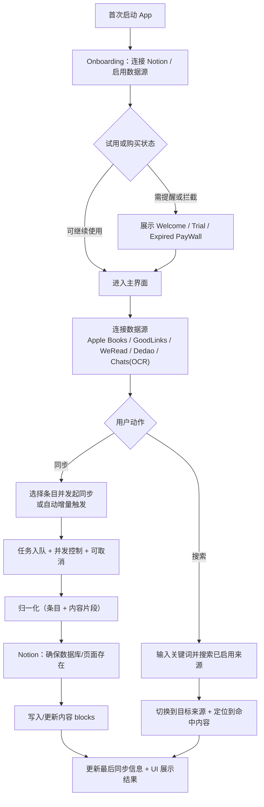
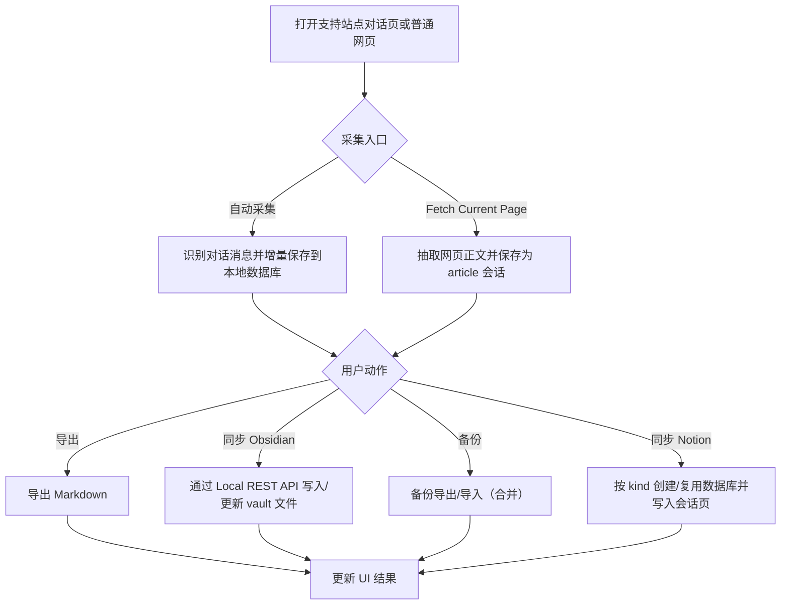

# SyncNos Business Logic

## 1 产品概述

SyncNos 是一套“把分散的阅读高亮/笔记与对话内容沉淀到 Notion”的工具组合，包含两条独立但相关的产品线：

- **SyncNos App（macOS）**：从 Apple Books、GoodLinks、WeRead（微信读书）、Dedao（得到）与聊天截图 OCR 中提取内容，整理后同步到 Notion。
- **WebClipper（浏览器扩展）**：在浏览器中采集 AI 对话与网页文章，先本地保存，再按需导出、备份、同步到 Notion 或 Obsidian。

- 给谁用：希望把阅读与对话中的“可复用信息”系统化沉淀到 Notion 的用户
- 核心体验：
  - App：连接阅读/聊天来源与 Notion 后，一键或自动增量同步，并在主界面中浏览与管理条目
  - WebClipper：打开网页即可自动或手动采集内容，在扩展中完成导出、备份、Obsidian 同步和 Notion 同步
- 共享输入：
  - Notion 授权信息与 Parent Page
  - 各来源原始内容与来源标识
- 共享输出：
  - Notion 中的数据库、页面/条目、页面属性与内容 blocks
  - 本地缓存、映射、配置与必要凭据

## 2 共享业务基础

### 2.1 Notion 授权与 Parent Page 选择

- 用户价值：确保 SyncNos 拥有写入权限，并让用户明确“产物落点”
- 触发方式：用户在设置或首次配置流程中完成授权并选择 Parent Page
- 输入：Notion OAuth（推荐）或 API key；Parent Page
- 输出：后续可在 Parent Page 下创建/复用数据库与页面
- 关键边界与失败方式：未授权或未选择 Parent Page 时，所有需要写入 Notion 的入口都应被阻止并给出明确提示

### 2.2 归一化（Normalization）与字段降级

- 用户价值：不同来源的内容能以一致方式进入同步链路，并支持后续增量更新
- 触发方式：任意来源进入同步流程前
- 输入：来源原生数据（高亮/笔记/消息/文章）
- 输出：统一的“条目 + 内容片段”结构
- 关键边界与失败方式：来源字段不完整时应优先保留核心内容，并对作者、位置、颜色等可选字段做降级

### 2.3 Notion 侧组织方式（数据库、页面与内容写入）

- 用户价值：让 Notion 中的结果可检索、可追溯来源，并在重复同步时避免无序重复追加
- 触发方式：用户手动同步或自动同步触发
- 输入：Parent Page；归一化后的条目与内容片段
- 输出：
  - App：通常按来源创建/复用数据库，每个条目对应一个页面
  - WebClipper：按 kind 创建/复用数据库，通常按“1 会话 -> 1 页面”写入
- 关键边界与失败方式：Notion API 限流、网络异常或目标页面状态异常时，同步应失败并返回可理解原因

### 2.4 隐私与本地存储

- 用户价值：敏感凭据尽量只保存在本地，且以系统或平台能力保护；用户对“会同步什么”有稳定预期
- 触发方式：登录、授权、同步、本地缓存写入
- 输入：站点 Cookie、OAuth token、缓存数据、配置
- 输出：本地缓存与必要映射；敏感凭据留在本地安全存储或受控存储中
- 关键边界与失败方式：当 Keychain、浏览器本地存储或相关凭据读取失败时，应提示重新登录或重新授权

## 3 SyncNos App（macOS）

### 3.1 核心业务能力

#### 3.1.1 首次引导、试用与付费门槛

- 用户价值：让用户先完成最小必要配置，再进入主界面；在试用与订阅状态变化时明确当前可用性
- 触发方式：首次启动 App、试用期临近结束、试用到期、订阅过期或购买状态变化
- 输入：Onboarding 完成状态、IAP 购买状态、试用剩余天数
- 输出：展示 Onboarding、欢迎/提醒/到期类 PayWall，或放行到主界面
- 关键边界与失败方式：未完成 Onboarding 时主列表不会初始化；试用到期或订阅过期时用户会先看到付费墙

#### 3.1.2 连接阅读与聊天数据源

- 用户价值：把不同阅读场景的高亮/笔记与聊天内容统一纳入可同步条目列表
- 触发方式：用户选择目录、登录站点，或导入聊天截图
- 输入：
  - Apple Books / GoodLinks：本地 SQLite 数据库（依赖 macOS 目录授权）
  - WeRead / Dedao：站点 Cookie 会话
  - Chats：聊天截图（OCR）或历史导入文件
- 输出：可浏览的书籍、文章、对话及其高亮/笔记/消息
- 关键边界与失败方式：目录未授权、数据库不可读、Cookie 失效、OCR 识别失败或导入内容为空时无法形成可用条目

#### 3.1.3 增量同步与自动同步

- 用户价值：日常使用时只同步新增或变更内容，减少等待与重复写入
- 触发方式：用户开启自动同步，或在登录/授权完成等关键事件后触发检查
- 输入：上次同步时间、已同步映射、最新读取到的内容
- 输出：仅把发生变化的条目入队并同步；同步后更新“最后同步时间/数量”等可见属性
- 关键边界与失败方式：当来源没有稳定标识时，增量可能退化为覆盖式重建或追加

#### 3.1.4 同步队列、并发与取消

- 用户价值：批量同步时进度可见、资源可控、可取消，不因单条失败拖垮整个批次
- 触发方式：用户发起批量同步或自动同步入队
- 输入：待同步条目集合、并发上限、用户取消动作
- 输出：任务状态（排队/进行中/成功/失败/取消/跳过）与错误信息
- 关键边界与失败方式：单条失败不应阻断整批；必要时应做短暂冷却，避免高频重试

#### 3.1.5 全局搜索与定位

- 用户价值：在多来源内容持续增长后，用户仍能快速找到命中的书籍、文章、高亮或聊天消息，并直接跳转到对应上下文
- 触发方式：用户打开全局搜索面板并输入关键词
- 输入：查询词、当前启用的数据源、各来源索引内容
- 输出：跨来源搜索结果，以及定位到目标 source / container / block 的跳转行为
- 关键边界与失败方式：仅搜索当前已启用的数据源；某个来源无结果时不应阻塞其他来源结果

### 3.2 核心用户流程

#### 3.2.1 首次配置并完成一次同步

1. 用户首次启动后完成 Onboarding，并至少启用一个同步来源
2. 系统根据试用或购买状态决定是否先展示欢迎页、试用提醒或付费墙
3. 用户完成 Notion 授权并选择 Parent Page
4. 用户连接至少一个数据源（选目录、登录、导入）
5. 用户在列表中选择条目发起同步
6. 系统将任务入队并展示进度与结果
7. Notion 中出现对应的数据库与页面/条目

#### 3.2.2 日常使用：自动增量同步

1. 用户开启某来源的自动同步
2. 系统按固定周期或关键事件触发增量检查
3. 仅将发生变化的条目入队同步
4. 同步完成后更新页面属性与本地最后同步信息

#### 3.2.3 跨来源搜索并回到上下文

1. 用户打开全局搜索面板并输入关键词
2. 系统并行搜索当前启用的数据源
3. 用户选择一个结果后，主界面切换到对应来源并选中目标容器
4. 详情区滚动到命中的高亮或消息位置

### 3.3 业务流程图（Mermaid）

### 3.4 业务规则与约束

- App 进入前置条件：首次使用必须先完成 Onboarding；当试用到期或订阅过期时，主界面会被 PayWall 流程拦截
- macOS 沙盒约束：Apple Books 与 GoodLinks 需要用户显式授权目录；授权不正确时无法读取数据
- 会话类数据源约束：WeRead 与 Dedao 依赖 Cookie；过期或失效会导致拉取失败，需要用户重新登录
- 增量与去重前提：依赖来源提供稳定标识；否则可能退化为覆盖式重建或出现重复追加风险
- 全局搜索约束：搜索范围受“当前启用的数据源”限制；跳转以容器定位和详情滚动为主，不直接修改原始数据

### 3.5 产物与可见结果

- Notion 侧：
  - 按来源创建/复用数据库，常见标题前缀为 `SyncNos-...`
  - 通常“一个条目一个页面”，页面内写入高亮、笔记或聊天内容 blocks，并维护同步属性
- 本地侧：
  - 缓存数据、已同步映射、最后同步时间戳
  - 本地安全保存的授权与登录状态

## 4 WebClipper（浏览器扩展）

### 4.1 核心业务能力

#### 4.1.1 对话采集与本地入库

- 用户价值：在不打断对话的前提下，把浏览器中的 AI 对话可靠地留存为可导出、可备份、可同步的记录
- 触发方式：用户打开支持站点的对话页面，或手动抓取当前网页文章
- 输入：页面中可见的消息内容、文章正文与必要元信息
- 输出：扩展本地数据库中的会话与消息记录
- 关键边界与失败方式：
  - 页面结构变化可能导致识别不完整，应以“尽量留存 + 可提示警告”为原则
  - 采集边界应限定为对话消息或文章正文，避免把侧栏、工具栏、时间戳、头像等噪声写入正文
  - `inpage_supported_only` 只影响按钮可见性，不影响 popup 中的 `Fetch Current Page`

#### 4.1.2 导出、Obsidian 与数据库备份

- 用户价值：即使不连接 Notion，也能把对话带走、沉淀到 Obsidian，或在不同设备/浏览器间恢复本地数据
- 触发方式：用户在扩展弹窗中选择导出、同步到 Obsidian，或备份导出/导入
- 输入：选中的会话；导入备份文件
- 输出：Markdown 导出文件、Obsidian 笔记、Zip v2 备份文件，以及合并导入后的本地数据
- 关键边界与失败方式：备份导入是合并模式；备份覆盖所有非敏感设置；当 Obsidian Local REST API 不可达时应明确提示失败

#### 4.1.3 Notion 同步与重复同步策略

- 用户价值：把浏览器中采集到的聊天和网页文章按结构化形式落到 Notion，并在重复同步时尽量保持正确更新
- 触发方式：用户在扩展中连接 Notion 并手动发起同步
- 输入：选中的会话、内容 kind、Parent Page、消息内容或文章正文
- 输出：
  - chat：写入 `SyncNos-AI Chats`
  - article：写入 `SyncNos-Web Articles`
  - `contentMarkdown` 可用时优先写入结构化 Notion blocks，否则回退纯文本
- 关键边界与失败方式：
  - chat：cursor 匹配时增量追加；cursor 缺失时覆盖式重建子块
  - article：重新 fetch 且内容变化时覆盖式重建子块

### 4.2 核心用户流程

#### 4.2.1 对话采集 → 导出 / Obsidian / 备份 / 同步 Notion

1. 用户在支持站点进行对话，扩展自动增量采集并本地入库
2. 用户也可以在设置页点击 `Fetch Current Page`，把当前网页文章抓取为 `sourceType=article` 的会话
3. 用户在扩展弹窗中选择会话后，可执行删除、导出、同步到 Obsidian、备份导出/导入或同步到 Notion
4. 系统根据目标操作生成文件、更新本地库、写入 Obsidian，或同步到对应 kind 的 Notion 数据库

### 4.3 业务流程图（Mermaid）

### 4.4 业务规则与约束

- inpage 显示范围约束：`inpage_supported_only=false` 时全站显示；为 `true` 时仅支持站点显示；切换后对新打开或刷新页面生效
- 备份约束：备份导出仅 Zip v2（`manifest.json + sources/conversations.csv + sources/... + config/storage-local.json`）；导入兼容 Zip v2 与 legacy JSON；备份文件不应包含 `notion_oauth_token*` 与 `notion_oauth_client_secret`
- Obsidian 约束：通过 Obsidian Local REST API（localhost HTTP）写入/更新 vault 文件；端口不可用、插件未运行或 API Key 无效时应报错
- Markdown 渲染约束：`contentMarkdown` 可用时按 Markdown 结构写入 Notion blocks；不可用时回退纯文本，避免同步中断

### 4.5 产物与可见结果

- Notion 侧：
  - `SyncNos-AI Chats`
  - `SyncNos-Web Articles`
  - 通常“一个会话一个页面”，按时间顺序组织消息或文章内容
- 本地侧：
  - 浏览器本地数据库（IndexedDB）的会话与消息
  - 非敏感设置、导出的 Markdown、Zip v2 备份文件
  - 按 kind 分目录写入 Obsidian 的笔记内容

## 5 术语表（Glossary）

- Parent Page：Notion 中承载 SyncNos 产物的父页面
- Onboarding：首次进入 App 主界面前的引导流程
- PayWall：根据欢迎态、试用剩余天数、试用到期、订阅过期等状态展示的付费或提醒界面
- 条目（Item）：一个可同步对象（书、文章、对话）
- 内容片段：条目下的高亮、笔记、消息或正文内容，最终写入 Notion blocks
- 增量同步：只同步新增或变更内容，并更新最后同步信息
- 覆盖式重建：为避免重复追加，清空目标页面子块后重建内容
- 会话（Conversation）：一次对话或一次网页抓取所形成的聚合记录
- 消息（Message）：会话中的最小内容单元
- Obsidian Local REST API：浏览器扩展通过 HTTP 与 Obsidian Vault 文件交互的本地服务插件

## 6 入口索引（读码起点，<= 5）

- `SyncNos/Services/DataSources-To/Notion/`
- `SyncNos/Services/DataSources-From/`
- `SyncNos/Services/SyncScheduling/`
- `SyncNos/ViewModels/`
- `Extensions/WebClipper/`
