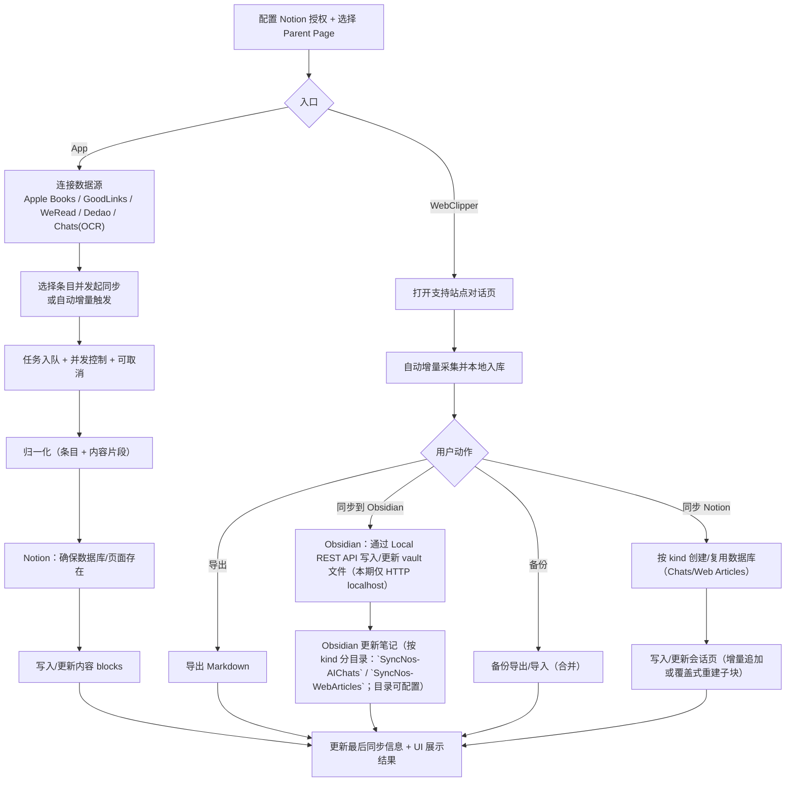

# SyncNos Business Logic

## 1 产品概述

SyncNos 是一套“把分散的阅读高亮/笔记与对话内容沉淀到 Notion”的工具组合，包含：

- **SyncNos（macOS App）**：从 Apple Books、GoodLinks、WeRead（微信读书）、Dedao（得到）与聊天截图 OCR 中提取高亮/笔记/消息，整理后同步到 Notion。
- **WebClipper（浏览器扩展）**：在浏览器中采集 AI 对话与网页文章（手动 fetch 当前页），增量保存到本地；支持导出（Markdown）、本地数据库备份导出/导入（合并导入），以及手动同步到 Notion（OAuth）。

- 给谁用：希望把阅读与对话中的“可复用信息”系统化沉淀到 Notion 的用户
- 核心体验：
  - App：连接数据源与 Notion 后，一键同步；可见进度；支持自动增量同步
  - WebClipper：对话页自动采集并本地入库；在扩展弹窗中多选导出/备份/同步
- 输入（用户/系统侧）：
  - App：本地数据库文件（Apple Books/GoodLinks）、站点登录会话（WeRead/Dedao Cookie）、聊天截图（OCR）、Notion 授权信息与 Parent Page
  - WebClipper：对话页面内容、Notion OAuth 授权信息与 Parent Page
- 输出（用户可见产物）：
  - Notion：数据库与页面/条目、页面属性（如最后同步时间/数量等）、内容 blocks
  - 本地：App 缓存与凭据；WebClipper 本地数据库与导出/备份文件

## 2 核心业务能力（Capabilities）

### 2.1 Notion 授权与 Parent Page 选择

- 用户价值：确保 SyncNos 拥有写入权限，并让用户明确“产物落点”
- 触发方式：在设置中完成授权并选择 Parent Page
- 输入：Notion OAuth（推荐）或 API key；Parent Page
- 输出：可在 Parent Page 下创建/复用数据库与页面
- 关键边界与失败方式：未授权或未选择 Parent Page 时，所有同步入口应被阻止并给出明确提示

### 2.2 App：连接阅读与笔记数据源

- 用户价值：把不同阅读场景的高亮/笔记统一纳入可同步的条目列表
- 触发方式：用户选择目录、登录站点，或导入素材
- 输入：
  - Apple Books / GoodLinks：本地 SQLite 数据库（依赖 macOS 目录授权）
  - WeRead / Dedao：站点 Cookie 会话（可能过期）
  - Chats：聊天截图（OCR）或历史导入文件
- 输出：可浏览的“条目列表”（书/文章/对话）及其高亮/笔记/消息
- 关键边界与失败方式：目录未授权/数据库不可读、未登录或 Cookie 失效、OCR 识别失败或导入内容为空

### 2.3 WebClipper：对话采集与本地入库

- 用户价值：在不打断对话的前提下，把浏览器中的 AI 对话可靠地留存为可导出/可同步的记录
- 触发方式：用户打开支持站点的对话页面（自动采集为主，手动触发为辅）；inpage 按钮默认可在所有 `http(s)` 页面出现，也可在设置中切换为“仅支持站点显示”
- 输入：对话页面中可见的消息内容与必要元信息（如 URL、时间等）
- 输出：扩展本地数据库中的“会话/消息”记录（持续增量更新）
- 关键边界与失败方式：
  - 页面结构变化可能导致识别不完整；应以“尽量留存 + 可提示警告”为原则
  - 页面存在侧栏、工具栏、时间戳、头像等非消息内容时，采集应以“对话消息”为边界，避免把非消息内容写入会话
  - inpage 显示范围开关仅影响按钮可见性，不影响 popup 中 `Fetch Current Page` 的手动抓取能力

### 2.4 归一化（Normalization）与字段降级

- 用户价值：不同来源的内容能以一致的方式被写入 Notion，并支持后续增量更新
- 触发方式：任意来源进入同步流程前
- 输入：来源原生数据（高亮/笔记/消息）
- 输出：统一的“条目 + 内容片段”结构（必要字段齐全，可选字段尽量补齐）
- 关键边界与失败方式：来源缺少字段时采用可用字段优先的降级策略（例如缺少作者/位置/颜色）

### 2.5 Notion 侧组织方式（数据库、页面与内容写入）

- 用户价值：让 Notion 里的结果可检索、可追溯来源，并在重复同步时保持“不会无限重复追加”
- 触发方式：用户手动同步或自动同步触发
- 输入：Parent Page；条目与其内容片段
- 输出：
  - App：通常“按来源一个数据库”，每个条目对应一个页面，在页面内写入高亮/笔记 blocks
  - WebClipper：按 kind 分库创建/复用数据库并写入页面内容：
    - chat：`SyncNos-AI Chats`
    - article：`SyncNos-Web Articles`
    - 统一按“1 会话 -> 1 页面”写入内容 blocks
    - 当 `contentMarkdown` 可用时优先渲染为结构化 blocks（标题/列表/引用/代码块等），否则回退为纯文本段落
- 关键边界与失败方式：Notion API 限流或网络异常会导致同步失败；需要提供可重试与失败原因

### 2.6 增量同步与自动同步（App）

- 用户价值：日常使用时只同步新增/变更内容，减少等待与重复写入
- 触发方式：用户开启自动同步；或在关键事件后触发检查（如成功登录、目录授权完成等）
- 输入：上次同步时间/已同步映射、最新拉取到的内容
- 输出：仅将发生变化的条目入队并同步；同步后更新“最后同步时间/数量”等可见属性
- 关键边界与失败方式：当来源无法提供稳定标识时，增量可能退化为覆盖式重建或追加

### 2.7 同步队列、并发与取消

- 用户价值：批量同步时进度可见、资源可控、可取消，不因偶发失败拖垮整个批次
- 触发方式：用户发起批量同步或自动同步入队
- 输入：待同步条目集合、并发上限、用户取消动作
- 输出：任务状态（排队/进行中/成功/失败/取消/跳过）与可理解的错误信息
- 关键边界与失败方式：单条失败不应阻断整批；必要时应对失败任务做短暂冷却，避免频繁重试

### 2.8 WebClipper：导出、Obsidian 与数据库备份（本地优先）

- 用户价值：即使不连接 Notion，也能把对话以可迁移的形式带走，或快速沉淀到 Obsidian，并可在不同设备/浏览器之间恢复
- 触发方式：用户在扩展弹窗中选择导出、添加到 Obsidian，或备份导出/导入
- 输入：选中的会话；备份文件（导入）
- 输出：导出文件（Markdown）、通过 Obsidian Local REST API 写入/更新后的 vault 笔记、备份文件（Zip v2，含 manifest/index/sources/config）、合并导入后的本地数据（支持 Zip v2 与 legacy JSON）
- 关键边界与失败方式：备份导入为合并模式（不清空现有数据）；备份不应包含 Notion token；当 Obsidian Local REST API 不可达（未运行/端口不可用/API Key 无效）时应明确提示失败

### 2.9 隐私与本地存储

- 用户价值：敏感凭据尽量只保存在本地，且以系统能力保护；用户对“会同步什么”有预期
- 触发方式：登录、同步与本地缓存写入
- 输入：站点 Cookie、加密密钥（如有）、缓存数据
- 输出：本地缓存与必要映射；敏感凭据保存于系统安全存储（如 Keychain）
- 关键边界与失败方式：Keychain 不可用或读取失败时，相关来源应提示“需要重新登录/授权”

## 3 核心用户流程（User Journeys）

### 3.1 首次配置并完成一次同步（App 主流程）

1. 用户完成 Notion 授权并选择 Parent Page
2. 用户连接至少一个数据源（选目录/登录/导入）
3. 用户在列表中选择条目发起同步
4. 系统将任务入队并展示进度与结果
5. Notion 中出现对应的数据库与页面/条目

### 3.2 日常使用：自动增量同步（App）

1. 用户开启某来源的自动同步
2. 系统按固定周期或关键事件触发增量检查
3. 仅将发生变化的条目入队同步
4. 同步完成后更新页面属性与本地“最后同步信息”

### 3.3 WebClipper：对话采集 → 导出/Obsidian/备份/同步 Notion

1. 用户在支持站点进行对话，扩展自动增量采集并本地入库
   - inpage 按钮默认在所有 `http(s)` 页面可见；用户可在 Settings 开启“仅在支持站点显示 Inpage 按钮”
   - 或用户在设置页点击 “Fetch Current Page”，将当前网页文章抓取为 `sourceType=article` 的会话并入库
2. 用户在扩展弹窗中选择会话，执行：
   - 导出（Markdown），或
   - 同步到 Obsidian（通过 Obsidian Local REST API 写入/更新 vault 文件，按 kind 分目录落入 `SyncNos-AIChats` / `SyncNos-WebArticles`，且目录可配置），或
   - 数据库备份导出/导入（合并导入），或
   - 连接 Notion 并选择 Parent Page，同步到对应 kind 的数据库（`SyncNos-AI Chats` / `SyncNos-Web Articles`）
3. 重复同步策略：
   - chat：cursor 匹配时增量追加；cursor 缺失时覆盖式重建子块
   - article：当文章被重新 fetch 且内容更新时，也会覆盖式重建子块（避免停留在 no_changes）

## 4 业务流程图（Mermaid）

## 5 业务规则与约束（Rules & Constraints）

- 同步前置条件：必须具备有效的 Notion 授权信息与 Parent Page
- macOS 沙盒约束：Apple Books/GoodLinks 需要用户显式授权目录；授权不正确时无法读取数据
- 会话类数据源约束：WeRead/Dedao 依赖 Cookie；过期/失效会导致拉取失败，需要用户重新登录
- 增量与去重前提：依赖来源提供稳定标识；否则可能退化为覆盖式重建或出现重复追加风险
- WebClipper 重复同步策略（按 kind）：
  - chat：cursor 匹配时增量追加；cursor 缺失时覆盖式重建子块
  - article：当文章被重新 fetch 且内容更新时覆盖式重建子块
- WebClipper Obsidian 约束：通过 Obsidian Local REST API（localhost HTTP）写入/更新 vault 文件；若 Obsidian 未运行或端口不可用，扩展应返回可理解的失败提示
- WebClipper 备份约束：备份导出仅 Zip v2；导入为合并模式（Zip v2 + legacy JSON）；备份文件不应包含 Notion token 等敏感凭据
- WebClipper 采集边界：以“对话消息”为最小单位，避免把侧栏/操作按钮/时间戳/头像等非消息内容写入消息正文
- WebClipper inpage 显示范围约束：配置项 `inpage_supported_only=false` 时全站显示；为 `true` 时仅支持站点显示；该配置不影响 popup 手动抓取当前页
- WebClipper Markdown 渲染约束：`contentMarkdown` 可用时按 Markdown 结构写入 Notion blocks；不可用时回退纯文本，避免同步中断

## 6 产物与可见结果（Outputs）

### 6.1 Notion 侧产物

- 按来源创建/复用数据库（App 常见标题前缀为 `SyncNos-...`；WebClipper 常见标题为 `SyncNos-AI Chats` / `SyncNos-Web Articles`）
- 页面/条目结构：
  - App：通常“一个条目一个页面”，在页面内写入高亮/笔记 blocks，并维护“最后同步时间/数量”等属性
  - WebClipper：通常“一个会话一个页面”，写入按时间顺序组织的消息内容

### 6.2 本地侧产物

- App：用于加速展示与增量同步的缓存数据、已同步映射与时间戳；敏感凭据优先使用系统安全存储（如 Keychain）
- WebClipper：浏览器本地数据库（IndexedDB）的会话与消息、非敏感设置、导出的 Markdown 与备份文件，以及写入 Obsidian 的笔记内容（按 kind 分目录：`SyncNos-AIChats` / `SyncNos-WebArticles`）

## 7 术语表（Glossary）

- Parent Page：Notion 中承载 SyncNos 产物的父页面（统一落点）
- 条目（Item）：一个可同步对象（书/文章/对话），在 Notion 中通常对应一个页面或一个数据库条目
- 内容片段：条目下的高亮/笔记/消息，写入 Notion 的 blocks
- 增量同步：只同步新增或变更的内容，并更新“最后同步信息”
- 覆盖式重建：为避免重复追加，清空目标页面的子块后重建内容
- 会话（Conversation）：一次对话的聚合单位；在 WebClipper 中通常对应一个可导出/可同步的记录
- 消息（Message）：会话中的最小内容单元，通常按 user/assistant 顺序组织
- Obsidian Local REST API：用于从浏览器扩展通过 HTTP 与 Obsidian Vault 文件交互的本地服务插件

## 8 入口索引（读码起点，<= 5）

- `SyncNos/Services/DataSources-To/Notion/`
- `SyncNos/Services/DataSources-From/`
- `SyncNos/Services/SyncScheduling/`
- `SyncNos/ViewModels/`
- `Extensions/WebClipper/`
