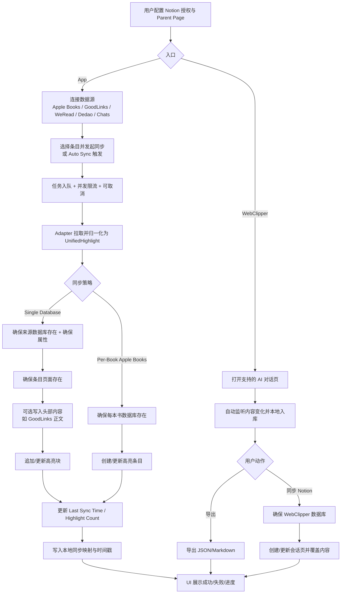

# SyncNos Business Logic (Business Map)

## 1) 产品概述

SyncNos 是一套“把分散知识沉淀到 Notion”的工具组合，包含：

- **SyncNos（macOS App）**：将多个内容来源中的高亮/笔记/消息摘要统一整理后同步到 Notion，形成可检索、可持续增量更新的知识库。
- **WebClipper（浏览器扩展）**：在浏览器中采集 AI 对话（ChatGPT、Claude、Gemini、DeepSeek、Kimi、豆包、元宝、NotionAI 等），自动入库到扩展本地数据库，并支持手动导出/手动同步到 Notion；Firefox 版本已上架 AMO：https://addons.mozilla.org/zh-CN/firefox/addon/syncnos-webclipper/

- 给谁用：需要把分散在阅读器、稍后读、读书应用、以及聊天截图中的信息沉淀到 Notion 的用户
- 核心体验：
  - App：连接数据源与 Notion 后，按“书籍/文章/对话”维度一键同步；支持队列与进度；支持自动增量同步
  - WebClipper：在对话页面自动监听内容变化并增量保存；用户在扩展弹窗中多选导出或批量同步到 Notion
- 输入（用户/系统侧）：
  - App：本地 Apple Books/GoodLinks 数据库文件、WeRead/Dedao 的登录会话（Cookie）、聊天截图（OCR）、Notion 授权信息与父页面选择
  - WebClipper：浏览器页面 DOM（AI 对话）、Notion OAuth 授权信息与 Parent Page 选择
- 输出（用户可见产物）：
  - Notion：按来源创建的数据库与页面/条目，以及页面属性（如最后同步时间等）与内容块
  - 本地：App 的缓存（SwiftData）与凭据（Keychain）；WebClipper 的本地数据库与导出文件（JSON/Markdown）

## 2) 核心业务能力（Capabilities）

### 2.1 Notion 授权与父页面选择

- 用户价值：让 SyncNos 具备在用户工作区创建数据库/页面与写入内容的权限，并明确“产物落在哪里”
- 触发方式：在设置中进行 OAuth 授权（推荐）或手动填写 token 与父页面 ID
- 输入：Notion OAuth token 或 API key；用户选择的 Parent Page
- 输出：SyncNos 具备有效的 `effectiveToken` 与 `NOTION_PAGE_ID`；后续同步可以创建数据库与页面
- 关键边界与失败方式：
  - 未配置 token 或父页面：同步被阻止并提示需要配置
  - OAuth 客户端信息未配置：授权流程不可用（需要回退到手动方式）

### 2.2 数据源连接（从哪里同步）

SyncNos 将不同来源统一抽象为“可列出条目 + 可按条目获取高亮/笔记”的能力。

- Apple Books
  - 触发方式：用户选择 Apple Books 容器/目录（通过安全作用域书签持久化）
  - 输入：本地 Apple Books 数据目录下的 SQLite 数据库
  - 输出：书籍列表、每本书的高亮与注释
  - 失败方式：未授权目录、数据库不存在或不可读
- GoodLinks
  - 触发方式：用户选择 GoodLinks 共享容器目录（通过书签持久化），或使用默认路径
  - 输入：GoodLinks `data.sqlite`
  - 输出：文章列表与高亮，附带实时聚合的高亮数量
  - 失败方式：数据库缺失/不可读
- WeRead（微信读书）
  - 触发方式：在应用内登录获取 Cookie（支持会话过期后尝试静默刷新）
  - 输入：WeRead Web API（Cookie 鉴权），含笔记本列表、高亮与想法（review）
  - 输出：书籍列表；“高亮 + 想法合并后”的高亮列表
  - 失败方式：未登录、Cookie 过期/失效、限流或 API 错误
- Dedao（得到）
  - 触发方式：在应用内登录获取 Cookie
  - 输入：Dedao Web API（Cookie 鉴权），含书架与电子书笔记
  - 输出：书籍列表与笔记（可写入本地缓存）
  - 失败方式：未登录、反爬限流、接口错误
- Chats（聊天 OCR）
  - 触发方式：用户导入聊天截图，或导入历史导出的 JSON/Markdown
  - 输入：截图（本地 OCR）或导入文件
  - 输出：对话列表与消息；支持用户修正消息类型、方向与昵称
  - 失败方式：OCR 识别失败、导入格式不支持或内容为空

### 2.3 统一数据模型（Normalization）

- 用户价值：不同来源的高亮/笔记能够以一致的逻辑被同步与增量更新
- 触发方式：任意来源在进入同步引擎前都会转换为统一结构
- 输入：来源原生高亮/笔记/消息记录
- 输出：统一的 `UnifiedSyncItem`（条目：书/文/对话）与 `UnifiedHighlight`（高亮/笔记/消息）
- 关键边界与失败方式：来源缺少部分字段时会以“可用字段优先”的方式降级（例如无作者、无位置、无颜色）

### 2.4 同步到 Notion（Sync Engine + Adapter）

- 用户价值：把高亮内容写入 Notion，并保证重复同步不会不断追加重复内容
- 触发方式：用户手动同步（批量/选中）；或自动同步触发
- 输入：Notion 配置（token + parent page）；某条目对应的高亮列表
- 输出：
  - 单一数据库模式：按来源创建一个数据库，每个条目在该数据库中对应一个页面，高亮以块的形式写入页面
  - 每本书独立模式（仅 Apple Books 支持）：每本书创建一个数据库，每条高亮成为一个数据库条目（page item）
- 关键边界与失败方式：
  - Notion 未授权或配置缺失：同步失败并提示
  - Notion API 触发限流/冲突：引擎会尽量避免并发重复 ensure，仍可能因外部限制失败

### 2.5 GoodLinks 正文抓取与“文章头部内容”写入

- 用户价值：在 Notion 页面中不仅同步高亮，也可在页面顶部写入文章正文（提取后的正文 HTML 转块）
- 触发方式：GoodLinks 同步时为新页面生成“Article”头部内容；或在无高亮但页面已存在时补齐正文
- 输入：文章 URL；本地正文缓存（SwiftData）；必要时通过 WebKit 离屏渲染提取正文
- 输出：Notion 页面头部的文章正文 blocks（可为空）
- 关键边界与失败方式：
  - 正文抓取失败或转换失败：继续同步高亮（若有），正文部分跳过
  - 正文缓存版本不匹配：视为未命中并重新抓取

### 2.6 增量同步（去重与更新策略）

- 用户价值：重复同步不会产生大量重复块，并且能在内容变更时更新对应块
- 触发方式：对同一条目再次执行同步
- 输入：上次同步时间；本地已同步记录（UUID -> Notion blockId + contentHash）
- 输出：仅追加新增高亮；仅更新变更高亮；无变化时提示 “No changes”
- 关键边界与失败方式：
  - 本地记录缺失时：回退到从 Notion 读取 UUID 映射以重建本地记录（Chats 例外）
  - Chats 的特殊性：Chats 不在 Notion 块中写入 UUID/modified 元信息；若页面已存在但本地记录为空，会清空该页并重建以避免重复追加

### 2.7 自动同步（Auto Sync）

- 用户价值：减少手动操作，把“有变更的条目”自动同步到 Notion
- 触发方式：定时器触发（默认每 5 分钟）或关键事件触发（例如选择数据目录、登录成功、刷新请求）
- 输入：各来源的“变更检测信号”（例如 maxModifiedDate、link.modifiedAt、book.updatedAt、本地缓存的最新更新时间等）
- 输出：将需要同步的条目入队并后台执行同步
- 关键边界与失败方式：
  - Notion 未配置：自动同步整体跳过
  - Chats：定时触发为 no-op（设计为主要依赖用户手动同步）

### 2.8 同步队列、并发与取消

- 用户价值：大批量同步时可见进度、可控并发、可取消；避免多个入口重复触发导致“无进度假死”
- 触发方式：手动批量同步与自动同步均会入队；UI 可取消 queued/running 任务
- 输入：待同步条目列表；全局并发上限；用户取消动作
- 输出：队列状态（queued/running/succeeded/failed/cancelled/skipped）、进度文本、失败原因（可选）
- 关键边界与失败方式：
  - 冷却机制：失败任务会进入短暂冷却期，避免频繁重试造成资源浪费
  - 退出拦截：当检测到仍有同步任务在进行时，退出需要用户确认

### 2.9 本地缓存与隐私保护

- 用户价值：减少重复抓取/请求，提高同步速度；敏感数据尽量本地保存并加密
- 触发方式：WeRead/Dedao/Chats/网页正文等会落本地缓存；站点 Cookie 进入 Keychain
- 输入：来源数据与同步过程中的映射信息
- 输出：本地 SwiftData store（例如 weread/dedao/chats/web_article_cache/synced-highlights）；Keychain 中的 Cookie Header 与加密密钥
- 关键边界与失败方式：
  - Keychain 读取失败或无 Cookie：相关来源视为未登录
  - Chats 的存储升级可能为破坏性升级（需要用户重新导入）

### 2.10 WebClipper：浏览器侧 AI 对话采集与手动同步

- 用户价值：把“发生在浏览器里的 AI 对话”以最小打扰的方式沉淀到 Notion；同时保留本地导出能力
- 触发方式：
  - 在支持站点打开对话页时自动采集并增量入库（默认开启）
  - 用户在扩展 popup 中手动导出（JSON/Markdown）或手动批量同步 Notion
- 输入：
  - 当前页面可见的对话内容
  - Notion OAuth token 与 Parent Page 选择
- 输出：
  - 扩展本地数据库中的会话与消息记录
  - 下载到本地的导出文件（Markdown / JSON；批量 JSON 导出会打包为 zip）
  - Notion 中按来源（平台）创建/复用的数据库与会话页面（`1 会话 -> 1 页面`，重复同步会以“清空后重建”的方式刷新页面内容）
- 关键边界与失败方式（用户视角）：
  - 页面形态复杂（如 NotionAI 侧栏/浮窗）：容器识别不确定时会标记 warning，但仍会入库
  - 批量同步：单条失败不阻断整批，结束后给出失败清单
  - 同步覆盖：为了避免重复追加，WebClipper 的会话同步会覆盖目标 Notion 页面的子块内容（保留页面本身与属性）

## 3) 核心用户流程（User Journeys）

### 3.1 首次配置并完成一次同步（主流程）

1. 用户完成引导（Onboarding）并进入主界面
2. 用户在设置中授权 Notion（OAuth 或手动 token），并选择 Parent Page
3. 用户连接至少一个来源（选目录/登录/导入）
4. 用户在列表中选择若干条目发起同步
5. 系统将任务入队，展示进度与状态；完成后 Notion 中出现对应数据库与页面/条目

### 3.2 日常使用：自动增量同步

1. 用户开启某来源的自动同步开关
2. 系统每 5 分钟触发一次检查，并在目录选择、登录成功等事件后也会触发
3. 对每个来源仅挑选“自上次同步以来发生变化”的条目入队
4. 同步完成后更新 Notion 页面属性（如 Last Sync Time、Highlight Count 等）

### 3.3 Chats：从截图到 Notion

1. 用户导入聊天截图（或导入历史导出文件）
2. 系统本地 OCR 识别文字并解析为消息序列（含系统消息/气泡消息方向判定）
3. 用户可对消息的方向、类型、昵称进行修正
4. 用户选择对话发起同步，Notion 中生成对话页面并按发送者分组写入消息

### 3.4 WebClipper：从浏览器对话到 Notion

1. 用户在浏览器安装 WebClipper 扩展并授予必要站点权限
2. 用户打开支持的 AI 对话页面并进行对话
3. 扩展自动检测对话内容变化并增量保存到本地数据库
4. 用户打开扩展 popup，多选会话后选择导出或同步
5. 导出：下载 JSON/Markdown；同步：连接 Notion、选择 Parent Page、批量同步到 Notion（同步会覆盖目标会话页内容）

## 4) 业务流程图（Mermaid）

## 5) 业务规则与约束（Rules & Constraints）

- Notion 是主要同步目标：App 侧以同步为主；WebClipper 侧除同步外还支持本地导出（JSON/Markdown）
- 同步前置条件：必须具备有效的 Notion token（OAuth 或 API key）与 Parent Page
- Apple Books 与 GoodLinks 依赖 macOS 沙盒的安全作用域授权：用户必须选择正确目录并允许访问
- WeRead/Dedao 依赖 Cookie 会话：未登录或 Cookie 失效时不能拉取数据；WeRead 会尝试静默刷新但不保证成功
- 自动同步是“增量检查”：只有检测到条目有变更才会入队；Chats 的定时自动同步当前不执行实际同步
- 去重/增量依赖“来源内 UUID”：统一高亮模型必须能提供稳定 uuid；否则会退化为追加或需要重建
- 高并发下的数据库/属性 ensure 会做缓存与串行化，避免重复创建导致 Notion 侧 409/429 与长时间无进度

## 6) 产物与可见结果（Outputs）

### 6.1 Notion 侧产物

- 按来源创建数据库（App 常见标题前缀为 `SyncNos-...`；WebClipper 常见标题为 `WebClipper - <Source>`）
- 单一数据库模式：
  - 每个条目（书/文章/对话）在数据库中对应一个页面
  - 页面内包含高亮/笔记/消息的 blocks；部分来源会在块中写入内部标记以支持增量更新
  - 页面属性包含 `Last Sync Time`，并可能包含来源特有属性（如 GoodLinks 的 Tags/Summary/Starred）
- 每本书独立模式（Apple Books）：
  - 每本书创建一个 Notion 数据库
  - 每条高亮以数据库条目（page item）形式写入，并携带属性（Text、UUID、Added/Modified、Location 等）

### 6.2 本地侧产物

- SwiftData 缓存（位于 Application Support 的 SyncNos 目录下）：
  - `weread.store`（WeRead）
  - `dedao.store`（Dedao）
  - `chats_v3_minimal.store`（Chats）
  - `web_article_cache.store`（网页正文缓存）
  - `synced-highlights.store`（UUID -> Notion blockId + contentHash 的已同步映射）
- Keychain 存储：
  - 站点 Cookie Header（按 domain 归档，供 WeRead/Dedao 等鉴权使用）
  - Chats 本地加密密钥（用于加密存储字段）

## 7) 术语表（Glossary）

- `ContentSource`：数据源类别（Apple Books / GoodLinks / WeRead / Dedao / Chats）
- `UnifiedSyncItem`：统一条目（书籍/文章/对话），同步引擎以此创建/定位 Notion 页面或数据库
- `UnifiedHighlight`：统一高亮（高亮文本 + 笔记/想法 + 颜色/时间/位置 + UUID）
- `Single Database`：按来源一个数据库、按条目一个页面、在页面中写入高亮 blocks
- `Per-Book Database`：按书一个数据库、按高亮一个条目（当前主要用于 Apple Books）
- `Last Sync Time`：用于判断是否增量同步的上次同步时间
- `Synced Highlight Record`：本地记录的 UUID -> Notion blockId 映射，用于快速增量更新

## 8) 入口索引（读码起点，<= 5）

- `SyncNos/Services/DataSources-To/Notion/`
- `SyncNos/Services/DataSources-From/`
- `SyncNos/Services/SyncScheduling/`
- `SyncNos/Models/`
- `Extensions/WebClipper/`
