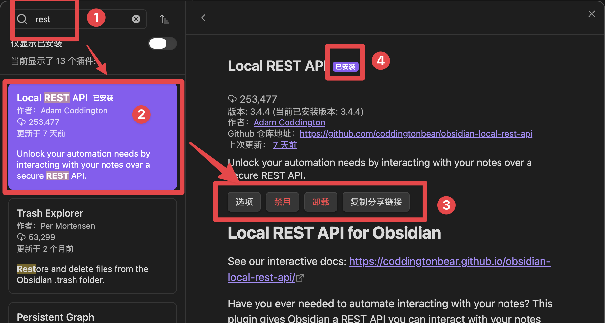
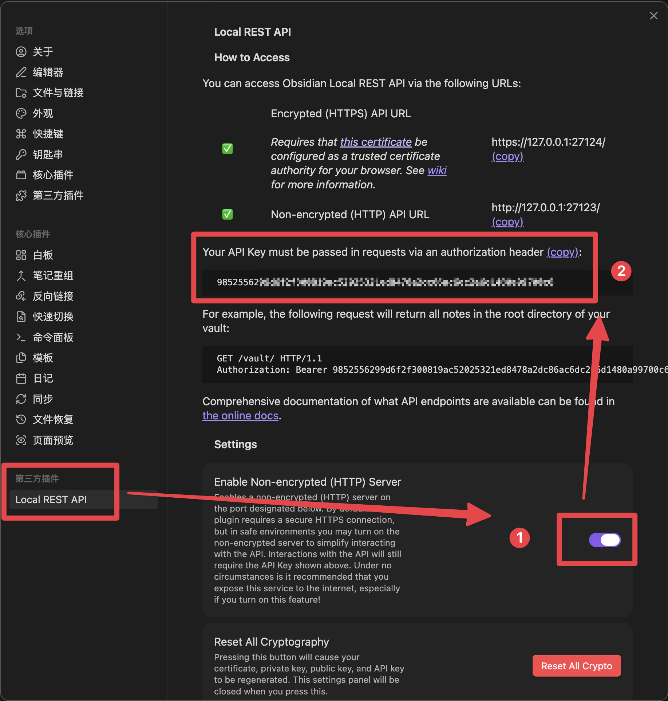
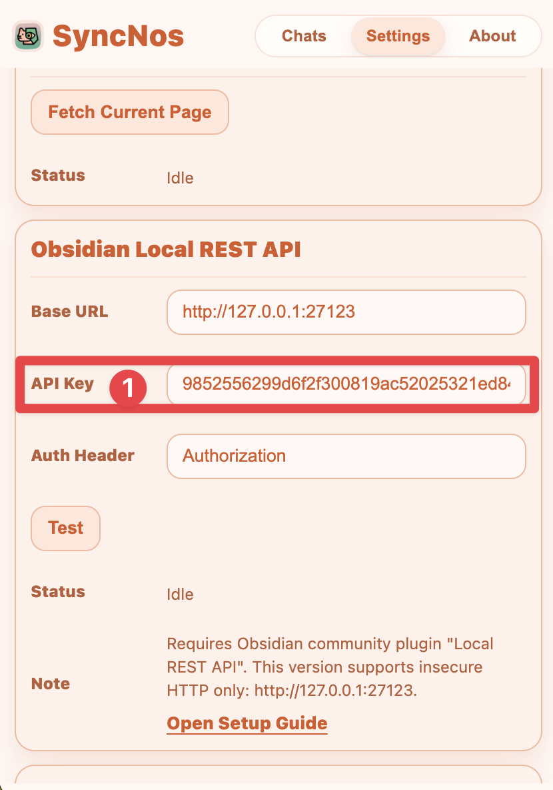

# WebClipper: Obsidian Local REST API Sync

本文档描述 SyncNos WebClipper 的 Obsidian 同步能力（基于 `obsidian-local-rest-api` 插件），以及本期实现范围与故障排查。

## 范围与策略

- 同步通道：仅 `coddingtonbear/obsidian-local-rest-api`（Local REST API）
- 平台主导同步（以 Obsidian 文件状态为准）：
  - Obsidian 中不存在目标文件：全量写入（`PUT /vault/<path>`）
  - Obsidian 中存在目标文件且 `frontmatter.syncnos` 兼容：增量追加（`PATCH` 追加到 heading `SyncNos::Messages`）并更新 `frontmatter.syncnos`
  - 若 `frontmatter` 缺失/不兼容/检测到冲突，或增量 PATCH 失败：自动回退全量重建（`PUT`）
- 本期仅支持 HTTP insecure 模式：`http://127.0.0.1:27123`
  - 不支持 `https://127.0.0.1:27124` 自签名证书模式（浏览器扩展无法无交互信任证书）

## Obsidian 端准备

1. 安装并启用插件：`Obsidian Local REST API`

2. 在插件设置中启用 `Insecure HTTP`（默认端口 `27123`）

3. 复制 `API Key`（后续要粘贴到 WebClipper 设置里）

4. 确认监听地址为 `127.0.0.1`（不要绑定 `0.0.0.0` 暴露到局域网）

## WebClipper 配置

Popup -> `Settings` -> `Obsidian Local REST API` / `Obsidian Paths`

- `Base URL`: 默认 `http://127.0.0.1:27123`
- `API Key`: 输入插件里生成的 Key（明文显示；存储在扩展本地存储中）
- `Auth Header`: 默认 `Authorization`
- `Test`: 验证连通性与认证是否正确
- 保存行为：输入框在 `blur` 时自动保存；也支持按 `Enter` 立即保存

## 文件定位与 frontmatter

- 文件路径：由 `source + conversationKey` 生成稳定 hash（避免标题改名导致无法增量命中同一文件）
- 默认目录按 kind 分流：
  - chat：`SyncNos-AIChats/`
  - article：`SyncNos-WebArticles/`
- 目录可配置：`Settings -> Obsidian Paths` 可分别设置 Chat 与 Web article 的 vault-relative 文件夹
- 同步游标存储在 `frontmatter.syncnos`（示例字段）：
  - `schemaVersion`
  - `source`
  - `conversationKey`
  - `lastSyncedSequence`
  - `lastSyncedMessageKey`
  - `lastSyncedMessageUpdatedAt`（用于冲突检测）
  - `lastSyncedAt`

## 行为说明

- 你在 Obsidian 中删除了文件：下次同步会 `404 -> PUT` 自动重建
- 你在 Obsidian 中删除了 `frontmatter.syncnos`：下次同步会回退全量重建并补齐 `syncnos`
- 重复触发同一批增量：如果 Local REST API 返回 `content-already-preexists-in-target`，会视为幂等成功（不会重复写入）

## 常见问题

- `Invalid API Base URL`：确保使用 `http://127.0.0.1:27123`
- `unauthorized` / `auth_error`：检查 API Key 与 header 名称
- `network_error`：确认 Obsidian 正在运行、插件启用、端口未被占用
