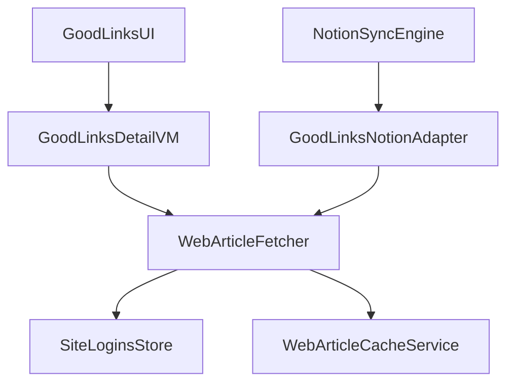

## 现状盘点（已确认的依赖与耦合）

- **抓取实现**：`SyncNos/Services/DataSources-From/GoodLinks/GoodLinksURLFetcher.swift`
  - `GoodLinksURLFetcherProtocol.fetchArticle(url:) -> ArticleFetchResult`
  - 依赖 `SiteLoginsStoreProtocol`（用 cookieHeader 做鉴权抓取）
  - 依赖 `GoodLinksURLCacheServiceProtocol`（SwiftData 缓存）
  - 使用 `UserDefaults` 的 `GoodLinksURLFetcher.DefaultsKeys.*`

- **缓存实现**：
  - `SyncNos/Services/DataSources-From/GoodLinks/GoodLinksURLCacheService.swift`（`@ModelActor`）
  - `SyncNos/Services/DataSources-From/GoodLinks/GoodLinksURLCacheModels.swift`（`CachedGoodLinksArticle`）

- **抓取类型定义**（目前放在 GoodLinks models 内）：`SyncNos/Services/DataSources-From/GoodLinks/GoodLinksModels.swift`
  - `FetchSource` / `ArticleFetchResult` / `URLFetchError`

- **协议与 DI**：
  - `SyncNos/Services/Core/Protocols.swift`：`GoodLinksURLCacheServiceProtocol`
  - `SyncNos/Services/Core/DIContainer.swift`：`goodLinksURLFetcher` / `goodLinksURLCacheService`

- **使用方（导致耦合外溢）**：
  - Notion 同步：`SyncNos/Services/DataSources-To/Notion/SyncEngine/Adapters/GoodLinksNotionAdapter.swift` 直接依赖 `GoodLinksURLFetcherProtocol` 和 `ArticleFetchResult`
  - GoodLinks 详情页：`SyncNos/ViewModels/GoodLinks/GoodLinksDetailViewModel.swift` 直接依赖 `GoodLinksURLFetcherProtocol` 和 `ArticleFetchResult`
  - GoodLinks 设置页：`SyncNos/ViewModels/GoodLinks/GoodLinksSettingsViewModel.swift` 读写 `GoodLinksURLFetcher.DefaultsKeys.*`

## 目标拆分（“完全拆开”的具体含义）

- **GoodLinks 层只保留“GoodLinks 自己的事情”**：数据库读取、link/highlight models、GoodLinks UI。
- **URL 网页文章抓取变成通用能力**：命名与路径不再包含 GoodLinks。
- **GoodLinks 仅作为 WebArticle 服务的一个消费者**：通过 Protocol + DI 注入获取抓取能力。

## 设计（新的模块边界）

新增一个通用模块目录：`SyncNos/Services/Core/WebArticle/`（或保持在 `Services` 下的 Core 子域）。该模块包含：

- `WebArticleModels.swift`
  - `FetchSource`（沿用）
  - `ArticleFetchResult`
  - `URLFetchError`

- `WebArticleFetcher.swift`
  - `protocol WebArticleFetcherProtocol: AnyObject, Sendable { func fetchArticle(url: String) async throws -> ArticleFetchResult }`
  - `final class WebArticleFetcher: WebArticleFetcherProtocol`（从现 `GoodLinksURLFetcher` 迁移，保留 cookie + retry + telemetry 逻辑）
  - `DefaultsKeys`：建议**保留原有 key 字符串**（例如仍为 `goodlinks.urlFetcher.enableCache`）以避免用户设置丢失；但把定义迁到 `WebArticleFetcher.DefaultsKeys`，让代码层面“去 GoodLinks 化”。

- `WebArticleCacheModels.swift`
  - `@Model final class CachedWebArticle { ... }`（从 `CachedGoodLinksArticle` 更名）

- `WebArticleCacheService.swift`
  - `protocol WebArticleCacheServiceProtocol: Actor { getArticle/upsert/removeExpired/removeAll }`
  - `@ModelActor actor WebArticleCacheService: WebArticleCacheServiceProtocol`
  - `WebArticleCacheModelContainerFactory`：
    - 默认将 store 文件名改为 `web_article_cache.store` 以实现真正的拆分。
    - 取舍：这会丢弃旧的 GoodLinks 缓存（但缓存本身是短期数据）。如果你更在意“保留缓存”，也可以继续用旧文件名（`goodlinks_url_cache.store`）并在注释里说明其历史原因。

- `Protocols.swift` 与 `DIContainer.swift`
  - `Protocols.swift`：把 `GoodLinksURLCacheServiceProtocol` 重命名为 `WebArticleCacheServiceProtocol`。
  - `DIContainer.swift`：新增/替换为 `webArticleFetcher`、`webArticleCacheService`，并在初始化 `WebArticleFetcher` 时注入 `siteLoginsStore`。

## 迁移步骤（按文件逐个改，保证每一步都可编译）

1. **抽离通用 Models**

   - 从 `SyncNos/Services/DataSources-From/GoodLinks/GoodLinksModels.swift` 中把 `FetchSource` / `ArticleFetchResult` / `URLFetchError` 移到 `SyncNos/Services/Core/WebArticle/WebArticleModels.swift`。
   - 更新引用点：`GoodLinksURLFetcher.swift`、`GoodLinksURLCacheService.swift`、`GoodLinksDetailViewModel.swift`、`GoodLinksNotionAdapter.swift`。

2. **抽离并重命名 Fetcher**

   - 新建 `SyncNos/Services/Core/WebArticle/WebArticleFetcher.swift`，把 `GoodLinksURLFetcher` 迁移并重命名为 `WebArticleFetcher`。
   - 将 `GoodLinksURLFetcherProtocol` 改为 `WebArticleFetcherProtocol`。
   - 日志 tag 从 `[GoodLinksURLFetcher]` 改为 `[WebArticleFetcher]`（可选）。

3. **抽离缓存模型与服务**

   - 将 `CachedGoodLinksArticle` → `CachedWebArticle`。
   - 将 `GoodLinksURLCacheService` → `WebArticleCacheService`。
   - 将 `GoodLinksURLCacheModelContainerFactory` → `WebArticleCacheModelContainerFactory`。
   - 更新缓存 store 文件名策略（见“取舍”）。

4. **核心协议与 DI 解耦**

   - `SyncNos/Services/Core/Protocols.swift`：引入 `WebArticleCacheServiceProtocol`（替换旧的 `GoodLinksURLCacheServiceProtocol`）。
   - `SyncNos/Services/Core/DIContainer.swift`：
     - 增加 `private var _webArticleFetcher: WebArticleFetcherProtocol?`
     - 增加 `private var _webArticleCacheService: WebArticleCacheServiceProtocol?`
     - 增加 `var webArticleFetcher: WebArticleFetcherProtocol { ... }`
     - 增加 `var webArticleCacheService: WebArticleCacheServiceProtocol { ... }`

5. **更新 GoodLinks 消费方引用**

   - `SyncNos/Services/DataSources-To/Notion/SyncEngine/Adapters/GoodLinksNotionAdapter.swift`
     - `create(... urlFetcher: WebArticleFetcherProtocol = DIContainer.shared.webArticleFetcher ...)`
   - `SyncNos/ViewModels/GoodLinks/GoodLinksDetailViewModel.swift`
     - 注入与属性类型改为 `WebArticleFetcherProtocol`。
   - `SyncNos/ViewModels/GoodLinks/GoodLinksSettingsViewModel.swift`
     - 读写 key 的定义改为 `WebArticleFetcher.DefaultsKeys.*`（保留同样的字符串）。

6. **清理旧文件与命名**

   - 删除或留存 `SyncNos/Services/DataSources-From/GoodLinks/GoodLinksURLFetcher.swift` 等旧实现：
     - 如果删除：确保所有引用都已迁移。
     - 如果暂时保留：改为 thin wrapper（不推荐，容易保留耦合）。

## 验证方式（不改国际化）

- 本次拆分目标只涉及代码/服务，不修改 `Resource/Localizable.xcstrings`。
- 编译验证：
```bash
xcodebuild -scheme SyncNos build
```

- 关键路径自检：
  - 打开 GoodLinks 详情页时预览/全文加载仍能工作（cookie 登录站点仍能抓取）。
  - 同步到 Notion 时 `GoodLinksNotionAdapter.create` 仍能把 Article 头部写入。

## 风险与取舍

- **缓存文件名迁移**：改成通用文件名会丢弃旧缓存；但缓存本身是可再生数据、且有 7 天过期策略，通常可接受。
- **UserDefaults key 迁移**：建议保留原 key 字符串，避免用户设置丢失；之后如要彻底去掉 `goodlinks.` 前缀，可单独做一次“读新 key，fallback 旧 key，保存回新 key”的迁移。

## 代码结构示意（解耦后）

