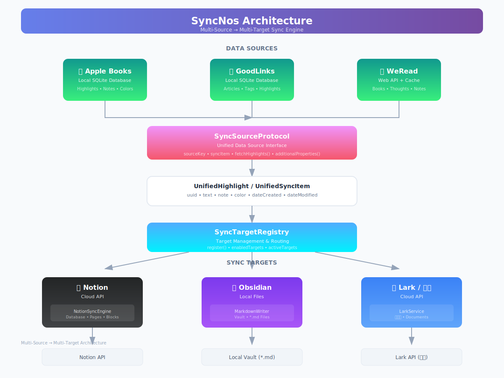

# SyncNos 📚

[](README.cn.md)
[](README.md)

[](https://apps.apple.com/app/syncnos/id6755133888)

> **SyncNos** - 专业的阅读笔记同步工具，将 Apple Books、GoodLinks 和微信读书中的高亮与注释无缝同步到 Notion，支持多种同步策略和强大的自定义功能。

## ✨ 主要功能

### 支持多平台同步
- Apple Books
- GoodLinks
- WeRead（微信读书）
- Notion

### 📚 Apple Books 同步
- **完整数据提取**：书名、作者、高亮笔记、注释、颜色标签
- **时间戳支持**：创建时间和修改时间的精确同步
- **智能分页**：大量数据的分页处理，确保性能优化
- **数据库监控**：自动检测最新的 Apple Books 数据库文件

### 🔗 GoodLinks 同步
- **文章内容同步**：标题、链接、全文内容、标签
- **高亮笔记**：支持 GoodLinks 的所有高亮功能
- **标签解析**：完整的标签系统支持
- **批量处理**：高效处理大量文章数据

### 📖 微信读书同步
- **书籍列表同步**：完整的书架数据
- **高亮与想法**：划线和批注的完整同步
- **Cookie 自动刷新**：透明的认证管理
- **本地缓存**：SwiftData 持久化，支持离线访问

### 🔄 智能同步策略
- **单库模式**：所有内容在一个 Notion 数据库中统一管理
- **分库模式**：每本书/文章单独创建数据库，便于组织
- **幂等同步**：基于 UUID 确保不重复同步
- **增量同步**：基于时间戳的智能增量更新

### 🎯 高级功能
- **自动同步**：可配置的后台定时同步
- **实时状态**：同步进度的实时显示
- **错误重试**：智能的错误重试机制
- **Apple 登录**：安全的 Apple ID 认证集成

## 🎉 欢迎下载使用SyncNos

[前往Mac App Store下载 ->](https://apps.apple.com/app/syncnos/id6755133888)


## 🏗️ 架构设计

<p align="center">
  
</p>

<details>
<summary>📊 查看文本架构图</summary>

```
┌─────────────────────────────────────────────────────────────────────────────────┐
│                                   SyncNos                                        │
│                          多数据源 → 多同步目标 架构                                │
└─────────────────────────────────────────────────────────────────────────────────┘

                              ┌─────────────────┐
                              │   用户 / 应用    │
                              └────────┬────────┘
                                       │
                              ┌────────▼────────┐
                              │   ViewModels    │
                              │   (业务逻辑层)   │
                              └────────┬────────┘
                                       │
         ┌─────────────────────────────┼─────────────────────────────┐
         │                             │                             │
         ▼                             ▼                             ▼
┌─────────────────┐          ┌─────────────────┐          ┌─────────────────┐
│  AppleBooks     │          │   GoodLinks     │          │    微信读书      │
│  适配器          │          │   适配器         │          │    适配器        │
│ (本地 SQLite)   │          │ (本地 SQLite)   │          │   (Web API)     │
└────────┬────────┘          └────────┬────────┘          └────────┬────────┘
         │                             │                             │
         └─────────────────────────────┼─────────────────────────────┘
                                       │
                                       ▼
        ┌─────────────────────────────────────────────────────────────┐
        │                    SyncSourceProtocol                        │
        │                  (统一数据源接口)                             │
        └──────────────────────────────┬──────────────────────────────┘
                                       │
                                       ▼
        ┌─────────────────────────────────────────────────────────────┐
        │                 UnifiedHighlight / UnifiedSyncItem           │
        │                      (统一数据模型)                           │
        └──────────────────────────────┬──────────────────────────────┘
                                       │
                                       ▼
        ┌─────────────────────────────────────────────────────────────┐
        │                    SyncTargetRegistry                        │
        │                   (目标管理与路由)                            │
        └──────────────────────────────┬──────────────────────────────┘
                                       │
         ┌─────────────────────────────┼─────────────────────────────┐
         │                             │                             │
         ▼                             ▼                             ▼
┌─────────────────┐          ┌─────────────────┐          ┌─────────────────┐
│  NotionTarget   │          │ ObsidianTarget  │          │   LarkTarget    │
│  (云端 API)     │          │ (本地文件)       │          │  (云端 API)     │
└────────┬────────┘          └────────┬────────┘          └────────┬────────┘
         │                             │                             │
         ▼                             ▼                             ▼
┌─────────────────┐          ┌─────────────────┐          ┌─────────────────┐
│  Notion API     │          │  本地 Vault     │          │   飞书 API      │
└─────────────────┘          └─────────────────┘          └─────────────────┘
```

</details>

### 同步策略

| 模式 | 说明 |
|------|------|
| **单一数据库模式** | 所有书籍在一个 Notion 数据库中，每本书一个页面 |
| **每本书独立数据库** | 每本书独立创建数据库，高亮作为数据库条目 |

### 数据流

```
1. 用户选择要同步的书籍/文章
                    ↓
2. ViewModel 创建适配器 (如 WeReadNotionAdapter)
                    ↓
3. 适配器实现 SyncSourceProtocol
   - fetchHighlights() → [UnifiedHighlight]
   - syncItem → UnifiedSyncItem
                    ↓
4. SyncTargetRegistry 路由到已启用的目标
                    ↓
5. 每个 SyncTarget (Notion/Obsidian/Lark) 处理数据
                    ↓
6. SyncTimestampStore 记录上次同步时间
```

### 扩展性

| 添加新数据源 | 添加新同步目标 |
|-------------|---------------|
| 1. 创建 `XxxModels.swift` | 1. 创建 `YyyConfigStore.swift` |
| 2. 创建 `XxxNotionAdapter.swift` | 2. 创建 `YyySyncTarget.swift` |
| 3. 实现 `SyncSourceProtocol` | 3. 实现 `SyncTargetProtocol` |
| 4. 创建 ViewModel 和 Views | 4. 创建集成视图 |
| 5. 在 DIContainer 中注册 | 5. 在 SyncTargetRegistry 中注册 |

> 详见 [ADD_NEW_DATASOURCE_CHECKLIST.md](Resource/ADD_NEW_DATASOURCE_CHECKLIST.md) 和 [ADD_NEW_SYNC_TARGET_CHECKLIST.md](Resource/ADD_NEW_SYNC_TARGET_CHECKLIST.md)

## 📄 许可证

本项目采用 [AGPL-3.0 License](LICENSE)。

---

<div align="center">

**⭐ 如果这个项目对你有帮助，请给我们一个 Star！**

Made with ❤️ by [Chii Magnus](https://github.com/chiimagnus)

</div>
