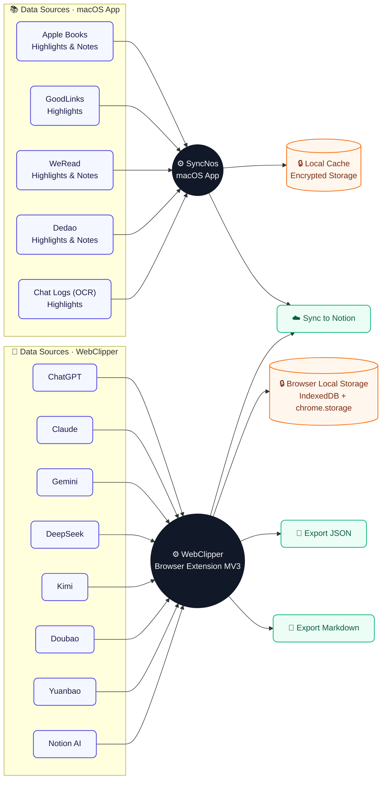

# SyncNos

English | [中文](README.zh-CN.md)

This project has two parts:

1. **macOS app**: sync highlights and notes to Notion from Apple Books, GoodLinks, WeRead, Dedao, and chat history (including OCR). Supported: **macOS 14.0+**.
2. **WebClipper extension**: capture AI chats from supported sites into local browser storage, export (JSON/Markdown), and manually sync to Notion (OAuth). Supported: **Chromium-based browsers (Chrome/Edge/Arc/etc.)** and **Firefox (unsigned, temporary load)**.

## How It Works (Diagram)



## macOS App

- Supported: **macOS 14.0+**
- Download (App Store): https://apps.apple.com/app/syncnos/id6755133888

### Sync Scope

#### Sync From

- Apple Books
- GoodLinks
- WeRead (微信读书)
- Dedao (得到)
- Chat history (beta)
  - OCR version supported
  - Local storage encryption

#### Sync To

- Notion

### Development

```bash
open SyncNos.xcodeproj
xcodebuild -scheme SyncNos -configuration Debug build
```

## WebClipper (Browser Extension)

This repository includes a standalone MV3 browser extension under `Extensions/WebClipper/`.

- Supported browsers: **Chromium-based browsers (Chrome/Edge/Arc/etc.)** and **Firefox (unsigned, temporary load)**
- Download (Releases): https://github.com/chiimagnus/SyncNos/releases

### What It Does

- Captures AI chats from supported sites into local browser storage
- Exports selected conversations as JSON/Markdown
- Manually syncs selected conversations to Notion (OAuth)

### Supported Sites

ChatGPT / Claude / Gemini / DeepSeek / Kimi / Doubao / Yuanbao / NotionAI

### Install From Releases

- Go to GitHub Releases and download the attached assets:
  - `syncnos-webclipper-chrome-v*.zip` (Chrome)
  - `syncnos-webclipper-edge-v*.zip` (Edge)
  - `syncnos-webclipper-firefox-v*.xpi` (Firefox, unsigned)
- Chrome/Edge: unzip, then load unpacked in `chrome://extensions` / `edge://extensions` (Developer mode).
- Firefox: use `about:debugging#/runtime/this-firefox` -> “Load Temporary Add-on…” and select the `.xpi` (or unzip and select `manifest.json`).

### Development

```bash
npm --prefix Extensions/WebClipper install
npm --prefix Extensions/WebClipper run check
npm --prefix Extensions/WebClipper run test
npm --prefix Extensions/WebClipper run build
```

## Docs

- Repository guide: `AGENTS.md`
- Business logic map: `.github/docs/business-logic.md`
- Keyboard navigation: `.github/docs/键盘导航与焦点管理技术文档（全项目）.md`
- WebClipper guide: `Extensions/WebClipper/AGENTS.md`

## License

This project is licensed under the [AGPL-3.0 License](LICENSE).
