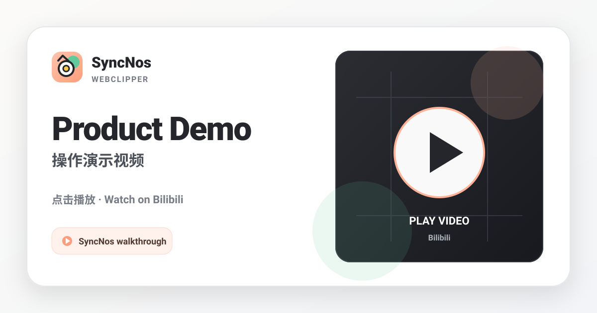

# SyncNos

Never lose an AI conversation, a useful article, or a video transcript again.

Capture supported AI conversations, web articles, and YouTube/Bilibili transcripts into local browser storage first, then optionally sync to Notion, Obsidian, or Feishu (Lark), or export as Markdown / Zip.

[SyncNos Angel Sponsors 😍](https://chiimagnus.notion.site/syncnos-angels) · **English** · [中文](README.zh-CN.md)

## What it does

SyncNos is local-first: captured content is saved locally before any optional sync or export. Notion, Obsidian, Feishu, Markdown, and Zip are derived outputs rather than the source of truth.

## Download & Install

| Channel | Download |
| --- | --- |
| Chrome, Arc, Brave, and other Chromium browsers | [Chrome Web Store](https://chromewebstore.google.com/detail/syncnos-webclipper/hmgjflllphdffeocddjjcfllifhejpok) |
| Edge | [Microsoft Edge Add-ons](https://microsoftedge.microsoft.com/addons/detail/ijkpghlfmkbjcgafapjcjahaikmnjncl) |
| Firefox | [Firefox Add-ons](https://addons.mozilla.org/firefox/addon/syncnos-webclipper/) |
| Safari (macOS / iOS) | Build from source with Xcode |

## Demo Video

## Supported Sources

### AI conversations

| Platform | Capture mode |
| --- | --- |
| ChatGPT | Manual only¹ |
| Gemini | Auto-save capable² |
| Google AI Studio | Manual only¹ |
| DeepSeek | Auto-save capable² |
| Kimi | Auto-save capable² |
| Doubao | Auto-save capable² |
| Yuanbao | Auto-save capable² |
| Poe | Auto-save capable² |
| Notion AI | Auto-save capable² |
| z.ai | Auto-save capable² |

¹ ChatGPT and Google AI Studio use virtualized conversation lists and require an explicit manual capture so SyncNos can verify completeness.

² Automatic capture only runs when AI auto-save is enabled. The source-of-truth site list lives in `src/collectors/ai-chat-sites.ts`.

### Web articles

Any `http(s)` page can be captured manually. SyncNos extracts readable content and relevant metadata, with site-specific fallbacks where needed.

### Video transcripts

YouTube and Bilibili pages can capture transcripts/subtitles that the page has already loaded, including timestamps when available.

## Output Targets

| Target | Behavior |
| --- | --- |
| **Notion** | Syncs local content through the Notion API after OAuth. Manual sync is always available; optional auto-sync can be enabled. |
| **Obsidian** | Writes Markdown and local image attachments to your vault through the localhost Local REST API. See [setup](docs/obsidian-setup.md). |
| **Feishu (DocX)** | Syncs local content to Feishu DocX after OAuth. Manual sync is always available; optional auto-sync can be enabled. See [setup](docs/feishu-setup.md). |
| **Markdown / Zip** | Exports individual content or a local backup package. |

For storage, backup, permission, and network behavior, see [Privacy Policy](PRIVACY.md) and the [documentation index](docs/overview.md).

## Screenshots

WebClipper Popup: save and browse conversations

WebClipper Settings: backup and sync

Article discussion sidebar: exact quotes, compact threads, and one active reply composer

## Contributing

Development setup, issue/commit/PR workflow, and validation requirements are maintained in [docs/CONTRIBUTING.md](docs/CONTRIBUTING.md). Architecture and non-negotiable product contracts are maintained in [AGENTS.md](AGENTS.md).

## Support

SyncNos is a one-person project.

If you'd like to sponsor the project, please leave a message about why you use SyncNos or what you would like it to become.

## Acknowledgements

- Special thanks to the [linux.do](https://linux.do/t/topic/1635410) community 💛
- Thanks to [Obsidian Web Clipper](https://github.com/obsidianmd/obsidian-clipper) for the inspiration
