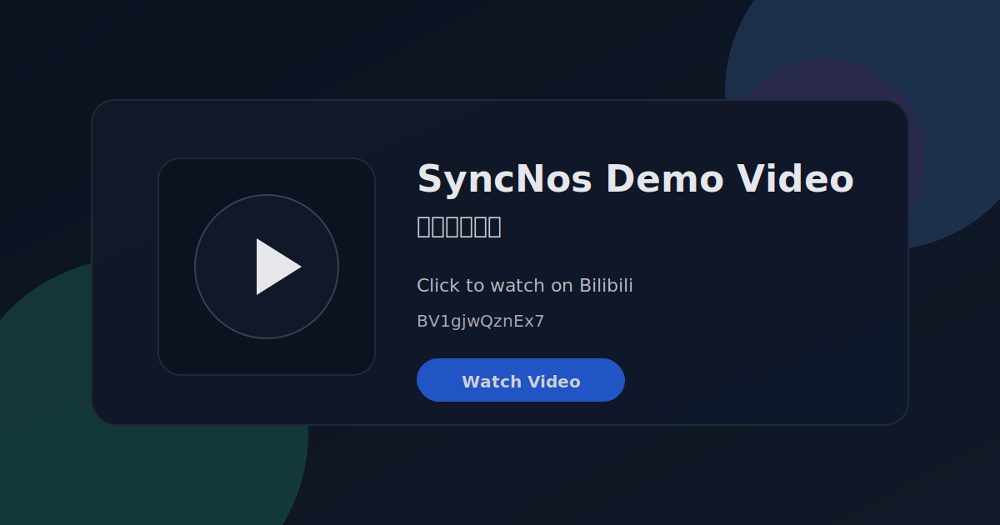
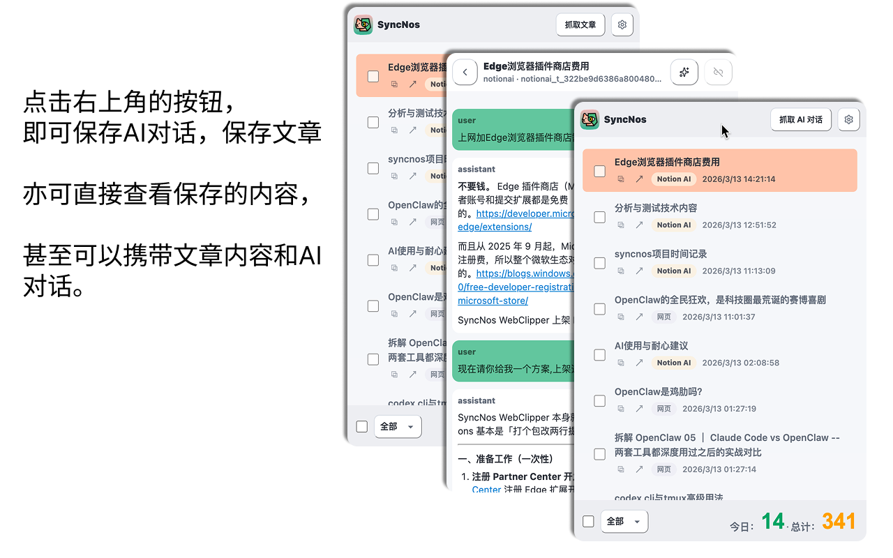
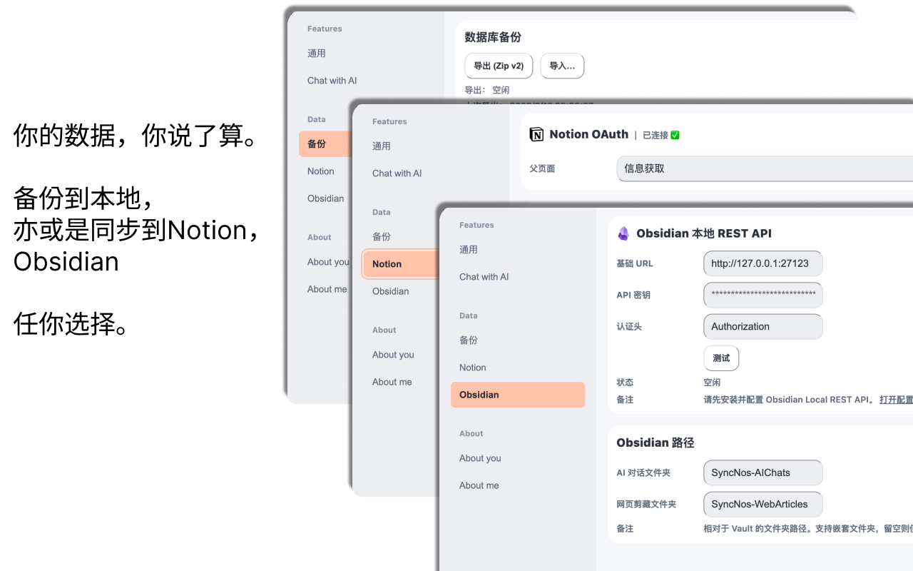

# SyncNos

你问过 AI 的每一句话，看过的每一篇长文，再也不会丢。

11+ AI 平台对话 + 任意网页文章，后台自动采集，本地优先存储。
一键同步到 Notion / Obsidian，或导出 Markdown / Zip。

[SyncNos 天使赞助者们😍](https://chiimagnus.notion.site/syncnos-angels) · [English](README.md) · **中文**

## 为什么用 SyncNos WebClipper？

| | |
| --- | --- |
| 🔒 **数据不出你的浏览器** | 没有第三方服务器，没有数据采集。所有内容先存 IndexedDB，再由你决定同步到哪里。 |
| 🔄 **增量同步，不重复不遗漏** | 只同步新内容，游标精确追踪上次同步位置。后台自动采集，知识库在你聊天的同时自己生长。 |
| 🔓 **完全开源，没有黑箱** | 每一行代码都在这个仓库里。你能看到你的浏览器里到底跑了什么。 |
| 📦 **多目标输出** | Notion / Obsidian / Markdown / Zip——你的数据你做主，不被任何平台绑架。 |

---

## 下载与安装

| 渠道 | 下载入口 |
| --- | --- |
| Chrome | [Chrome Web Store](https://chromewebstore.google.com/detail/syncnos-webclipper/hmgjflllphdffeocddjjcfllifhejpok) |
| Edge | [GitHub Releases](https://github.com/chiimagnus/SyncNos/releases) |
| Firefox | [Firefox AMO](https://addons.mozilla.org/firefox/addon/syncnos-webclipper/) |
| Arc / Brave 等 Chromium 系 | 使用 Chrome Web Store 链接 |

---

## 3 步上手

1. **安装扩展**（Chrome / Edge / Firefox / Arc）
2. **打开任何支持的 AI 平台或网页**，插件自动在后台采集对话或文章
3. **同步或导出**：进入 Settings，一键同步到 Notion / Obsidian，或导出 Markdown / Zip 备份

---

## 操作演示视频

---

## 支持采集的来源

### AI 对话（11+ 平台）

| 平台 | 采集方式 |
| --- | --- |
| ChatGPT | 自动 |
| Claude | 自动 |
| Gemini | 自动 |
| DeepSeek | 自动 |
| Kimi | 自动 |
| 豆包 | 自动 |
| 元宝 | 自动 |
| Poe | 自动 |
| Notion AI | 自动 |
| z.ai | 自动 |
| Google AI Studio | 手动保存优先（虚拟列表限制） |

### 网页文章

任意 `http(s)` 页面均可触发抓取，自动提取正文、标题、作者和发布时间。

---

## 输出目标

| 目标 | 说明 |
| --- | --- |
| **Notion** | OAuth 授权后一键同步。AI 对话 → `SyncNos-AI Chats` 数据库；网页文章 → `SyncNos-Web Articles` 数据库。 |
| **Obsidian** | 通过 [Local REST API](https://github.com/coddingtonbear/obsidian-local-rest-api) 插件直接写入 vault。本地到本地，不经网络。 |
| **Markdown / Zip** | 单文件或批量导出，随时备份完整数据。 |

---

## 核心能力

- **后台自动采集**：打开支持站点即开始采集，无需手动操作（部分站点除外）。
- **本地优先存储**：所有内容先落 IndexedDB，再派生到任何外部目标。
- **增量同步**：游标精确追踪，只同步新消息和新文章，不重复不遗漏。
- **Insight 仪表盘**：总 clips、来源分布、最长对话——让你的知识积累看得见。
- **Chat with AI**：一键复制本地内容到剪贴板，跳转到你常用的 AI 平台继续深聊。
- **图片缓存**：可选开启 AI 对话图片本地缓存，支持详情页手动补全历史图片。
- **数据库备份 / 恢复**：完整导出和导入本地会话库，敏感信息（OAuth token 等）自动排除。
- **主题模式**：跟随系统 / 手动切换 Light / Dark。
- **Inpage 按钮**：可配置显示范围（所有站点 / 仅支持站点 / 关闭）。

---

## 界面预览

<!-- 保留你的截图，按需更新 -->

WebClipper Popup：保存与浏览对话

WebClipper Settings：备份与同步（Notion / Obsidian）

---

## 支持

SyncNos 是一个人用心做的项目。

如果你想赞助我，有一个小小的请求：**别只给钱——留句话吧。** 说说你为什么用 SyncNos，讲个故事，或者就一句"加油"都好。

让我继续做下去的，不是钱，是知道有人在乎。把我们连在一起的，是情感，不是交易。

---
