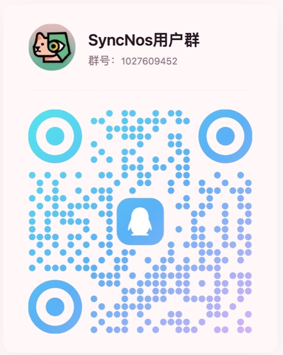

<div align="center"><a name="readme-top"></a>

# SyncNos

本地优先地保存 AI 对话、网页文章和视频页面内容。

内容先进入浏览器本地，再按需同步到 Notion、Obsidian、飞书或 GitHub，导出选中的 Markdown / JSON，或创建本地 Backup ZIP。

[官网](https://chiimagnus.github.io/SyncNos/) · [SyncNos 天使赞助者们😍](https://chiimagnus.github.io/SyncNos/#sponsors) · [English](README.md) · **中文**

[](https://chromewebstore.google.com/detail/syncnos-webclipper/hmgjflllphdffeocddjjcfllifhejpok)
[](https://microsoftedge.microsoft.com/addons/detail/ijkpghlfmkbjcgafapjcjahaikmnjncl)
[](https://addons.mozilla.org/firefox/addon/syncnos-webclipper/)

[](https://github.com/chiimagnus/SyncNos/releases)

</div>

## 为什么使用 SyncNos

采集内容先保存在本地，再进行可选的同步或导出。外部 Provider 和导出文件都是派生副本，不是主数据。权限、凭据和网络数据流见[隐私政策](PRIVACY.md)。

## 安装

| 浏览器 | 安装入口 |
| --- | --- |
| Chrome、Arc、Brave 等 Chromium 浏览器 | [Chrome Web Store](https://chromewebstore.google.com/detail/syncnos-webclipper/hmgjflllphdffeocddjjcfllifhejpok) |
| Edge | [Microsoft Edge Add-ons](https://microsoftedge.microsoft.com/addons/detail/ijkpghlfmkbjcgafapjcjahaikmnjncl) |
| Firefox | [Firefox Add-ons](https://addons.mozilla.org/firefox/addon/syncnos-webclipper/) |
| Safari（macOS / iOS） | 使用 Xcode 从源码构建 |

### CLI & AI SKILL

可选的 `syncnos` CLI 让 AI Agent 访问正在运行的 SyncNos 浏览器 Profile。在目标 Profile 中开启 **设置 → CLI & AI SKILL → 本地 CLI 集成 → SyncNos CLI**，并在使用时保持浏览器运行。

```bash
npm install -g @chiimagnus/syncnos@latest
syncnos install
syncnos doctor
```

安装方式见 [CLI & AI SKILL](https://chiimagnus.github.io/SyncNos/docs/cli/)。仓库同时提供给 AI Agent 使用的 Skill：[`skills/syncnos-zh/`](skills/syncnos-zh/)（中文）和 [`skills/syncnos/`](skills/syncnos/)（English）。

## 演示

[](https://www.bilibili.com/video/BV1gjwQznEx7/)

## 采集

除了 Popup 和页内入口，SyncNos 还提供浏览器原生快捷键，用于打开 Popup、保存当前页面，以及打开 / 聚焦 SyncNos 应用。默认不预设键位，可在 **设置 → 快捷键** 查看浏览器当前绑定。详见[采集方式](https://chiimagnus.github.io/SyncNos/docs/capture/#浏览器快捷键)。

### AI 对话

支持 ChatGPT、Gemini、Google AI Studio、DeepSeek、Kimi、豆包、元宝、Poe、Notion AI 和 z.ai。

ChatGPT 与 Google AI Studio 使用虚拟列表，只支持手动抓取；其它受支持的 AI 对话在开启 AI 自动保存后可自动采集。

ChatGPT 默认使用 DOM 采集，也提供可选的高级 API 路径用于手动采集当前会话。具体行为和限制见[采集内容](https://chiimagnus.github.io/SyncNos/docs/capture/)。

### 网页文章

普通 `http(s)` 页面都可以手动抓取。SyncNos 会提取可读正文和必要元数据，并在需要时使用站点特定处理。抓取后的文章支持本地评论和仅划线注释。

### 视频页面

SyncNos 支持 YouTube watch / youtu.be 页面和 Bilibili BV 播放页，也支持带合法 `bvid` 的稍后再看播放页。它会保存可用的页面上下文和页面已经加载的字幕 / transcript；当前 Bilibili 播放器提供章节 / 看点时也会一并保存。SyncNos 不下载音视频流；即使当前没有字幕，受支持的视频仍会按 Video 保存。

## 输出目标

| 目标 | 行为 |
| --- | --- |
| **Notion** | OAuth 后通过 Notion API 同步本地内容。[配置指南](https://chiimagnus.github.io/SyncNos/docs/sync/notion/) |
| **Obsidian** | 通过 Local REST API 写入 Markdown 和本地图片附件。[配置指南](https://chiimagnus.github.io/SyncNos/docs/sync/obsidian/) |
| **飞书** | OAuth 后同步到飞书 DocX。[配置指南](https://chiimagnus.github.io/SyncNos/docs/sync/feishu/) |
| **GitHub** | 通过 SyncNos GitHub App 写入已授权的 repository / branch。[配置指南](https://chiimagnus.github.io/SyncNos/docs/sync/github/) |
| **Markdown / JSON** | 在本机导出选中的条目和可取得的引用图片附件。[导出与备份](https://chiimagnus.github.io/SyncNos/docs/export-backup/) |
| **Backup ZIP** | 创建用于恢复 SyncNos 本地内容和可恢复状态的恢复包。[导出与备份](https://chiimagnus.github.io/SyncNos/docs/export-backup/) |

每个 Provider 都可以手动同步，并可单独启用自动同步。

## 界面预览

WebClipper Popup：保存并浏览已采集内容。


文章讨论侧栏：精确引用、紧凑线程和单 active reply composer。


## 文档

- [用户文档：从这里开始](https://chiimagnus.github.io/SyncNos/docs/)
- [采集方式](https://chiimagnus.github.io/SyncNos/docs/capture/)
- [功能总览](https://chiimagnus.github.io/SyncNos/docs/features/)
- [同步到外部服务](https://chiimagnus.github.io/SyncNos/docs/sync/)
- [导出与备份](https://chiimagnus.github.io/SyncNos/docs/export-backup/)
- [隐私政策](PRIVACY.md)
- [参与贡献](docs/CONTRIBUTING.md)

## 支持

欢迎加入 SyncNos 用户 QQ 群（1027609452）交流使用体验、反馈问题和建议。



SyncNos 由一人维护。如果你愿意赞助，也欢迎留一句你为什么使用 SyncNos，或希望它接下来解决什么问题。


## 致谢

- 感谢 [linux.do](https://linux.do/t/topic/1635410) 社区的支持 💛
- 感谢 [Obsidian Web Clipper](https://github.com/obsidianmd/obsidian-clipper) 的启发
