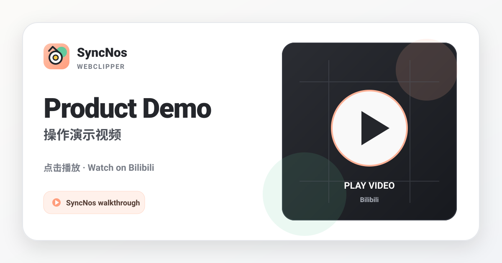
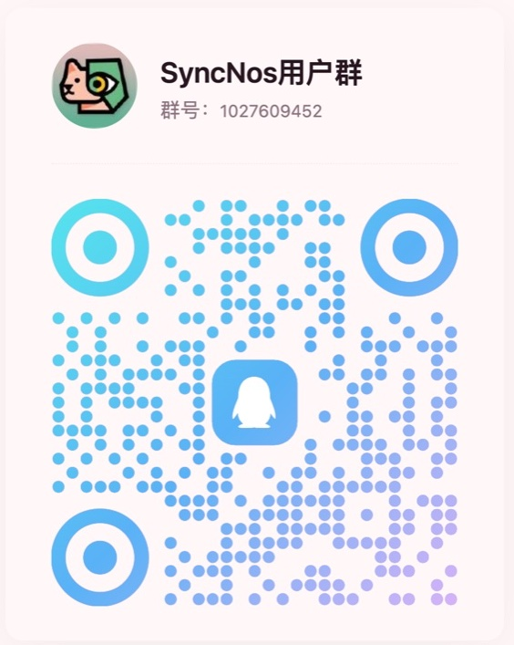

<div align="center"><a name="readme-top"></a>

# SyncNos

本地优先地保存 AI 对话、网页文章和视频内容。

内容先进入浏览器本地，再按需同步到 Notion、Obsidian、飞书或 GitHub，或导出为 Markdown / JSON / Backup。

[官网](https://chiimagnus.github.io/SyncNos/) · [赞助者](https://chiimagnus.github.io/SyncNos/#sponsors) · [English](README.md) · **中文**

[](https://chromewebstore.google.com/detail/syncnos-webclipper/hmgjflllphdffeocddjjcfllifhejpok)
[](https://microsoftedge.microsoft.com/addons/detail/ijkpghlfmkbjcgafapjcjahaikmnjncl)
[](https://addons.mozilla.org/firefox/addon/syncnos-webclipper/)

[](https://github.com/chiimagnus/SyncNos/releases)

</div>

## 安装

| 浏览器 | 安装入口 |
| --- | --- |
| Chrome、Arc、Brave 等 Chromium 浏览器 | [Chrome Web Store](https://chromewebstore.google.com/detail/syncnos-webclipper/hmgjflllphdffeocddjjcfllifhejpok) |
| Edge | [Microsoft Edge Add-ons](https://microsoftedge.microsoft.com/addons/detail/ijkpghlfmkbjcgafapjcjahaikmnjncl) |
| Firefox | [Firefox Add-ons](https://addons.mozilla.org/firefox/addon/syncnos-webclipper/) |
| Safari（macOS / iOS） | 使用 Xcode 从源码构建 |

## 能做什么

- 保存 ChatGPT、Claude、Gemini、Google AI Studio、DeepSeek、Kimi、豆包、元宝、Poe、Notion AI 和 z.ai 对话
- 保存网页正文、内容图片，以及 YouTube / Bilibili 字幕与页面信息
- 在本地库搜索、阅读、划线、评论、朗读和查看数据概览
- 在支持的 AI 输入框中用 `$` 搜索并插入本地内容
- 手动或自动同步到 Notion、Obsidian、飞书和 GitHub
- 导出 Markdown / JSON，或创建可恢复的 Backup

详细行为和限制见[用户文档](https://chiimagnus.github.io/SyncNos/docs/)。

## CLI & AI SKILL

需要 AI Agent 使用 SyncNos 时：

```bash
npm install -g @chiimagnus/syncnos@latest
syncnos install
syncnos doctor
```

然后在目标浏览器 Profile 中开启 **设置 → CLI & AI SKILL → 本地 CLI 集成 → SyncNos CLI**。完整说明见 [CLI & AI SKILL](https://chiimagnus.github.io/SyncNos/docs/cli/)。

## 演示与预览

<a href="https://www.bilibili.com/video/BV1gjwQznEx7/"></a>


## 文档

- [从这里开始](https://chiimagnus.github.io/SyncNos/docs/)
- [采集内容](https://chiimagnus.github.io/SyncNos/docs/capture/)
- [同步](https://chiimagnus.github.io/SyncNos/docs/sync/)
- [导出与备份](https://chiimagnus.github.io/SyncNos/docs/export-backup/)
- [隐私政策](PRIVACY.md)
- [参与贡献](docs/CONTRIBUTING.md)

## 支持

欢迎加入 SyncNos 用户 QQ 群（1027609452）交流和反馈。



SyncNos 由一人维护。如果你愿意赞助，也欢迎留下你使用 SyncNos 的原因或期待。


## 致谢

- 感谢 [linux.do](https://linux.do/t/topic/1635410) 社区的支持 💛
- 感谢 [Obsidian Web Clipper](https://github.com/obsidianmd/obsidian-clipper) 的启发
