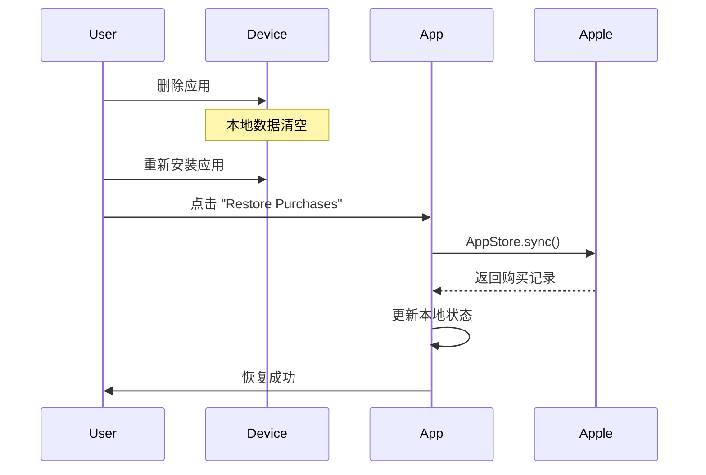
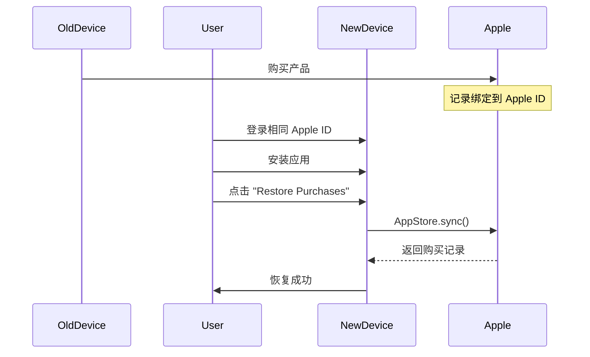
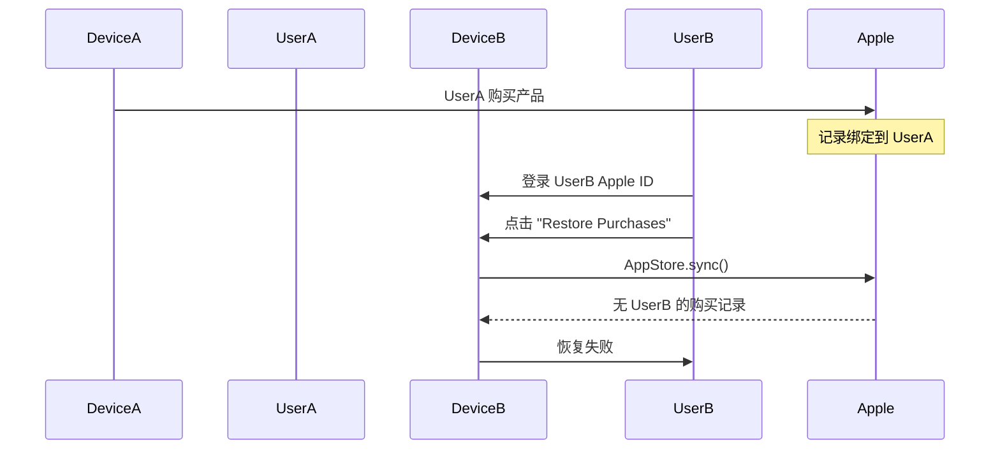
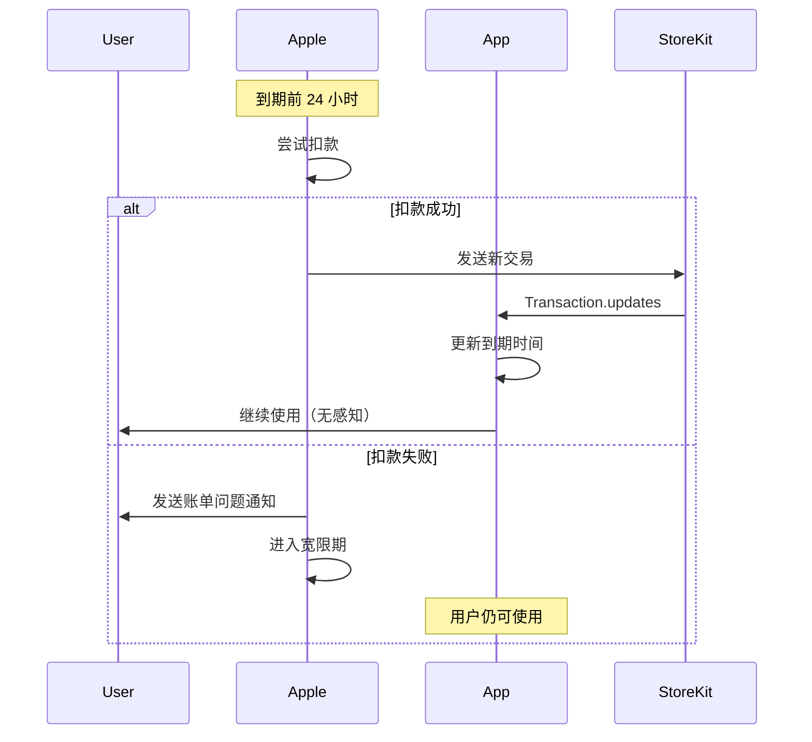
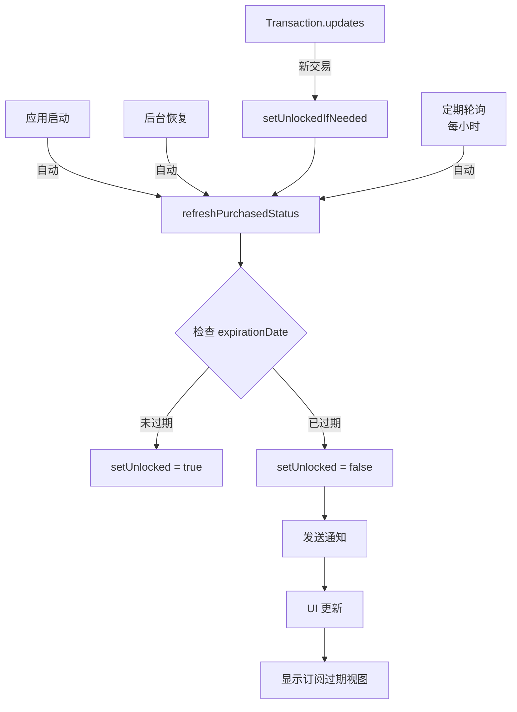
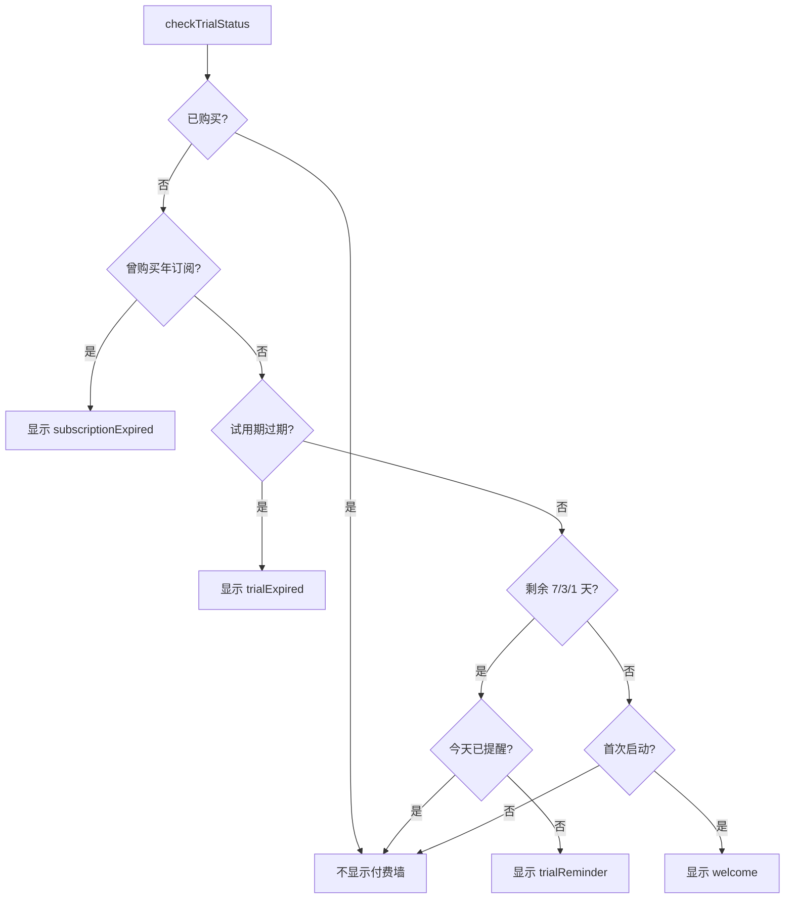

# SyncNos 应用内购买（IAP）技术文档

## 文档概述

本文档详细描述了 SyncNos macOS 应用的应用内购买（In-App Purchase, IAP）系统的完整技术实现，包括开发环境测试指南和生产环境运行机制。

---

# 第一部分：开发环境测试文档

## 1. 环境准备

### 1.1 StoreKit Configuration 文件配置

SyncNos 使用 StoreKit Configuration File 进行本地测试，无需连接 App Store Connect。

**配置文件位置**: `Resource/SyncNos.storekit`

**产品配置**:

```json
{
  "products": [
    {
      "productID": "com.syncnos.lifetime.68",
      "type": "NonConsumable",
      "displayPrice": "68.0",
      "localizations": [
        {
          "locale": "en_US",
          "displayName": "SyncNos Lifetime",
          "description": "Lifetime access to all features"
        },
        {
          "locale": "zh_Hans",
          "displayName": "SyncNos 买断制",
          "description": "终身访问所有功能"
        }
      ]
    }
  ],
  "subscriptionGroups": [
    {
      "name": "SyncNos Premium",
      "subscriptions": [
        {
          "productID": "com.syncnos.annual.18",
          "type": "RecurringSubscription",
          "displayPrice": "18",
          "recurringSubscriptionPeriod": "P1Y"
        }
      ]
    }
  ]
}
```

### 1.2 Xcode Scheme 设置

**启用 StoreKit Configuration File**:

1. 打开 Xcode，选择 `Product` → `Scheme` → `Edit Scheme...`
2. 选择 `Run` → `Options` 标签页
3. 在 `StoreKit Configuration` 下拉菜单中选择 `SyncNos.storekit`
4. 点击 `Close` 保存

**验证配置**:
- 运行应用后，IAP 产品应该立即可用，无需网络连接
- 购买操作会弹出模拟的 StoreKit 对话框（非真实 App Store 界面）

### 1.3 本地测试 vs Sandbox 测试

| 特性 | 本地测试 (StoreKit Config) | Sandbox 测试 |
|------|---------------------------|--------------|
| 网络连接 | ❌ 不需要 | ✅ 需要 |
| 测试账户 | ❌ 不需要 | ✅ 需要 Sandbox 账户 |
| 购买记录持久化 | ✅ 本地持久化 | ✅ Apple 服务器持久化 |
| 测试速度 | ⚡️ 快速 | 🐢 较慢 |
| 真实性 | 🔸 模拟环境 | ✅ 接近生产环境 |
| 适用场景 | 快速迭代开发 | 集成测试、发布前验证 |

**推荐工作流**:
1. **开发阶段**: 使用 StoreKit Configuration File 进行快速测试
2. **集成测试**: 使用 Sandbox 账户测试完整流程
3. **发布前验证**: 使用 TestFlight 进行最终测试


## 2. Sandbox 测试账户

### 2.1 创建 Sandbox 测试账户

**步骤**:

1. 登录 [App Store Connect](https://appstoreconnect.apple.com)
2. 导航至 `用户和访问` → `Sandbox 测试员`
3. 点击 `+` 按钮创建新测试员
4. 填写信息:
   - **名字/姓氏**: 任意（建议使用易识别的名称，如 "Test User 1"）
   - **电子邮件**: 必须是未注册过 Apple ID 的邮箱（可以使用 `+` 技巧，如 `chiimagnus1@tester1.com`）
   - **密码**: 设置测试账户密码
   - **国家或地区**: 选择测试地区（建议选择中国）
5. 点击 `邀请` 完成创建

**注意事项**:
- ⚠️ Sandbox 账户的邮箱**不能**是已注册的真实 Apple ID
- ⚠️ 一个 Sandbox 账户可以在多个设备上使用
- ⚠️ Sandbox 账户不需要邮箱验证，创建后立即可用

### 2.2 在 Mac 上登录 Sandbox 账户

**正确方式** (在应用内登录):

1. **不要**在 `系统设置` → `Apple ID` 中登录 Sandbox 账户
2. 运行应用，触发购买流程
3. 在弹出的 StoreKit 购买对话框中输入 Sandbox 账户和密码
4. 首次登录会提示 "使用沙盒环境"

**错误方式** (❌ 不要这样做):
- ❌ 在系统设置中登录 Sandbox 账户（会导致真实 Apple ID 被登出）
- ❌ 在 App Store 应用中登录 Sandbox 账户（无效）

### 2.3 注意事项

**Sandbox 环境特性**:
- ✅ 购买不会真实扣费
- ✅ 订阅周期加速（1年订阅 = 1小时）
- ✅ 可以重复购买测试
- ⚠️ 购买记录会持久化到 Apple 服务器
- ⚠️ 需要定期清理测试数据（见下文）

**常见问题**:
- **问题**: "此时你没有权限在 Sandbox 购买"
  - **原因**: Sandbox 账户未正确登录或已过期
  - **解决**: 重新登录 Sandbox 账户

- **问题**: 购买后状态未更新
  - **原因**: 本地缓存未刷新
  - **解决**: 调用 `restorePurchases()` 或重启应用

## 4. 调试工具

### 4.1 StoreKit Transaction Manager

**访问路径**: Xcode → `Debug` → `StoreKit` → `Manage Transactions...`

**功能**:
- 查看所有测试购买记录
- 取消订阅
- 删除购买记录
- 模拟退款
- 查看交易详情（Transaction ID、购买日期、到期日期等）

**使用场景**:

1. **清除测试购买记录**:
   - 选中交易 → 右键 → `Delete Transaction`
   - 用于重新测试首次购买流程

2. **模拟订阅取消**:
   - 选中订阅 → 右键 → `Cancel Subscription`
   - 用于测试订阅过期处理

3. **模拟退款**:
   - 选中交易 → 右键 → `Refund Purchase`
   - 用于测试退款后的应用行为

4. **查看交易详情**:
   - 双击交易查看完整信息
   - 包括 Transaction ID、购买日期、到期日期、撤销日期等

### 4.2 应用内调试面板

**访问路径**: 设置 (⌘,) → 支持本计划 → IAP 调试

**前提条件**: 仅在开发环境下可见（`#if DEBUG`）

**功能**:

#### 4.2.1 查看当前状态

显示完整的 IAP 状态信息:

```swift
struct IAPDebugInfo {
    let hasPurchasedAnnual: Bool        // 是否购买年订阅
    let hasPurchasedLifetime: Bool      // 是否购买买断制
    let isInTrialPeriod: Bool           // 是否在试用期内
    let trialDaysRemaining: Int         // 试用期剩余天数
    let firstLaunchDate: Date?          // 首次启动日期
}
```

**UI 显示**:
- 购买状态（年订阅/买断制/未购买）
- 试用期状态（进行中/已过期）
- 剩余天数
- 首次启动日期
- 设备指纹
- UserDefaults 键值对
- Keychain 数据

#### 4.2.2 重置所有 IAP 数据

**功能**: 清除所有购买和试用数据，恢复到全新安装状态

**操作步骤**:
1. 点击 "Reset All IAP Data" 按钮
2. 确认警告对话框
3. 等待重置完成

**清除的数据**:
- UserDefaults:
  - `syncnos.annual.subscription.unlocked`
  - `syncnos.lifetime.license.unlocked`
  - `syncnos.first.launch.date`
  - `syncnos.device.fingerprint`
  - `syncnos.last.reminder.date`
  - `syncnos.has.shown.welcome`
  - `syncnos.annual.subscription.transaction.id`
  - `syncnos.lifetime.license.transaction.id`

- Keychain:
  - 首次启动日期
  - 设备指纹

**预期日志输出**:

```
Starting IAP reset. Before state: hasPurchasedAnnual=true, hasPurchasedLifetime=false, isInTrialPeriod=false, trialDaysRemaining=0
Clearing UserDefaults IAP keys...
UserDefaults cleared
Clearing Keychain IAP data...
Keychain cleared
Status change notification sent
IAP reset complete. After state: hasPurchasedAnnual=false, hasPurchasedLifetime=false, isInTrialPeriod=true, trialDaysRemaining=30
```

**注意**: 
- ⚠️ 此操作**不会**删除 Apple 服务器上的购买记录
- ⚠️ 调用 `restorePurchases()` 可以重新恢复购买状态
- ⚠️ 仅用于开发测试，生产环境不可用

#### 4.2.3 模拟购买状态

**功能**: 快速切换到不同的购买/试用状态，无需真实购买

**可用状态**:

1. **Purchased Annual**: 模拟已购买年订阅
2. **Purchased Lifetime**: 模拟已购买买断制
3. **Trial Day 23** (7 days left): 模拟试用期剩余 7 天
4. **Trial Day 27** (3 days left): 模拟试用期剩余 3 天
5. **Trial Day 29** (1 day left): 模拟试用期剩余 1 天
6. **Trial Expired**: 模拟试用期已过期

**操作步骤**:
1. 点击 "Simulate State" 菜单
2. 选择要模拟的状态
3. 验证 UI 更新

**实现原理**:

```swift
func simulatePurchaseState(_ state: SimulatedPurchaseState) throws {
    switch state {
    case .purchasedAnnual:
        UserDefaults.standard.set(true, forKey: annualSubscriptionKey)
        
    case .purchasedLifetime:
        UserDefaults.standard.set(true, forKey: lifetimeLicenseKey)
        
    case .trialDay(let day):
        let targetDate = Calendar.current.date(byAdding: .day, value: -day, to: Date())!
        UserDefaults.standard.set(targetDate, forKey: firstLaunchDateKey)
        KeychainHelper.shared.saveFirstLaunchDate(targetDate)
        
    case .trialExpired:
        let expiredDate = Calendar.current.date(byAdding: .day, value: -31, to: Date())!
        UserDefaults.standard.set(expiredDate, forKey: firstLaunchDateKey)
        KeychainHelper.shared.saveFirstLaunchDate(expiredDate)
        
    case .reset:
        try resetAllPurchaseData()
    }
    
    // 发送状态变更通知，触发 UI 更新
    NotificationCenter.default.post(name: Self.statusChangedNotification, object: nil)
}
```

### 4.3 如何清除测试购买记录

**方法 1: 使用 Xcode Transaction Manager**

1. 打开 Xcode → `Debug` → `StoreKit` → `Manage Transactions...`
2. 选中要删除的交易
3. 右键 → `Delete Transaction`
4. 确认删除

**方法 2: 使用应用内调试工具**

1. 打开 IAP 调试面板
2. 点击 "Reset All IAP Data"
3. 确认重置

**方法 3: 删除应用重新安装**

1. 删除应用
2. 清理 Xcode Derived Data: `~/Library/Developer/Xcode/DerivedData`
3. 重新运行应用

**注意**: 
- 方法 1 和 2 只清除本地数据
- Apple 服务器上的购买记录无法删除（除非使用 Sandbox 账户重置）
- 生产环境的购买记录永久保存，无法删除

### 4.4 如何重置本地状态

**完整重置步骤**:

1. **清除 UserDefaults**:
   ```bash
   defaults delete com.syncnos.SyncNos
   ```

2. **清除 Keychain** (使用应用内工具):
   ```swift
   KeychainHelper.shared.deleteFirstLaunchDate()
   KeychainHelper.shared.deleteDeviceFingerprint()
   ```

3. **清除 StoreKit 缓存** (Xcode):
   - `Debug` → `StoreKit` → `Manage Transactions...`
   - 删除所有交易

4. **重启应用**:
   - 验证状态已重置为全新安装

**验证重置成功**:

```swift
// 所有状态应该恢复默认值
iapService.hasPurchased  // false
iapService.isInTrialPeriod  // true
iapService.trialDaysRemaining  // 30
iapService.hasShownWelcome  // false
```

# 第二部分：生产环境文档

## 1. 产品配置

### 1.1 产品信息

SyncNos 提供两种付费方式：

#### 年度订阅（Auto-Renewable Subscription）

| 属性 | 值 |
|------|-----|
| 产品 ID | `com.syncnos.annual.18` |
| 产品类型 | RecurringSubscription |
| 价格 | ¥18/年 |
| 订阅组 | SyncNos Premium (ID: 21840005) |
| 订阅周期 | 1 年 |
| 自动续费 | ✅ 是 |
| 家庭共享 | ❌ 否 |
| 试用期 | ❌ 无（应用层面提供 30 天试用） |

**特性**:
- 自动续费，无需用户手动操作
- 可以随时取消，取消后在当前周期结束前仍可使用
- 支持宽限期（Grace Period）和账单重试
- 订阅状态变更会通过 StoreKit 2 的 `Transaction.updates` 通知

#### 买断制（Non-Consumable）

| 属性 | 值 |
|------|-----|
| 产品 ID | `com.syncnos.lifetime.68` |
| 产品类型 | NonConsumable |
| 价格 | ¥68 |
| 有效期 | 永久 |
| 家庭共享 | ❌ 否 |

**特性**:
- 一次性购买，永久有效
- 可以跨设备恢复（同一 Apple ID）
- 不会过期，不需要续费
- 重复购买会被 Apple 自动拦截（返回现有交易记录，不收费）

### 1.2 试用期机制

**应用层面的试用期**（非 StoreKit 试用期）:

- **时长**: 30 天
- **触发**: 首次启动应用时自动开始
- **存储**: UserDefaults + Keychain 双重存储
- **防滥用**: 使用设备指纹（硬件 UUID）防止重复试用

**试用期状态**:

```swift
var isInTrialPeriod: Bool {
    guard let firstLaunchDate = getFirstLaunchDate() else {
        recordFirstLaunch()  // 首次启动，记录日期
        return true
    }
    let daysSinceLaunch = Calendar.current.dateComponents([.day], from: firstLaunchDate, to: Date()).day ?? 0
    return daysSinceLaunch < 30
}
```

**试用期提醒**:

- 剩余 7 天: 蓝色提醒，"Trial Ending Soon"
- 剩余 3 天: 橙色警告，"Only 3 Days Left"
- 剩余 1 天: 红色警告，"Last Day of Trial"
- 每天最多提醒一次（通过 `lastReminderDate` 控制）

### 1.3 App Store Connect 配置

**必需配置**:

1. **产品信息**:
   - 在 App Store Connect → 我的 App → SyncNos → 功能 → App 内购买项目
   - 创建两个产品（年订阅和买断制）
   - 填写产品名称、描述、价格等信息

2. **订阅组**（仅年订阅需要）:
   - 创建订阅组 "SyncNos Premium"
   - 设置订阅等级（如果有多个订阅选项）

3. **本地化**:
   - 为每个产品添加多语言本地化
   - 至少包含英文和中文

4. **审核信息**:
   - 提供测试账户（Sandbox）
   - 说明 IAP 功能和试用期机制

**可选配置**:

- 促销优惠（Promotional Offers）
- 优惠代码（Offer Codes）
- 订阅优惠（Introductory Offers）

## 2. 架构设计

### 2.1 MVVM 架构

SyncNos 严格遵循 MVVM 架构模式：

```
┌─────────────────────────────────────────────────────────────┐
│                         Views (UI)                          │
│  ┌──────────────┐  ┌──────────────┐  ┌──────────────┐     │
│  │ MainListView │  │ PayWallView  │  │   IAPView    │     │
│  └──────────────┘  └──────────────┘  └──────────────┘     │
└─────────────────────────────────────────────────────────────┘
                            │
                            │ @StateObject / @Published
                            ▼
┌─────────────────────────────────────────────────────────────┐
│                    ViewModels (Logic)                       │
│                  ┌──────────────────┐                       │
│                  │  IAPViewModel    │                       │
│                  │  - products      │                       │
│                  │  - isProUnlocked │                       │
│                  │  - buy()         │                       │
│                  │  - restore()     │                       │
│                  └──────────────────┘                       │
└─────────────────────────────────────────────────────────────┘
                            │
                            │ Dependency Injection
                            ▼
┌─────────────────────────────────────────────────────────────┐
│                    Services (Business)                      │
│                  ┌──────────────────┐                       │
│                  │   IAPService     │                       │
│                  │  - purchase()    │                       │
│                  │  - restore()     │                       │
│                  │  - observe()     │                       │
│                  └──────────────────┘                       │
└─────────────────────────────────────────────────────────────┘
                            │
                            │ StoreKit 2 API
                            ▼
┌─────────────────────────────────────────────────────────────┐
│                    StoreKit 2 Framework                     │
│  ┌──────────────┐  ┌──────────────┐  ┌──────────────┐     │
│  │   Product    │  │ Transaction  │  │  AppStore    │     │
│  └──────────────┘  └──────────────┘  └──────────────┘     │
└─────────────────────────────────────────────────────────────┘
```

**职责分离**:

- **Views**: 纯 UI 展示，不包含业务逻辑
  - 使用 `@StateObject` 管理 ViewModel
  - 通过 `@Published` 属性响应状态变化
  - 不直接调用 StoreKit API

- **ViewModels**: 处理业务逻辑和状态管理
  - 继承 `ObservableObject`
  - 使用 `@Published` 标记需要触发 UI 更新的属性
  - 调用 Service 执行操作
  - 不直接引用 SwiftUI Views

- **Services**: 封装 StoreKit 2 API
  - 实现协议以支持测试
  - 处理购买、恢复、交易监听等核心逻辑
  - 通过 `NotificationCenter` 发送状态变更通知

### 2.2 核心组件

#### IAPService (Services/Auth/IAPService.swift)

**职责**: 封装所有 IAP 相关的业务逻辑

**核心属性**:

```swift
final class IAPService: IAPServiceProtocol {
    // 购买状态（计算属性，基于 UserDefaults）
    var isProUnlocked: Bool { hasPurchased || isInTrialPeriod }
    var hasPurchased: Bool { hasPurchasedAnnual || hasPurchasedLifetime }
    var hasPurchasedAnnual: Bool { UserDefaults.standard.bool(forKey: annualSubscriptionKey) }
    var hasPurchasedLifetime: Bool { UserDefaults.standard.bool(forKey: lifetimeLicenseKey) }
    var purchaseType: PurchaseType { /* 返回当前购买类型 */ }
    
    // 试用期状态
    var isInTrialPeriod: Bool { /* 基于首次启动日期计算 */ }
    var trialDaysRemaining: Int { /* 计算剩余天数 */ }
    
    // UI 状态
    var hasShownWelcome: Bool { UserDefaults.standard.bool(forKey: hasShownWelcomeKey) }
}
```

**核心方法**:

```swift
// 获取产品列表
func fetchProducts() async throws -> [Product]

// 购买产品
func purchase(product: Product) async throws -> Bool

// 恢复购买
func restorePurchases() async -> Bool

// 开始监听交易更新
func startObservingTransactions()

// 刷新购买状态（从 Apple 服务器同步）
func refreshPurchasedStatus() async -> Bool
```

**状态通知**:

```swift
static let statusChangedNotification = Notification.Name("IAPServiceStatusChanged")
static let showWelcomeNotification = Notification.Name("IAPServiceShowWelcome")
static let showTrialReminderNotification = Notification.Name("IAPServiceShowTrialReminder")
```

#### IAPViewModel (ViewModels/Account/IAPViewModel.swift)

**职责**: 为 UI 提供响应式数据绑定

**核心属性**:

```swift
@MainActor
final class IAPViewModel: ObservableObject {
    @Published var products: [Product] = []
    @Published var isLoading: Bool = false
    @Published var message: String?
    @Published var isProUnlocked: Bool
    @Published var hasPurchased: Bool
    @Published var purchaseType: PurchaseType
    @Published var isInTrialPeriod: Bool
    @Published var trialDaysRemaining: Int
    @Published var expirationDate: Date?
    @Published var purchaseDate: Date?
}
```

**响应式更新**:

```swift
init(iap: IAPServiceProtocol = DIContainer.shared.iapService) {
    self.iap = iap
    
    // 订阅状态变更通知
    NotificationCenter.default
        .publisher(for: IAPService.statusChangedNotification)
        .receive(on: DispatchQueue.main)
        .sink { [weak self] _ in
            Task { @MainActor in
                self?.updateStatus()
            }
        }
        .store(in: &cancellables)
}
```

#### PayWallView (Views/Settting/IAPViews/PayWallView.swift)

**职责**: 统一的付费墙界面，根据不同模式显示不同内容

**展示模式**:

```swift
enum IAPPresentationMode {
    case welcome                        // 欢迎页面（首次启动）
    case trialReminder(daysRemaining: Int)  // 试用期提醒（7/3/1 天）
    case trialExpired                   // 试用期过期
    case subscriptionExpired            // 年订阅已过期（新增）
}
```

**自动关闭逻辑**:

```swift
.onChange(of: viewModel.isProUnlocked) { _, newValue in
    if newValue {
        handlePurchaseSuccess()
    }
}

private func handlePurchaseSuccess() {
    // 如果是欢迎模式，标记已显示
    if case .welcome = presentationMode {
        DIContainer.shared.iapService.markWelcomeShown()
    }
    dismiss()
}
```

### 2.3 依赖注入

**DIContainer** (Services/Core/DIContainer.swift):

```swift
final class DIContainer {
    static let shared = DIContainer()
    
    lazy var iapService: IAPServiceProtocol = IAPService()
    lazy var loggerService: LoggerServiceProtocol = LoggerService()
    // ... 其他服务
}
```

**使用方式**:

```swift
// 在 ViewModel 中
let iapService = DIContainer.shared.iapService

// 在 View 中（通过 ViewModel）
@StateObject private var viewModel = IAPViewModel()
```


## 3. 购买数据存储

### 3.1 Apple 服务器（权威来源）

**存储内容**: 所有购买记录和交易信息

**特性**:
- ✅ 与 Apple ID 绑定，永久保存
- ✅ 跨设备同步（同一 Apple ID）
- ✅ 无法被用户或开发者删除
- ✅ 支持退款后的撤销记录
- ✅ 订阅状态实时更新

**访问方式**:

```swift
// 1. 同步最新购买记录到本地
try await AppStore.sync()

// 2. 查询特定产品的最新交易
let latest = await Transaction.latest(for: "com.syncnos.annual.18")

// 3. 查询所有当前有效的交易
for await result in Transaction.currentEntitlements {
    switch result {
    case .verified(let transaction):
        // 处理有效交易
    case .unverified:
        // 处理未验证交易
    }
}
```

**数据结构**:

```swift
struct Transaction {
    let id: UInt64                  // 交易 ID（唯一标识）
    let productID: String           // 产品 ID
    let purchaseDate: Date          // 购买日期
    let expirationDate: Date?       // 到期日期（订阅产品）
    let revocationDate: Date?       // 撤销日期（退款后）
    let isUpgraded: Bool            // 是否已升级
    // ... 其他属性
}
```

### 3.2 本地设备存储

#### 3.2.1 StoreKit 系统级缓存

**位置**: 系统管理，应用无法直接访问

**内容**: 
- 购买记录的本地副本
- 交易验证信息
- 订阅状态

**特性**:
- ✅ 由 StoreKit 2 自动管理
- ✅ 提高查询性能（无需每次访问网络）
- ✅ 通过 `AppStore.sync()` 与服务器同步
- ⚠️ 可能因系统清理而丢失（需要重新同步）

#### 3.2.2 应用内状态标记（UserDefaults）

**位置**: `~/Library/Preferences/com.syncnos.SyncNos.plist`

**存储内容**:

```swift
// 购买状态缓存（快速查询）
"syncnos.annual.subscription.unlocked": Bool
"syncnos.lifetime.license.unlocked": Bool

// 试用期数据
"syncnos.first.launch.date": Date
"syncnos.has.shown.welcome": Bool
"syncnos.last.reminder.date": Date

// 设备指纹
"syncnos.device.fingerprint": String

// Transaction ID（用于判断重复购买）
"syncnos.annual.subscription.transaction.id": String
"syncnos.lifetime.license.transaction.id": String
```

**特性**:
- ✅ 快速访问，无需异步查询
- ✅ 用于 UI 判断和状态缓存
- ⚠️ 不是权威来源，可能与 Apple 服务器不一致
- ⚠️ 用户可以手动删除（通过删除应用或清理数据）

**使用原则**:
- 仅用于快速 UI 判断
- 定期通过 `refreshPurchasedStatus()` 与 Apple 服务器同步
- 应用启动时自动刷新状态

#### 3.2.3 Keychain（安全存储）

**位置**: macOS Keychain（系统级安全存储）

**存储内容**:

```swift
// 试用期数据（更持久）
Service: "com.syncnos.trial"
Account: "firstLaunchDate"
Data: Date (JSON encoded)

// 设备指纹（防止试用期滥用）
Service: "com.syncnos.trial"
Account: "deviceFingerprint"
Data: String (硬件 UUID)
```

**特性**:
- ✅ 比 UserDefaults 更持久
- ✅ 即使删除应用也可能保留（取决于系统设置）
- ✅ 加密存储，更安全
- ⚠️ 用户可以通过 Keychain Access 应用手动删除

**双重存储策略**:

```swift
// 写入时：同时保存到 UserDefaults 和 Keychain
UserDefaults.standard.set(date, forKey: firstLaunchDateKey)
KeychainHelper.shared.saveFirstLaunchDate(date)

// 读取时：优先 UserDefaults，失败则从 Keychain 恢复
if let date = UserDefaults.standard.object(forKey: firstLaunchDateKey) as? Date {
    return date
}
if let keychainDate = KeychainHelper.shared.getFirstLaunchDate() {
    // 同步回 UserDefaults
    UserDefaults.standard.set(keychainDate, forKey: firstLaunchDateKey)
    return keychainDate
}
return nil
```

### 3.3 数据同步策略

**启动时自动同步**:

```swift
// SyncNosApp.swift
init() {
    // 启动 IAP 交易监听
    DIContainer.shared.iapService.startObservingTransactions()
    
    // 自动刷新购买状态（后台异步）
    Task {
        await DIContainer.shared.iapService.refreshPurchasedStatus()
    }
}
```

**手动同步（恢复购买）**:

```swift
func restorePurchases() async -> Bool {
    // 1. 从 Apple 服务器同步最新购买记录
    try await AppStore.sync()
    
    // 2. 刷新本地状态
    let unlocked = await refreshPurchasedStatus()
    
    return unlocked
}
```

**实时监听交易更新**:

```swift
func startObservingTransactions() {
    updatesTask = Task.detached(priority: .background) { [weak self] in
        for await update in Transaction.updates {
            switch update {
            case .verified(let transaction):
                await self?.setUnlockedIfNeeded(for: transaction)
                await transaction.finish()
            case .unverified(_, let error):
                // 记录错误
            }
        }
    }
}
```

**数据流向图**:

```mermaid
graph TB
    A[Apple 服务器] -->|AppStore.sync| B[StoreKit 缓存]
    B -->|Transaction.latest| C[IAPService]
    C -->|更新| D[UserDefaults]
    C -->|更新| E[Keychain]
    D -->|读取| F[IAPViewModel]
    E -->|读取| F
    F -->|@Published| G[UI Views]
    
    H[用户购买] -->|purchase| A
    I[Transaction.updates] -->|实时通知| C
```

### 3.4 数据一致性保证

**原则**: 始终以 Apple 服务器为准

**实现**:

1. **启动时刷新**: 应用启动时自动调用 `refreshPurchasedStatus()`
2. **购买后验证**: 购买成功后立即验证交易并更新本地状态
3. **定期同步**: 通过 `Transaction.updates` 监听服务器端的状态变更
4. **恢复购买**: 提供手动同步按钮，强制从服务器拉取最新状态

**冲突处理**:

```swift
// 如果本地状态与服务器不一致，以服务器为准
func refreshPurchasedStatus() async -> Bool {
    for productId in IAPProductIds.allCases {
        if let latest = await Transaction.latest(for: productId.rawValue) {
            switch latest {
            case .verified(let transaction):
                let isValid = transaction.revocationDate == nil
                // 更新本地状态，覆盖旧值
                await setUnlocked(transaction.productID, isValid)
            case .unverified:
                // 服务器无有效交易，清除本地状态
                await setUnlocked(productId.rawValue, false)
            }
        } else {
            // 服务器无交易记录，清除本地状态
            await setUnlocked(productId.rawValue, false)
        }
    }
    return isProUnlocked
}
```

## 4. Restore Purchases 机制

### 4.1 工作原理

**核心流程**:

1. **用户触发**: 点击 "Restore Purchases" 按钮
2. **同步服务器**: 调用 `AppStore.sync()` 从 Apple 服务器拉取购买记录
3. **查询交易**: 遍历所有产品，查询最新有效交易
4. **更新本地**: 将服务器状态同步到本地 UserDefaults
5. **通知 UI**: 发送状态变更通知，更新界面

**代码实现**:

```swift
func restorePurchases() async -> Bool {
    do {
        logger.debug("🔄 开始恢复购买流程...")
        
        // Step 1: 从 Apple 服务器同步购买记录
        try await AppStore.sync()
        logger.info("✅ AppStore.sync() 完成")
        
        // Step 2: 查询并更新本地状态
        let unlocked = await refreshPurchasedStatus()
        
        if unlocked {
            logger.info("✅ 恢复成功 - 检测到有效的购买记录")
        } else {
            logger.info("ℹ️ 恢复完成 - 未找到有效的购买记录")
        }
        
        return unlocked
    } catch {
        logger.error("❌ 恢复购买失败: \(error.localizedDescription)")
        return false
    }
}
```

### 4.2 跨设备恢复流程

**场景 1: 同一设备重新安装**



**场景 2: 换新设备（同一 Apple ID）**



**场景 3: 不同 Apple ID（失败）**



### 4.3 换电脑后的恢复

**前提条件**: 使用相同的 Apple ID

**步骤**:

1. **新电脑上安装应用**
2. **首次启动**: 应用显示试用期（30 天）
3. **点击 "Restore Purchases"**:
   - 输入购买时使用的 Apple ID
   - 等待同步完成
4. **恢复成功**: 购买状态恢复，功能解锁

**注意事项**:
- ✅ 购买记录与 Apple ID 绑定，不与设备绑定
- ✅ 可以在多台设备上恢复（同一 Apple ID）
- ⚠️ 本地试用期数据不会跨设备同步（每台设备独立计算）
- ⚠️ 如果使用不同的 Apple ID，无法恢复购买

### 4.4 自动检查 vs 手动恢复

**自动检查**（应用启动时）:

```swift
// SyncNosApp.swift
init() {
    // 启动交易监听（自动处理服务器端的状态变更）
    DIContainer.shared.iapService.startObservingTransactions()
    
    // 后台刷新购买状态
    Task {
        await DIContainer.shared.iapService.refreshPurchasedStatus()
    }
}
```

**特性**:
- ✅ 静默执行，不打扰用户
- ✅ 仅查询本地 StoreKit 缓存，速度快
- ⚠️ 如果本地缓存过期，可能无法检测到购买

**手动恢复**（用户点击按钮）:

```swift
Button("Restore Purchases") {
    viewModel.restore()
}

func restore() {
    Task { @MainActor in
        let ok = await iap.restorePurchases()
        message = ok ? "Restored successfully." : "Restore failed."
    }
}
```

**特性**:
- ✅ 强制从 Apple 服务器同步，最可靠
- ✅ 适用于跨设备恢复场景
- ⚠️ 需要网络连接
- ⚠️ 可能需要用户输入 Apple ID 密码

**推荐策略**:
- 应用启动时自动检查（静默）
- 提供手动恢复按钮（用户主动触发）
- 在付费墙界面显著位置放置恢复按钮


## 5. 订阅生命周期管理

### 5.1 自动续费处理

**订阅周期**: 1 年（从购买日期开始计算）

**自动续费时间**: 到期前 24 小时

**续费流程**:



**代码实现**:

```swift
func startObservingTransactions() {
    updatesTask = Task.detached(priority: .background) { [weak self] in
        for await update in Transaction.updates {
            switch update {
            case .verified(let transaction):
                // 处理续费交易
                if transaction.productID == IAPProductIds.annualSubscription.rawValue {
                    logger.info("📅 订阅已续费，新到期时间: \(transaction.expirationDate)")
                }
                await self?.setUnlockedIfNeeded(for: transaction)
                await transaction.finish()
            case .unverified(_, let error):
                logger.warning("⚠️ 未验证的交易: \(error)")
            }
        }
    }
}
```

**用户体验**:
- ✅ 完全自动化，用户无需操作
- ✅ 续费成功后立即生效
- ✅ 应用通过 `Transaction.updates` 实时感知续费

### 5.2 订阅过期检测

**检测时机**:
1. **应用启动时**: `SyncNosApp.init()` → `refreshPurchasedStatus()`
2. **应用从后台恢复时**: `AppDelegate.applicationDidBecomeActive()` → `refreshPurchasedStatus()`
3. **收到新交易通知时**: `Transaction.updates` → `setUnlockedIfNeeded()` → `refreshPurchasedStatus()`
4. **定期轮询**: 每小时自动检查一次（后台 Task）

**为什么需要定期轮询**:
- ⚠️ `Transaction.updates` 只推送新交易（购买、续费、退款），**不推送过期事件**
- ⚠️ 订阅过期需要主动检查 `expirationDate`，而不是被动等待通知
- ✅ 定期轮询确保即使没有新交易，也能及时检测到过期状态

**检测逻辑**:

```swift
func refreshPurchasedStatus() async -> Bool {
    logger.debug("🔄 刷新购买状态 - 从本地 StoreKit 缓存查询最新交易记录")
    
    for productId in IAPProductIds.allCases {
        if let latest = await Transaction.latest(for: productId.rawValue) {
            switch latest {
            case .verified(let transaction):
                // 1. 检查是否被撤销
                let isRevoked = transaction.revocationDate != nil
                
                // 2. 检查订阅是否过期（仅适用于订阅类产品）
                var isExpired = false
                if let expirationDate = transaction.expirationDate {
                    isExpired = expirationDate < Date()
                    logger.debug("    ⏰ 到期日期: \(expirationDate)")
                    logger.debug("    ⏰ 当前时间: \(Date())")
                    logger.debug("    ⏰ 是否过期: \(isExpired)")
                }
                
                // 3. 综合判断：未被撤销 且 未过期
                let isValid = !isRevoked && !isExpired
                
                if isExpired {
                    logger.warning("⚠️ 订阅已过期: \(expirationDate)")
                }
                
                // 保存 Transaction ID（用于 hasEverPurchasedAnnual 判断）
                let currentTransactionId = String(transaction.id)
                if getPreviousTransactionId(for: transaction.productID) == nil {
                    savePreviousTransactionId(currentTransactionId, for: transaction.productID)
                }
                
                await setUnlocked(transaction.productID, isValid)
            case .unverified:
                await setUnlocked(productId.rawValue, false)
            }
        } else {
            await setUnlocked(productId.rawValue, false)
        }
    }
    
    return isProUnlocked
}
```

**定期轮询实现**:

```swift
func startObservingTransactions() {
    // 1. 监听新交易（购买、续费、退款等）
    updatesTask = Task.detached(priority: .background) { [weak self] in
        for await update in Transaction.updates {
            switch update {
            case .verified(let transaction):
                await self?.setUnlockedIfNeeded(for: transaction)
                await transaction.finish()
                // 交易更新后，立即刷新所有产品的状态（检查过期）
                await self?.refreshPurchasedStatus()
            case .unverified(_, let error):
                self?.logger.warning("Unverified transaction: \(error)")
            }
        }
    }
    
    // 2. 定期检查订阅过期状态（每小时检查一次）
    // 因为 Transaction.updates 不会推送过期事件，需要主动轮询
    Task.detached(priority: .background) { [weak self] in
        while !Task.isCancelled {
            // 等待 1 小时
            try? await Task.sleep(nanoseconds: 3600 * 1_000_000_000)
            
            self?.logger.debug("⏰ 定期检查订阅状态...")
            let wasUnlocked = await self?.isProUnlocked ?? false
            await self?.refreshPurchasedStatus()
            let isUnlocked = await self?.isProUnlocked ?? false
            
            // 如果状态从解锁变为锁定，说明订阅过期了
            if wasUnlocked && !isUnlocked {
                self?.logger.warning("⚠️ 订阅已过期！")
                await MainActor.run {
                    NotificationCenter.default.post(
                        name: Self.statusChangedNotification,
                        object: nil
                    )
                }
            }
        }
    }
}
```

**订阅历史追踪**:

为了区分"从未购买"和"曾经购买但已过期"，我们引入了 `hasEverPurchasedAnnual` 属性：

```swift
/// 是否曾经购买过年订阅（包括已过期的）
var hasEverPurchasedAnnual: Bool {
    // 检查是否有年订阅的 Transaction ID 记录
    return UserDefaults.standard.string(forKey: annualSubscriptionTransactionIdKey) != nil
}
```

**过期后的处理**:

```swift
// MainListView.swift
private func checkTrialStatus() {
    // Priority 1: 已购买 → 不显示付费墙
    if iapService.hasPurchased {
        showIAPView = false
        return
    }
    
    // Priority 2: 曾经购买过年订阅但已过期 → 显示订阅过期视图
    if iapService.hasEverPurchasedAnnual && !iapService.hasPurchased {
        iapPresentationMode = .subscriptionExpired
        showIAPView = true
        return
    }
    
    // Priority 3: 试用期过期且从未购买 → 显示试用期过期视图
    if !iapService.isProUnlocked {
        iapPresentationMode = .trialExpired
        showIAPView = true
        return
    }
}
```

**UI 状态显示**:

1. **IAPView.swift** - 设置页面显示三种状态：
   - `purchasedStatusView`: 当前有有效购买
   - `expiredSubscriptionView`: 曾经购买但已过期（新增）
   - `trialStatusView`: 从未购买，显示试用期状态

2. **PayWallView.swift** - 付费墙显示四种模式：
   - `.welcome`: 欢迎页面（首次启动）
   - `.trialReminder(daysRemaining)`: 试用期提醒（7/3/1 天）
   - `.trialExpired`: 试用期过期
   - `.subscriptionExpired`: 年订阅已过期（新增）

**数据流向图**:



### 5.3 宽限期（Grace Period）处理

**什么是宽限期**:
- Apple 提供的缓冲期，当订阅续费失败时，给用户时间解决账单问题
- 在宽限期内，用户仍可正常使用应用
- 宽限期结束后，如果仍未解决，订阅将过期

**配置**: 在 App Store Connect 中配置（最长 16 天）

**StoreKit 2 处理**:

```swift
// Transaction 包含宽限期信息
if let transaction = await Transaction.latest(for: productID) {
    switch transaction {
    case .verified(let t):
        // 检查是否在宽限期内
        if let gracePeriodExpirationDate = t.gracePeriodExpirationDate {
            if gracePeriodExpirationDate > Date() {
                logger.warning("⚠️ 订阅在宽限期内，到期时间: \(gracePeriodExpirationDate)")
                // 用户仍可使用，但应显示账单问题提示
            }
        }
    }
}
```

**用户体验**:
- ✅ 在宽限期内，应用功能正常
- ✅ 显示温和的提示，告知账单问题
- ✅ 提供更新付款方式的链接

**UI 提示**:

```swift
if let gracePeriodExpiration = viewModel.gracePeriodExpirationDate {
    HStack {
        Image(systemName: "exclamationmark.triangle.fill")
            .foregroundColor(.orange)
        VStack(alignment: .leading) {
            Text("Billing Issue")
                .font(.headline)
            Text("Please update your payment method by \(gracePeriodExpiration, style: .date)")
                .font(.caption)
        }
    }
    .padding()
    .background(Color.orange.opacity(0.1))
    .cornerRadius(8)
}
```

### 5.4 订阅状态变更通知

**StoreKit 2 自动通知**:

```swift
// Transaction.updates 会推送以下事件：
// - 新购买
// - 续费成功
// - 订阅升级/降级
// - 订阅取消
// - 退款

for await update in Transaction.updates {
    switch update {
    case .verified(let transaction):
        logger.info("📬 收到交易更新: \(transaction.productID)")
        
        // 判断事件类型
        if transaction.revocationDate != nil {
            logger.warning("💳 订阅已退款")
        } else if let expirationDate = transaction.expirationDate {
            if expirationDate > Date() {
                logger.info("✅ 订阅有效，到期时间: \(expirationDate)")
            } else {
                logger.warning("⚠️ 订阅已过期")
            }
        }
        
        // 更新本地状态
        await setUnlockedIfNeeded(for: transaction)
        await transaction.finish()
    }
}
```

**应用内通知**:

```swift
// IAPService 发送通知
NotificationCenter.default.post(
    name: Self.statusChangedNotification,
    object: nil
)

// MainListView 监听通知
.onReceive(NotificationCenter.default.publisher(for: IAPService.statusChangedNotification)) { _ in
    checkTrialStatus()
}
```

### 5.5 订阅取消处理

**用户取消订阅的方式**:
1. 在 App Store 账户设置中取消
2. 通过 Apple 客服取消
3. 通过家庭共享管理员取消（如果启用家庭共享）

**取消后的行为**:
- ✅ 当前订阅周期结束前仍可使用
- ✅ 到期后不再续费
- ✅ `expirationDate` 保持不变
- ✅ 应用可以检测到取消状态

**检测取消状态**:

```swift
// StoreKit 2 提供了订阅状态 API
if let status = try? await Product.SubscriptionInfo.Status.currentEntitlement(for: productID) {
    switch status.state {
    case .subscribed:
        logger.info("✅ 订阅活跃")
    case .expired:
        logger.warning("⚠️ 订阅已过期")
    case .inGracePeriod:
        logger.warning("⚠️ 订阅在宽限期内")
    case .inBillingRetryPeriod:
        logger.warning("⚠️ 订阅在账单重试期")
    case .revoked:
        logger.error("❌ 订阅已撤销（退款）")
    }
    
    // 检查是否会自动续费
    if status.renewalInfo.willAutoRenew {
        logger.info("🔄 订阅将自动续费")
    } else {
        logger.warning("⏸️ 订阅已取消，当前周期结束后将过期")
    }
}
```

**UI 提示**:

```swift
if viewModel.subscriptionWillExpire {
    HStack {
        Image(systemName: "info.circle.fill")
            .foregroundColor(.blue)
        VStack(alignment: .leading) {
            Text("Subscription Ending")
                .font(.headline)
            Text("Your subscription will expire on \(viewModel.expirationDate, style: .date)")
                .font(.caption)
        }
        Spacer()
        Button("Renew") {
            // 引导用户重新订阅
        }
    }
    .padding()
    .background(Color.blue.opacity(0.1))
    .cornerRadius(8)
}
```

## 6. 付费墙显示逻辑

### 6.1 显示优先级

**决策树**:



**代码实现**:

```swift
private func checkTrialStatus() {
    // Priority 1: 已购买 → 不显示
    if iapService.hasPurchased {
        showIAPView = false
        return
    }
    
    // Priority 2: 曾经购买过年订阅但已过期 → 显示订阅过期视图
    if iapService.hasEverPurchasedAnnual && !iapService.hasPurchased {
        iapPresentationMode = .subscriptionExpired
        showIAPView = true
        return
    }
    
    // Priority 3: 试用期过期且从未购买 → 显示试用期过期视图
    if !iapService.isProUnlocked {
        iapPresentationMode = .trialExpired
        showIAPView = true
        return
    }
    
    // Priority 4: 试用期提醒 → 显示提醒视图
    if iapService.shouldShowTrialReminder() {
        iapPresentationMode = .trialReminder(daysRemaining: iapService.trialDaysRemaining)
        showIAPView = true
        return
    }
    
    // Priority 5: 首次启动 → 显示欢迎视图
    if !iapService.hasShownWelcome {
        iapPresentationMode = .welcome
        showIAPView = true
        return
    }
    
    // 其他情况 → 不显示
    showIAPView = false
}
```

### 6.2 触发时机

**自动触发**:

1. **应用启动时**:
   ```swift
   .onAppear {
       checkTrialStatus()
   }
   ```

2. **IAP 状态变更时**:
   ```swift
   .onReceive(NotificationCenter.default.publisher(for: IAPService.statusChangedNotification)) { _ in
       checkTrialStatus()
   }
   ```

3. **应用从后台恢复时**:
   ```swift
   .onReceive(NotificationCenter.default.publisher(for: UIApplication.willEnterForegroundNotification)) { _ in
       checkTrialStatus()
   }
   ```

**手动触发**:
- 用户点击 "Upgrade" 按钮
- 尝试使用付费功能时

### 6.3 自动关闭逻辑

**购买成功后自动关闭**:

```swift
// PayWallView.swift
.onChange(of: viewModel.isProUnlocked) { _, newValue in
    if newValue {
        handlePurchaseSuccess()
    }
}

private func handlePurchaseSuccess() {
    // 如果是欢迎模式，标记已显示
    if case .welcome = presentationMode {
        DIContainer.shared.iapService.markWelcomeShown()
    }
    
    // 关闭付费墙
    dismiss()
}
```

**恢复购买成功后自动关闭**:

```swift
func restore() {
    Task { @MainActor in
        let ok = await iap.restorePurchases()
        if ok {
            // 恢复成功，isProUnlocked 会变为 true
            // 触发 onChange，自动关闭付费墙
        } else {
            message = "Restore failed."
        }
    }
}
```

### 6.4 防止重复显示

**问题**: 状态变更通知可能导致付费墙重复弹出

**解决方案**:

1. **检查当前显示状态**:
   ```swift
   private func checkTrialStatus() {
       // 如果已经在显示付费墙，且状态未变化，不重复触发
       if showIAPView && shouldShowSameMode() {
           return
       }
       // ... 其他逻辑
   }
   ```

2. **使用 @State 管理显示状态**:
   ```swift
   @State private var showIAPView = false
   @State private var iapPresentationMode: IAPPresentationMode = .welcome
   
   // SwiftUI 会自动处理重复的状态更新
   ```

3. **防抖动**:
   ```swift
   private var checkTrialStatusTask: Task<Void, Never>?
   
   private func checkTrialStatus() {
       checkTrialStatusTask?.cancel()
       checkTrialStatusTask = Task { @MainActor in
           try? await Task.sleep(nanoseconds: 100_000_000) // 100ms
           // 执行检查逻辑
       }
   }
   ```


## 7. 错误处理

### 7.1 购买错误

**常见错误类型**:

```swift
enum PurchaseError: Error {
    case userCancelled          // 用户取消购买
    case pending                // 购买待处理（需要家长批准等）
    case productNotAvailable    // 产品不可用
    case networkError           // 网络错误
    case verificationFailed     // 交易验证失败
    case unknown(Error)         // 未知错误
}
```

**错误处理实现**:

```swift
func purchase(product: Product) async throws -> Bool {
    do {
        let result = try await product.purchase()
        
        switch result {
        case .success(let verification):
            switch verification {
            case .verified(let transaction):
                await setUnlockedIfNeeded(for: transaction)
                await transaction.finish()
                return true
                
            case .unverified(let transaction, let error):
                logger.error("❌ 交易验证失败: \(error.localizedDescription)")
                throw PurchaseError.verificationFailed
            }
            
        case .userCancelled:
            logger.info("⚠️ 用户取消了购买")
            return false
            
        case .pending:
            logger.info("⏳ 购买待处理")
            return false
            
        @unknown default:
            logger.warning("⚠️ 未知的购买结果")
            return false
        }
    } catch {
        logger.error("❌ 购买过程出错: \(error.localizedDescription)")
        throw error
    }
}
```

**UI 错误显示**:

```swift
// IAPViewModel.swift
func buy(product: Product) {
    Task { @MainActor in
        do {
            let ok = try await iap.purchase(product: product)
            if ok {
                message = NSLocalizedString("Purchase successful.", comment: "")
            } else {
                message = NSLocalizedString("Purchase cancelled or pending.", comment: "")
            }
        } catch {
            // 显示用户友好的错误消息
            message = localizedErrorMessage(for: error)
        }
    }
}

private func localizedErrorMessage(for error: Error) -> String {
    switch error {
    case PurchaseError.networkError:
        return NSLocalizedString("Network error. Please check your connection.", comment: "")
    case PurchaseError.productNotAvailable:
        return NSLocalizedString("Product not available.", comment: "")
    case PurchaseError.verificationFailed:
        return NSLocalizedString("Purchase verification failed. Please try again.", comment: "")
    default:
        return error.localizedDescription
    }
}
```

### 7.2 恢复购买错误

**错误场景**:

1. **网络连接失败**:
   ```swift
   do {
       try await AppStore.sync()
   } catch {
       logger.error("❌ 网络错误: \(error.localizedDescription)")
       return false
   }
   ```

2. **无购买记录**:
   ```swift
   let unlocked = await refreshPurchasedStatus()
   if !unlocked {
       logger.info("ℹ️ 未找到有效的购买记录")
       return false
   }
   ```

3. **Apple ID 不匹配**:
   - 用户使用了不同的 Apple ID
   - 无法恢复其他账户的购买

**用户提示**:

```swift
func restore() {
    Task { @MainActor in
        isLoading = true
        let ok = await iap.restorePurchases()
        isLoading = false
        
        if ok {
            message = NSLocalizedString("Restored successfully.", comment: "")
        } else {
            message = NSLocalizedString(
                "Restore failed. Please make sure you're using the same Apple ID that made the purchase.",
                comment: ""
            )
        }
    }
}
```

### 7.3 交易验证错误

**验证失败原因**:
- 交易签名无效
- 交易已被篡改
- 设备时间不正确
- 越狱设备（可能）

**处理策略**:

```swift
switch verification {
case .verified(let transaction):
    // 交易有效，处理
    await setUnlockedIfNeeded(for: transaction)
    
case .unverified(let transaction, let error):
    // 交易无效，记录日志但不解锁功能
    logger.error("❌ 交易验证失败: \(transaction.id), 错误: \(error)")
    
    // 可选：上报到服务器进行进一步分析
    await reportVerificationFailure(transaction: transaction, error: error)
    
    // 不要解锁功能
    throw PurchaseError.verificationFailed
}
```

### 7.4 状态同步错误

**问题**: 本地状态与 Apple 服务器不一致

**检测**:

```swift
func validateStateConsistency() async {
    let localState = hasPurchased
    let serverState = await refreshPurchasedStatus()
    
    if localState != serverState {
        logger.warning("⚠️ 状态不一致: 本地=\(localState), 服务器=\(serverState)")
        
        // 以服务器为准，更新本地状态
        await refreshPurchasedStatus()
        
        // 通知 UI 更新
        NotificationCenter.default.post(name: Self.statusChangedNotification, object: nil)
    }
}
```

**自动修复**:

```swift
// 应用启动时自动检查
init() {
    Task {
        await validateStateConsistency()
    }
}

// 定期检查（可选）
Timer.scheduledTimer(withTimeInterval: 3600, repeats: true) { _ in
    Task {
        await validateStateConsistency()
    }
}
```

### 7.5 重试机制

**网络错误重试**:

```swift
func purchaseWithRetry(product: Product, maxRetries: Int = 3) async throws -> Bool {
    var lastError: Error?
    
    for attempt in 1...maxRetries {
        do {
            return try await purchase(product: product)
        } catch {
            lastError = error
            logger.warning("⚠️ 购买失败，尝试 \(attempt)/\(maxRetries): \(error)")
            
            // 指数退避
            let delay = UInt64(pow(2.0, Double(attempt)) * 1_000_000_000)
            try? await Task.sleep(nanoseconds: delay)
        }
    }
    
    throw lastError ?? PurchaseError.unknown(NSError(domain: "Unknown", code: -1))
}
```

**恢复购买重试**:

```swift
func restorePurchasesWithRetry(maxRetries: Int = 2) async -> Bool {
    for attempt in 1...maxRetries {
        let ok = await restorePurchases()
        if ok {
            return true
        }
        
        logger.warning("⚠️ 恢复购买失败，尝试 \(attempt)/\(maxRetries)")
        
        if attempt < maxRetries {
            try? await Task.sleep(nanoseconds: 2_000_000_000) // 2 秒
        }
    }
    
    return false
}
```

## 8. 安全性考虑

### 8.1 Receipt Validation

**StoreKit 2 自动验证**:

```swift
// StoreKit 2 自动验证交易签名
switch verification {
case .verified(let transaction):
    // Apple 已验证此交易的真实性
    // 可以安全地解锁功能
    
case .unverified(let transaction, let error):
    // 验证失败，不要解锁功能
    logger.error("验证失败: \(error)")
}
```

**优势**:
- ✅ 无需手动实现验证逻辑
- ✅ Apple 服务器端验证，更安全
- ✅ 自动处理签名和证书

**本地验证 vs 服务器验证**:

| 方式 | 优点 | 缺点 | 适用场景 |
|------|------|------|----------|
| 本地验证 | 快速、离线可用 | 可能被破解 | 单机应用 |
| 服务器验证 | 更安全、可审计 | 需要后端、网络依赖 | 在线服务 |

**SyncNos 策略**: 使用 StoreKit 2 本地验证（适合单机应用）

### 8.2 防止越狱破解

**StoreKit 2 内置保护**:
- 交易签名验证
- 设备完整性检查
- 防篡改机制

**额外保护措施**:

1. **检测越狱环境**（可选）:
   ```swift
   func isJailbroken() -> Bool {
       // 检查常见越狱文件
       let paths = [
           "/Applications/Cydia.app",
           "/Library/MobileSubstrate/MobileSubstrate.dylib",
           "/bin/bash",
           "/usr/sbin/sshd",
           "/etc/apt"
       ]
       
       for path in paths {
           if FileManager.default.fileExists(atPath: path) {
               return true
           }
       }
       
       return false
   }
   ```

2. **代码混淆**:
   - 使用 Swift 编译器优化
   - 避免在代码中硬编码敏感信息

3. **定期验证**:
   ```swift
   // 定期重新验证购买状态
   Timer.scheduledTimer(withTimeInterval: 3600, repeats: true) { _ in
       Task {
           await iapService.refreshPurchasedStatus()
       }
   }
   ```

**注意**: 
- ⚠️ 没有绝对安全的客户端验证
- ⚠️ 过度的反破解措施可能影响用户体验
- ✅ 对于单机应用，StoreKit 2 的保护已经足够

### 8.3 敏感信息存储（Keychain）

**存储内容**:
- 首次启动日期（试用期计算）
- 设备指纹（防止试用期滥用）

**不存储**:
- ❌ 购买状态（使用 Apple 服务器作为权威来源）
- ❌ Transaction ID（仅用于调试，存储在 UserDefaults）
- ❌ 用户个人信息

**Keychain 使用**:

```swift
final class KeychainHelper {
    static let shared = KeychainHelper()
    
    func save(service: String, account: String, data: Data) -> Bool {
        let query: [String: Any] = [
            kSecClass as String: kSecClassGenericPassword,
            kSecAttrService as String: service,
            kSecAttrAccount as String: account,
            kSecValueData as String: data,
            kSecAttrAccessible as String: kSecAttrAccessibleAfterFirstUnlock
        ]
        
        SecItemDelete(query as CFDictionary)
        let status = SecItemAdd(query as CFDictionary, nil)
        return status == errSecSuccess
    }
    
    func read(service: String, account: String) -> Data? {
        let query: [String: Any] = [
            kSecClass as String: kSecClassGenericPassword,
            kSecAttrService as String: service,
            kSecAttrAccount as String: account,
            kSecReturnData as String: true,
            kSecMatchLimit as String: kSecMatchLimitOne
        ]
        
        var item: CFTypeRef?
        let status = SecItemCopyMatching(query as CFDictionary, &item)
        guard status == errSecSuccess, let data = item as? Data else { return nil }
        return data
    }
}
```

**安全特性**:
- ✅ 系统级加密存储
- ✅ 沙盒隔离（其他应用无法访问）
- ✅ 支持 Touch ID/Face ID 保护（可选）
- ✅ 即使删除应用也可能保留（取决于 `kSecAttrAccessible` 设置）

### 8.4 防止试用期滥用

**策略**: 使用设备指纹绑定试用期

**设备指纹生成**:

```swift
private func generateDeviceFingerprint() -> String {
    var uuid = ""
    
    // 获取硬件 UUID（IOKit）
    let platformExpert = IOServiceGetMatchingService(kIOMainPortDefault, IOServiceMatching("IOPlatformExpertDevice"))
    if platformExpert != 0 {
        if let serialNumber = IORegistryEntryCreateCFProperty(
            platformExpert,
            kIOPlatformUUIDKey as CFString,
            kCFAllocatorDefault,
            0
        )?.takeRetainedValue() as? String {
            uuid = serialNumber
        }
        IOObjectRelease(platformExpert)
    }
    
    // 备用方案：系统信息组合
    if uuid.isEmpty {
        let host = Host.current()
        uuid = "\(host.localizedName ?? "unknown")-\(ProcessInfo.processInfo.hostName)"
    }
    
    return uuid
}
```

**特性**:
- ✅ 基于硬件 UUID，重装应用不变
- ✅ 存储在 Keychain，更持久
- ⚠️ 用户可以通过清理 Keychain 绕过（但需要技术知识）

**验证逻辑**:

```swift
private func recordFirstLaunch() {
    guard getFirstLaunchDate() == nil else { return }
    
    let now = Date()
    let fingerprint = generateDeviceFingerprint()
    
    // 双重存储
    UserDefaults.standard.set(now, forKey: firstLaunchDateKey)
    KeychainHelper.shared.saveFirstLaunchDate(now)
    
    UserDefaults.standard.set(fingerprint, forKey: deviceFingerprintKey)
    KeychainHelper.shared.saveDeviceFingerprint(fingerprint)
    
    logger.info("✅ 首次启动已记录 - 设备指纹: \(fingerprint)")
}
```

**局限性**:
- ⚠️ 无法完全防止技术用户绕过
- ⚠️ 虚拟机可能生成不同的指纹
- ✅ 对于普通用户已经足够

## 10. 发布检查清单

### 10.1 App Store Connect 配置

- [ ] 产品信息已创建并审核通过
  - [ ] 年度订阅: `com.syncnos.annual.18`
  - [ ] 买断制: `com.syncnos.lifetime.68`
- [ ] 订阅组已配置
- [ ] 产品本地化已完成（英文、中文）
- [ ] 产品截图和描述已上传
- [ ] 税务和银行信息已配置

### 10.2 代码检查

- [ ] 移除所有调试代码
  - [ ] `#if DEBUG` 块已正确使用
  - [ ] 调试日志已移除或条件编译
- [ ] 产品 ID 与 App Store Connect 一致
- [ ] StoreKit Configuration File 已从 Release 构建中移除
- [ ] 错误处理完善
- [ ] 用户提示文案已本地化

### 10.3 测试验证

- [ ] Sandbox 环境完整测试
  - [ ] 年度订阅购买
  - [ ] 买断制购买
  - [ ] 恢复购买
  - [ ] 订阅续费
  - [ ] 订阅取消
- [ ] TestFlight 测试
  - [ ] 内部测试通过
  - [ ] 外部测试通过
- [ ] 试用期逻辑验证
  - [ ] 首次启动
  - [ ] 试用期提醒
  - [ ] 试用期过期

### 10.4 文档准备

- [ ] 用户指南更新
- [ ] 隐私政策更新（如果涉及数据收集）
- [ ] 审核说明准备
  - [ ] 测试账户信息
  - [ ] IAP 功能说明
  - [ ] 试用期机制说明

### 10.5 审核准备

- [ ] 提供测试账户（Sandbox）
- [ ] 准备审核视频（演示购买流程）
- [ ] 说明试用期机制
- [ ] 说明恢复购买功能
- [ ] 确保符合 App Store 审核指南
  - [ ] 不使用误导性语言
  - [ ] 价格清晰透明
  - [ ] 取消订阅说明清楚

## 11. 常见审核问题

### 11.1 试用期相关

**问题**: "应用提供的试用期与订阅试用期混淆"

**解决**:
- 在 UI 中明确说明这是应用层面的试用期，不是订阅试用期
- 使用清晰的文案，如 "30-day free trial included with the app"

### 11.2 恢复购买

**问题**: "恢复购买按钮不够明显"

**解决**:
- 在所有付费墙界面显著位置放置 "Restore Purchases" 按钮
- 确保按钮可见且易于点击

### 11.3 价格透明度

**问题**: "价格信息不清晰"

**解决**:
- 显示完整价格，包括货币符号
- 订阅产品明确标注周期（年/月）
- 买断制产品明确标注 "一次性购买"

### 11.4 取消订阅

**问题**: "取消订阅说明不清楚"

**解决**:
- 在订阅页面添加取消说明
- 提供指向 Apple 订阅管理的链接
- 说明取消后的行为（当前周期结束前仍可使用）

## 12. 监控和分析

### 12.1 关键指标

**购买转化率**:
```swift
// 记录付费墙展示
Analytics.log("paywall_shown", parameters: [
    "mode": presentationMode.rawValue,
    "trial_days_remaining": iapService.trialDaysRemaining
])

// 记录购买成功
Analytics.log("purchase_completed", parameters: [
    "product_id": product.id,
    "price": product.price
])

// 计算转化率
let conversionRate = purchaseCount / paywallShowCount
```

**试用期指标**:
- 试用期启动率
- 试用期完成率（使用满 30 天）
- 试用转付费率

**订阅指标**:
- 订阅续费率
- 订阅取消率
- 平均订阅时长

### 12.2 错误监控

**购买错误**:
```swift
func purchase(product: Product) async throws -> Bool {
    do {
        return try await performPurchase(product)
    } catch {
        // 上报错误
        ErrorReporting.log(error, context: [
            "product_id": product.id,
            "user_id": userID
        ])
        throw error
    }
}
```

**恢复购买失败**:
```swift
func restorePurchases() async -> Bool {
    let success = await performRestore()
    
    if !success {
        ErrorReporting.log("restore_failed", context: [
            "has_network": hasNetworkConnection,
            "apple_id": currentAppleID
        ])
    }
    
    return success
}
```

### 12.3 用户反馈

**收集渠道**:
- 应用内反馈表单
- App Store 评论
- 客服邮件

**关注问题**:
- 购买失败
- 恢复购买失败
- 试用期计算错误
- 价格显示问题

---

## 附录

### A. 相关文件清单

**核心文件**:
- `SyncNos/Services/Auth/IAPService.swift` - IAP 核心服务
- `SyncNos/ViewModels/Account/IAPViewModel.swift` - IAP 视图模型
- `SyncNos/Views/Settting/IAPViews/PayWallView.swift` - 付费墙视图
- `SyncNos/Views/Settting/IAPViews/IAPView.swift` - IAP 设置视图
- `SyncNos/Models/IAPDebugModels.swift` - IAP 数据模型
- `SyncNos/Services/Core/KeychainHelper.swift` - Keychain 辅助类
- `SyncNos/Services/Core/Protocols.swift` - 服务协议定义

**配置文件**:
- `Resource/SyncNos.storekit` - StoreKit 配置文件
- `SyncNos/SyncNos.entitlements` - 应用权限配置

**文档**:
- `Resource/IAP_DEBUG_GUIDE.md` - IAP 调试指南
- `Resource/IAP_TECHNICAL_DOCUMENTATION.md` - 本文档

### B. 术语表

| 术语 | 英文 | 说明 |
|------|------|------|
| 应用内购买 | In-App Purchase (IAP) | 在应用内购买数字商品或服务 |
| 自动续费订阅 | Auto-Renewable Subscription | 自动续费的订阅产品 |
| 非消耗性产品 | Non-Consumable | 一次性购买，永久有效的产品 |
| 试用期 | Trial Period | 免费试用期，SyncNos 提供 30 天 |
| 恢复购买 | Restore Purchases | 从 Apple 服务器恢复购买记录 |
| 交易 | Transaction | 购买记录，包含产品 ID、购买日期等信息 |
| 宽限期 | Grace Period | 订阅续费失败后的缓冲期 |
| 沙盒环境 | Sandbox | Apple 提供的测试环境 |
| 设备指纹 | Device Fingerprint | 用于标识设备的唯一标识符 |

### C. 参考资源

**官方文档**:
- [StoreKit 2 Documentation](https://developer.apple.com/documentation/storekit)
- [In-App Purchase Programming Guide](https://developer.apple.com/in-app-purchase/)
- [App Store Review Guidelines](https://developer.apple.com/app-store/review/guidelines/)

**WWDC 视频**:
- [Meet StoreKit 2](https://developer.apple.com/videos/play/wwdc2021/10114/)
- [What's new in StoreKit 2](https://developer.apple.com/videos/play/wwdc2022/10007/)

**社区资源**:
- [StoreKit 2 Sample Code](https://developer.apple.com/documentation/storekit/in-app_purchase/implementing_a_store_in_your_app_using_the_storekit_api)
- [RevenueCat Blog](https://www.revenuecat.com/blog/)
