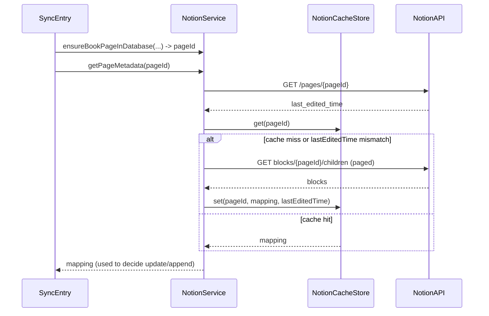

# 方案1：本地缓存 UUID->blockId 映射 + 基于页面编辑时间的增量刷新

目标：减少对 Notion 的重复 children 遍历请求，通过本地缓存 pageId 对应的 uuid->blockId 映射，并在 Notion 页面发生编辑时再刷新缓存，从而在绝大多数同步场景下避免全量抓取页面 children。

1) 本地缓存映射 + 基于页面编辑时间的增量刷新（推荐先做）
做法：第一次（或首次）fetch 全量并构建 uuid -> blockId 映射，持久化到本地（按 pageId）。后续 sync 先检查该 page 的 last_edited_time（或你保存的时间戳），只有在页面被改动时才重新 fetch 并更新映射；否则直接使用本地映射进行存在性判断/更新。
优点：实现简单、节省大量重复网络请求；兼顾手工编辑风险（通过检测 last_edited_time 来触发重建）。
风险/注意：Notion 对 children 的修改通常会更新 page 的 edited 时间，但边界情况需验证；需要处理映射失效和冲突（比如用户在 Notion 里移动/删除 block）。

## 核心思路
- 首次访问或缓存失效时，调用现有的 `collectExistingUUIDToBlockIdMapping(fromPageId:)` 完整抓取并构建映射；将映射持久化到本地（按 `pageId` 索引），同时保存该 page 的 `last_edited_time`（或 Notion 返回的相应时间戳）。
- 后续同步时先通过 Notion API 获取 page 的最新 `last_edited_time`（或从 `ensureBookPageInDatabase` / find 接口返回的 metadata），与本地缓存的时间比较：
  - 若 page 未被修改（时间一致），直接使用本地映射判断已有 uuid 并执行更新/追加流程；
  - 若 page 被修改或本地无缓存，则重新 fetch children 并重建缓存。
- 提供缓存过期/强制刷新接口，同时在页面被显式修改（检测到更新失败或 Notion 上用户手动改动）时可回退到全量重建。

## 设计细节
- 缓存数据结构（JSON）：
  - key: pageId
  - value: {
      "lastEditedTime": "2025-10-07T12:34:56Z",
      "collectedAt": "2025-10-07T12:35:01Z",
      "mapping": { "uuid1": "blockId1", "uuid2": "blockId2", ... }
    }
- 存储位置：
  - 推荐使用应用支持目录下的单个 JSON 文件（例如 `ApplicationSupport/SyncNos/notion_uuid_cache.json`），或使用 `UserDefaults`（如数据量较小）。优先推荐文件以便调试与导出。
- 同步流程集成点：
  - 在 `NotionService`（`Core/NotionService.swift`）添加对缓存的封装访问 API，例如：
    - `func cachedUUIDToBlockIdMap(pageId: String) -> [String:String]?`
    - `func updateCachedUUIDToBlockIdMap(pageId: String, mapping: [String:String], lastEditedTime: String)`
    - `func invalidateCacheForPage(pageId: String)`
  - 在 `AppleBooksSyncStrategySingleDB` 与 `GoodLinksSyncService` 使用 `notionService` 提供的缓存 API：在需要 `collectExistingUUID...` 之前，先检查缓存与 page.last_edited_time 是否一致；若一致则直接使用缓存结果。
- 获取 `last_edited_time`：
  - 在 `NotionService` 的 `ensureBookPageInDatabase` 或查询 page 的 API 中，返回或暴露 page metadata 中的 `last_edited_time` 字段（Notion pages 返回 `last_edited_time` 或 `last_edited_by`，需要在 `NotionService` / `NotionRequestHelper` 中解析并返回）。
  - 如果当前 `NotionService` 尚无相关实现，需要新增一个请求 `GET /pages/{page_id}` 或在已有 ensure/find 接口处同时返回 `last_edited_time`。

## 失效/冲突策略
- 若本地缓存存在但在使用过程中发现 mapping 中的 blockId 无法更新（例如 `updateBlockContent` 报 404），触发对该 page 的强制重建（重新 fetch children 并覆盖缓存）。
- 提供缓存版本字段或 collectedAt 时间，用于人工/自动清理陈旧缓存。

## 安全与边界情况
- Notion 的某些子块修改可能不更新 page 的 `last_edited_time`（需验证）。因此做法应允许定期全量重建（例如每天一次或当本地 sync 失败次数超过阈值时）。
- 当用户在 Notion 中大量重构页面（删除/移动 block），首次检测到大量失效时，应退回到全量重建并更新缓存。

## 影响的文件（具体修改项）
- 新增文件：
  - `SyncNos/Services/0-NotionAPI/NotionCacheStore.swift`（实现缓存读写与简单 API）
- 修改/扩展：
  - `SyncNos/Services/0-NotionAPI/Core/NotionService.swift`：
    - 在 `ensureBookPageInDatabase`、`findPageIdByAssetId` 或新加接口中返回 page metadata（`last_edited_time`）；
    - 添加缓存相关封装方法（调用 NotionCacheStore）。
  - `SyncNos/Services/0-NotionAPI/Operations/NotionQueryOperations.swift`：
    - 保持 `collectExistingUUIDToBlockIdMapping` 不变（作为可靠的完全构建逻辑）；
  - `SyncNos/Services/0-NotionAPI/1-AppleBooksSyncToNotion/AppleBooksSyncStrategySingleDB.swift`：
    - 在需要 `existingUUIDs` / `existingMap` 的地方，先尝试从 `notionService` 获取缓存；如命中且 lastEditedTime 匹配则跳过调用 `collectExistingUUIDToBlockIdMapping`，否则调用并在成功后更新缓存。
  - `SyncNos/Services/0-NotionAPI/2-GoodLinksSyncToNotion/GoodLinksSyncService.swift`：同上。
  - `SyncNos/Services/0-NotionAPI/Operations/NotionQueryOperations.swift` 或 `NotionRequestHelper.swift`：新增从 Notion 获取单个 page metadata 的实现（`GET pages/{page_id}`），用于读取 `last_edited_time`。

## 详细 TODO 列表（以可执行步骤排列）
- [ ] 新建 `NotionCacheStore.swift`：实现 JSON 文件持久化，提供 `get(pageId:) -> (mapping, lastEditedTime)?`、`set(pageId:, mapping:, lastEditedTime:)`、`invalidate(pageId:)`、`clearAll()`。
  - 存储路径：`Application Support/SyncNos/notion_uuid_cache.json`。
  - 实现要点：原子写入（写入临时文件后重命名）、读写并发保护（串行 DispatchQueue）。
- [ ] 扩展 `NotionRequestHelper` 或 `NotionService`：实现 `getPageMetadata(pageId:) async throws -> PageMetadata`，解析并返回 `last_edited_time`（ISO8601 String）。
- [ ] 在 `NotionService`（`Core/NotionService.swift`）添加缓存封装 API：
  - `func cachedUUIDToBlockIdMap(pageId: String) -> [String:String]?`
  - `func updateCachedUUIDToBlockIdMap(pageId: String, mapping: [String:String], lastEditedTime: String)`
  - `func invalidateCachedUUIDMap(pageId: String)`
  这些方法内部调用 `NotionCacheStore`。
- [ ] 修改 `AppleBooksSyncStrategySingleDB.sync(...)`：
  - 在原先调用 `collectExistingUUIDs` / `collectExistingUUIDToBlockIdMapping` 位置，先：
    1. 调用 `notionService.getPageMetadata(pageId:)` 获取 `lastEditedTimeRemote`。
    2. 尝试 `notionService.cachedUUIDToBlockIdMap(pageId:)`，若存在 `cached.lastEditedTime == lastEditedTimeRemote`，则直接使用缓存的 mapping；否则调用 `collectExistingUUIDToBlockIdMapping`，并在成功后调用 `notionService.updateCachedUUIDToBlockIdMap(...)`。
  - 增加错误回退：若在使用缓存时遇到 update/append 的 404/409 等错误，记录并触发 `notionService.invalidateCachedUUIDMap(pageId:)` 然后重试一次全量抓取。
- [ ] 修改 `GoodLinksSyncService.syncHighlights(...)` 做同样的缓存利用逻辑（与 AppleBooks 一致）。
- [ ] 编写单元测试/集成测试：
  - 模拟 Notion page 未改动情形，验证多次 sync 不会重复调用 children fetch。
  - 模拟 Notion page 被改动，验证缓存被刷新并更新 mapping。
  - 模拟 blockId 无效（update 返回 404），验证缓存失效并触发重建流程。
- [ ] 在 `SettingsView` 中增加调试按钮（可选）："清除 Notion UUID 缓存"，便于 QA 调试和回滚。

## 示意流程图（Mermaid）

## 实现细节建议与注意事项
- 异常与回退路径必须清晰：任何对 Notion 的写操作失败时，如果怀疑是缓存不一致，应立即 invalidate 并做一次全量重建。避免反复写入失败导致数据不一致。
- 缓存过期策略：可加上全局 TTL（例如 7 天）以防止长期依赖可能不完全可靠的 `last_edited_time`。
- 并发保护：若多个 sync 任务同时请求重建同一 page 的缓存，应确保只有一个任务执行重建，其他任务等待或复用结果（可用 DispatchSemaphore 或 Task 节流逻辑）。
- 日志：在重建、命中缓存、失效等关键点多记录日志，便于线上排查。

## 交付物（开发者可直接实现）
- 新文件：`NotionCacheStore.swift`（实现持久化）
- 修改文件列表与大致改动位置（见上文）
- 单元测试与 Settings 调试按钮（可选）

如果你同意该方案，我会按以下顺序开始实现并提交具体的 edits：
1. 新增 `NotionCacheStore.swift` 实现文件与单元测试框架（基础的读写/并发保护）。
2. 在 `NotionService` 中添加 page metadata 获取与缓存封装 API。 
3. 在 `AppleBooksSyncStrategySingleDB` 与 `GoodLinksSyncService` 中集成缓存逻辑并实现失效回退。 
4. 添加 Settings 的“清除缓存”按钮与若干单元测试。

请确认是否开始实现，或需要我在 plan 里调整存储位置（UserDefaults / file / CoreData）或缓存格式。
