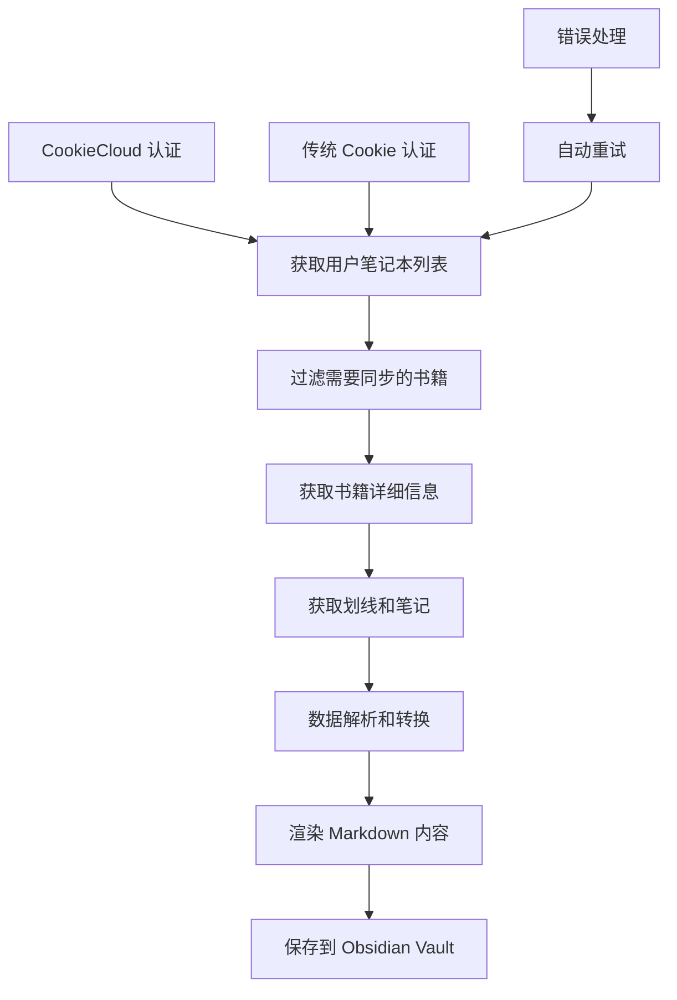

# Obsidian 微信读书插件技术架构分析报告

## 项目概述

Obsidian 微信读书插件是一个用于将微信读书笔记同步到 Obsidian 的社区插件。该插件通过调用微信读书的 API，获取用户的书籍、划线、笔记等信息，并将其转换为 Markdown 格式存储到 Obsidian vault 中。

**技术栈：**
- TypeScript 4.4.4
- Obsidian Plugin API (1.4.11)
- Svelte (用于状态管理)
- Webpack (构建工具)
- Node.js (后端依赖)

## 项目架构

### 目录结构

```
obsidian-weread-plugin/
├── src/                        # 主要源代码目录
│   ├── api.ts                  # API 调用核心模块
│   ├── models.ts               # 数据模型定义
│   ├── syncNotebooks.ts        # 笔记同步逻辑
│   ├── fileManager.ts          # 文件管理模块
│   ├── renderer.ts            # 渲染模块
│   ├── settings.ts             # 设置和状态管理
│   ├── cookieCloud.ts          # CookieCloud 认证模块
│   ├── components/             # UI 组件
│   ├── parser/                # 响应解析模块
│   └── utils/                 # 工具函数
├── docs/                      # 文档目录
├── main.ts                    # 插件入口文件
└── webpack.config.js          # 构建配置
```

## 核心模块分析

### 1. API 调用模块 (`src/api.ts`)

**架构设计：**
- 采用单一职责原则，ApiManager 类负责所有与微信读书 API 的通信
- 基于 Obsidian 的 requestUrl API 进行 HTTP 请求
- 实现了完整的错误处理和重试机制

**主要功能：**

#### 1.1 用户认证和 Cookie 管理
```typescript
private getHeaders() {
    return {
        'User-Agent': 'Mozilla/5.0 (Windows NT 10.0; Win64; x64) AppleWebKit/537.36...',
        'Accept-Encoding': 'gzip, deflate, br',
        'Accept-Language': 'zh-CN,zh;q=0.9,en;q=0.8',
        'accept': 'application/json, text/plain, */*',
        'Content-Type': 'application/json',
        Cookie: getCookieString(get(settingsStore).cookies)
    };
}
```

#### 1.2 Cookie 刷新机制
- 实现了自动 Cookie 刷新功能 (`refreshCookie()`)
- 支持双重认证方式：传统 Cookie 和 CookieCloud
- 当检测到 401 错误时自动尝试刷新认证信息

#### 1.3 API 端点实现

**与文档中的 API 端点对比：**

| 文档中的 API 端点 | 插件实际实现 | 差异说明 |
|----------------|-------------|----------|
| `https://i.weread.qq.com/book/bestbookmarks` | 未找到直接实现 | 推测已废弃或整合到其他接口 |
| `https://i.weread.qq.com/book/info` | `https://weread.qq.com/web/book/info` | 域名从 i.weread 改为 weread，路径更规范 |
| `https://i.weread.qq.com/review/list` | `https://weread.qq.com/web/review/list` | 域名更新，参数保持一致 |
| `https://i.weread.qq.com/shelf/sync` | `https://weread.qq.com/api/user/notebook` | 功能重构，获取用户笔记本列表 |
| `https://i.weread.qq.com/user/notebooks` | `https://weread.qq.com/api/user/notebook` | 端点合并 |

**核心 API 方法实现：**

1. **获取书籍详情** ([`getBook()`](src/api.ts:164))
   ```typescript
   async getBook(bookId: string): Promise<BookDetailResponse> {
       const req: RequestUrlParam = {
           url: `${this.baseUrl}/web/book/info?bookId=${bookId}`,
           method: 'GET',
           headers: this.getHeaders()
       };
       // 处理响应和错误重试
   }
   ```

2. **获取书籍划线** ([`getNotebookHighlights()`](src/api.ts:183))
   ```typescript
   async getNotebookHighlights(bookId: string): Promise<HighlightResponse> {
       const req: RequestUrlParam = {
           url: `${this.baseUrl}/web/book/bookmarklist?bookId=${bookId}`,
           method: 'GET',
           headers: this.getHeaders()
       };
   }
   ```

3. **获取用户笔记** ([`getNotebookReviews()`](src/api.ts:197))
   ```typescript
   async getNotebookReviews(bookId: string): Promise<BookReviewResponse> {
       const url = `${this.baseUrl}/web/review/list?bookId=${bookId}&listType=11&mine=1&synckey=0`;
   }
   ```

4. **获取用户笔记本列表** ([`getNotebooks()`](src/api.ts:70))
   ```typescript
   async getNotebooks() {
       const req: RequestUrlParam = {
           url: `${this.baseUrl}/api/user/notebook`,
           method: 'GET',
           headers: this.getHeaders()
       };
   }
   ```

### 2. 数据模型 (`src/models.ts`)

**类型安全设计：**
- 使用 TypeScript 接口定义所有 API 响应类型
- 完整的数据结构映射，确保类型安全
- 支持微信读书的各种数据格式（书籍、划线、笔记、进度等）

**核心数据结构：**

- `HighlightResponse`: 划线数据响应
- `BookReviewResponse`: 书籍笔记响应
- `ChapterResponse`: 章节信息响应
- `BookDetailResponse`: 书籍详情响应
- `BookProgressResponse`: 阅读进度响应
- `Notebook`: 完整的笔记本数据结构

### 3. 认证系统

#### 3.1 传统 Cookie 认证
- 使用 `wr_name`, `wr_skey` 等 Cookie 进行身份验证
- 实现了 Cookie 解析、验证和自动更新机制
- 支持过期检测和自动刷新

#### 3.2 CookieCloud 认证 (`src/cookieCloud.ts`)
**创新特性：**
- 支持第三方 Cookie 服务 CookieCloud
- 使用 AES 加密保护 Cookie 数据传输
- 支持自动获取和更新 Cookie

**实现机制：**
```typescript
async getCookie() {
    const req: RequestUrlParam = {
        url: `${info.serverUrl}/get/${info.uuid}`,
        method: 'GET'
    };

    const { cookie_data } = this.cookieDecrypt(
        info.uuid,
        json.encrypted,
        info.password
    );
}
```

### 4. 数据流处理

#### 4.1 同步流程 (`src/syncNotebooks.ts`)

**完整的同步架构：**



**关键方法：**

1. **批量同步** ([`syncNotebooks()`](src/syncNotebooks.ts:39))
   - 支持增量同步和强制全量同步
   - 实现了进度显示和错误处理
   - 支持并行处理提高效率

2. **数据转换** ([`convertToNotebook()`](src/syncNotebooks.ts:79))
   - 获取书籍详情、划线、笔记和进度信息
   - 将 API 响应转换为内部数据结构
   - 处理不同类型的内容（书籍、公众号文章）

#### 4.2 文件管理 (`src/fileManager.ts`)

**功能特性：**
- 支持多种文件命名策略
- 智能重复检测和处理
- 支持子文件夹分类
- 集成 Daily Notes 功能

**文件组织策略：**
```typescript
// 支持的文件命名方式
type FileNameType = 'BOOK_ID' | 'BOOK_NAME' | 'BOOK_NAME_AUTHOR' | 'BOOK_NAME_BOOKID';

// 支持的文件夹分类
type FolderType = 'title' | 'category' | '';
```

### 5. 渲染系统 (`src/renderer.ts`)

**模板引擎：**
- 使用 Nunjucks 模板引擎
- 支持自定义模板
- 生成结构化的 Markdown 内容

## 技术特性分析

### 1. 错误处理和容错机制

**多层错误处理：**
1. **网络层错误处理** - API 调用失败重试
2. **认证层错误处理** - Cookie 过期自动刷新
3. **数据层错误处理** - 数据解析异常捕获
4. **应用层错误处理** - 用户友好的错误提示

### 2. 性能优化

**优化策略：**
- **增量同步** - 只同步有更新的内容
- **并行处理** - 多本书籍同步并行执行
- **缓存机制** - 减少重复 API 调用
- **分页处理** - 大量数据分批处理

### 3. 用户体验设计

**用户体验特性：**
- **进度显示** - 实时显示同步进度
- **灵活配置** - 丰富的自定义选项
- **智能去重** - 自动处理重复书籍
- **多格式支持** - 支持不同输出格式

## 安全性分析

### 1. 数据安全

**安全措施：**
- Cookie 数据本地加密存储
- CookieCloud 传输加密
- API 请求使用 HTTPS
- 敏感信息不记录日志

### 2. 隐私保护

**隐私设计：**
- 数据仅存储在用户本地
- 不上传用户笔记到第三方服务器
- 支持 Cookie 认证方式的多样性选择

## 与 API 文档的对比分析

### 1. API 端点演进

**变化总结：**
1. **域名变更** - 从 `i.weread.qq.com` 迁移到 `weread.qq.com`
2. **路径规范化** - 添加 `/web` 和 `/api` 前缀提高可维护性
3. **功能整合** - 部分端点合并或重新设计
4. **新增功能** - 添加了阅读进度、章节信息等新接口

### 2. 实现质量评估

**优点：**
- ✅ 完整的错误处理机制
- ✅ 类型安全的 TypeScript 实现
- ✅ 模块化的架构设计
- ✅ 支持多种认证方式
- ✅ 丰富的配置选项

**改进建议：**
- 🔄 可以考虑增加 API 调用频率限制
- 🔄 可以增加更多的单元测试覆盖
- 🔄 可以优化大文件的同步性能

## 总结

Obsidian 微信读书插件展现了一个成熟的开源项目的特征：

1. **架构设计合理** - 清晰的模块划分和职责分离
2. **技术栈现代** - 使用 TypeScript 和现代开发工具链
3. **用户友好** - 丰富的配置选项和良好的错误处理
4. **安全性良好** - 合理的数据保护和隐私设计
5. **可维护性强** - 清晰的代码结构和文档

该插件成功地实现了微信读书 API 的调用，并将其无缝集成到 Obsidian 生态系统中，为用户提供了高质量的读书笔记管理体验。

---

*生成时间：2025-11-20*
*分析版本：obsidian-weread-plugin v0.14.0*