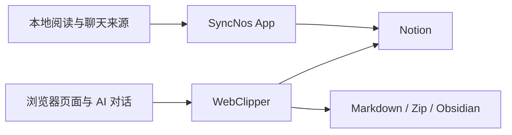

# 概览

## 目标
- SyncNos 是一个围绕“信息沉淀到 Notion”的双产品线仓库：桌面端负责阅读高亮与 OCR，同步扩展负责 AI 对话与网页文章。
- 主要用户是希望把阅读、聊天与网页内容持续沉淀到 Notion / Obsidian 的个人知识管理用户。
- 仓库既包含实际产品代码，也包含多份开发约束文档，因此阅读顺序比单纯扫目录更重要。

| 产品线 | 解决问题 | 主要输入 | 主要输出 | 首读文档 |
| --- | --- | --- | --- | --- |
| SyncNos App | 将阅读高亮、笔记和聊天 OCR 同步到 Notion | Apple Books / GoodLinks 数据库、WeRead / Dedao Cookie、聊天截图 | Notion 数据库、页面、SwiftData 缓存 | `SyncNos/AGENTS.md` |
| WebClipper | 将 AI 对话与网页文章本地保存、导出，并按需同步到 Notion / Obsidian | 浏览器 DOM、文章正文、用户设置、备份包 | IndexedDB 记录、Markdown / Zip、Notion 页面、Obsidian 文件 | `Extensions/WebClipper/AGENTS.md` |

## 仓库布局
| 路径 | 角色 | 典型内容 | 阅读建议 |
| --- | --- | --- | --- |
| `SyncNos/` | macOS App 主工程 | `Models/`、`Services/`、`ViewModels/`、`Views/` | 先看 `SyncNos/AGENTS.md`，再按层进入。 |
| `Extensions/WebClipper/` | 浏览器扩展 | `src/entrypoints/`、`src/collectors/`、`src/sync/` | 先确认改动属于 background / content / popup / app。 |
| `.github/docs/` | 仓库级业务与技术文档 | `business-logic.md`、键盘导航等专项文档 | 用来建立“为什么这样设计”的背景。 |
| `.github/workflows/` | GitHub Actions 流程 | release、WebClipper 打包与商店发布 | 关注产物生成与版本一致性。 |
| `Packages/` | 可复用 SwiftPM 模块 | `MenuBarDockKit` | 仅存放可复用且不反向依赖 UI 的能力。 |
| `Resource/` | 共享资源 | `flows.svg` 等图示资源 | 有助于理解双产品线如何汇聚到输出端。 |

## 入口点
| 入口 | 位置 | 作用 | 常用操作 |
| --- | --- | --- | --- |
| App 启动入口 | `SyncNos/SyncNosApp.swift` | 初始化订阅、自动同步和主窗口 | `xcodebuild -scheme SyncNos -configuration Debug build` |
| App 生命周期 | `SyncNos/AppDelegate.swift` | 处理菜单栏、退出确认、URL scheme 回调 | 结合 `Info.plist` 理解 OAuth 回调。 |
| Xcode 工程 | `SyncNos.xcodeproj` | App 构建入口 | 用 `open SyncNos.xcodeproj` 打开。 |
| WebClipper 打包入口 | `Extensions/WebClipper/package.json` | 管理 dev / build / compile / test 脚本 | `npm --prefix Extensions/WebClipper install` |
| WXT 配置 | `Extensions/WebClipper/wxt.config.ts` | 定义 manifest、权限和入口目录 | 与商店版本、tag 校验有关。 |
| 扩展后台入口 | `Extensions/WebClipper/src/entrypoints/background.ts` | 组装 router、handlers 与同步 orchestrator | 观察后台消息流。 |
| 扩展内容脚本入口 | `Extensions/WebClipper/src/entrypoints/content.ts` | 注册 collectors、inpage 控制器和增量更新 | 观察页面采集与 runtime gating。 |

| 导航入口 | 位置 | 价值 | 推荐场景 |
| --- | --- | --- | --- |
| `README.md` | 仓库根目录 | 最高层产品介绍与下载/开发入口 | 初次进入仓库。 |
| `AGENTS.md` | 仓库根目录 | 产品线分流、命令、文档同步规则 | 准备修改任何内容前。 |
| `.github/docs/business-logic.md` | 仓库级文档 | 双产品线共享业务语义 | 写文档或梳理数据流时。 |

## 关键产物
| 产物 | 生产方 | 位置/目标 | 说明 |
| --- | --- | --- | --- |
| Notion 数据库 / 页面 | App + WebClipper | 用户选择的 Parent Page 下 | App 以“条目 → 页面”为主，WebClipper 以“会话 / 文章 → 页面”为主。 |
| 本地缓存 | App | SwiftData / UserDefaults / Keychain | 支撑增量同步、授权状态和本地安全存储。 |
| 浏览器本地数据库 | WebClipper | IndexedDB + `chrome.storage.local` | 支撑会话列表、导出、备份与设置。 |
| Markdown / Zip 导出 | WebClipper | 用户本地文件系统 | 支持单文件、多文件 zip 和 Zip v2 备份。 |
| 发布包 | GitHub Actions | Release / Chrome / Edge / Firefox 渠道 | WebClipper 正式包由 CI 统一生成。 |

## 关键工作流
| 工作流 | 命令/动作 | 结果 |
| --- | --- | --- |
| App 构建 | `xcodebuild -scheme SyncNos -configuration Debug build` | 验证 macOS App 工程可构建。 |
| WebClipper 开发 | `npm --prefix Extensions/WebClipper run dev` | 启动 Chrome MV3 开发模式。 |
| WebClipper 检查 | `npm --prefix Extensions/WebClipper run compile` / `run test` / `run build` | 依次完成类型检查、单测、构建。 |
| 文档理解 | 阅读 `README.md` → `AGENTS.md` → 产品线 `AGENTS.md` | 快速建立修改边界和导航方式。 |
| 发布 | 推送 `v*` tag 或手动触发 workflow | 生成 GitHub Release 与各商店产物。 |

## 图表




## 示例片段
### 片段 1：App 会在启动期决定是否开启自动同步
```swift
let autoSyncEnabled = UserDefaults.standard.bool(forKey: "autoSync.appleBooks")
    || UserDefaults.standard.bool(forKey: "autoSync.goodLinks")
    || UserDefaults.standard.bool(forKey: "autoSync.weRead")
if autoSyncEnabled { DIContainer.shared.autoSyncService.start() }
```

### 片段 2：WebClipper 的开发、构建与测试命令都由 package.json 统一暴露
```json
"dev": "wxt --mv3",
"build": "wxt build --mv3",
"compile": "tsc --noEmit",
"test": "vitest run"
```

## 从哪里开始
- 先读 `README.md` 和 `.github/docs/business-logic.md`，理解这不是单一 App，而是“桌面同步 + 浏览器采集”组合仓库。
- 再读根 `AGENTS.md`，确认你要进入 `SyncNos/` 还是 `Extensions/WebClipper/`。
- 如果关注 App，同步阅读 `SyncNos/AGENTS.md`、`SyncNos/Services/AGENTS.md` 与 `SyncNos/Services/Core/AGENTS.md`。
- 如果关注扩展，同步阅读 `Extensions/WebClipper/AGENTS.md`、`package.json` 和 `wxt.config.ts`。

## 如何导航
- 从 [architecture.md](architecture.md) 看系统边界与契约，再进入 `modules/` 理解各产品线的内部组织。
- 与运行约束相关的问题，优先看 [configuration.md](configuration.md) 与 [workflow.md](workflow.md)。
- 与验证和回归相关的问题，优先看 [testing.md](testing.md)。
- 与命名语义和跨文档一致性相关的问题，优先看 [glossary.md](glossary.md)。

## 常见陷阱
- 仓库默认要求先判断产品线，不要把 App 的 MVVM 约束和 WebClipper 的 MV3 约束混在一起。
- 未被明确要求时，不要查看或编辑国际化字段；中文 deepwiki 只整理事实，不修改现有多语言资源。
- WebClipper 的正式发布包由 GitHub Actions 生成，本地主要用于 WXT 开发与验证，不应手工替代 CI 发布流程。
- 文档同步应以代码和脚本为准，而不是在文档之间互相抄写。

## 来源引用（Source References）
- `README.md`
- `AGENTS.md`
- `.github/docs/business-logic.md`
- `SyncNos/AGENTS.md`
- `SyncNos/SyncNosApp.swift`
- `SyncNos/AppDelegate.swift`
- `Extensions/WebClipper/AGENTS.md`
- `Extensions/WebClipper/package.json`
- `Extensions/WebClipper/wxt.config.ts`
- `Resource/flows.svg`
