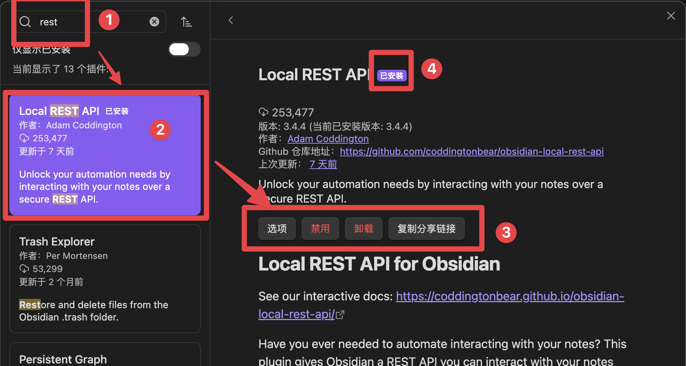
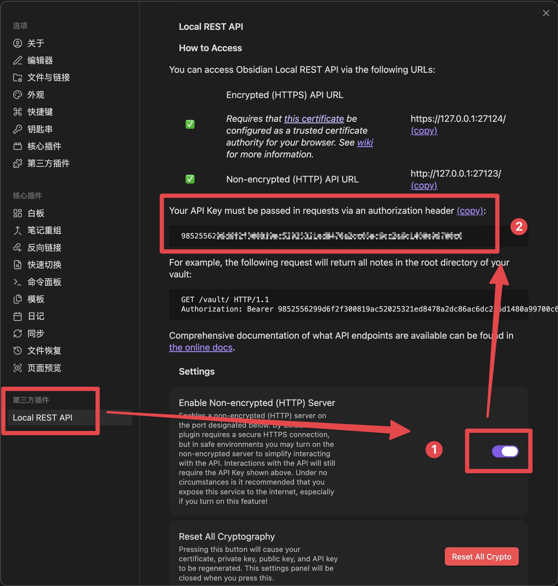
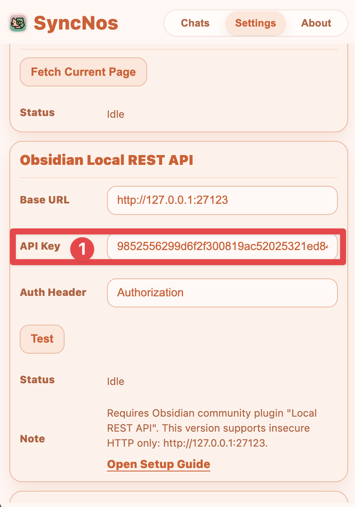

# Obsidian Local REST API Setup (WebClipper)

**English** | [中文](./LocalRestAPI.zh.md)

This guide covers the user-facing setup for syncing SyncNos WebClipper content to an Obsidian vault through the Local REST API plugin. Runtime behavior remains owned by `src/services/sync/obsidian/**`.

## Prerequisites

- Obsidian Desktop is installed and a vault is open.
- Community plugins are enabled.

## 1. Install Local REST API

In Obsidian, open `Settings` → `Community plugins`, search for **Local REST API** by Adam Coddington, install it, and enable it.



## 2. Enable local HTTP

The current SyncNos client accepts HTTP for this integration. In the Local REST API plugin settings, enable **Insecure HTTP**.

The default SyncNos endpoint is:

```text
http://127.0.0.1:27123
```

Keep the service bound to `127.0.0.1` / `localhost`. Do not bind it to `0.0.0.0` unless you intentionally want to expose the API to the local network.



## 3. Copy the API Key

Copy the API Key from the Local REST API plugin settings.



Then open WebClipper → `Settings` → `Obsidian` and configure:

- Base URL: normally `http://127.0.0.1:27123`.
- API Key: the key copied from Obsidian.
- Auth Header: normally `Authorization`.

Run the connection test after saving. The API Key is stored locally by the extension and is excluded from SyncNos backups.

## 4. Sync behavior

Obsidian is a local derived target. SyncNos writes Markdown and required local image attachments to the vault through the localhost REST API; this path does not require a SyncNos cloud service.

Manual sync is always available. If Obsidian auto-sync is explicitly enabled, local content changes can also enter the provider's automatic sync queue.

Destination folders and note naming are owned by the current Obsidian service and settings code rather than duplicated in this guide.

## 5. Troubleshooting

For `Failed to fetch` or another network error, check that Obsidian Desktop is running, Local REST API is enabled, Insecure HTTP is enabled, and the Base URL points to the local service.

For `401` / `403` or `authenticated false`, copy the API Key again and verify the configured Auth Header. Remove accidental leading/trailing whitespace before testing again.